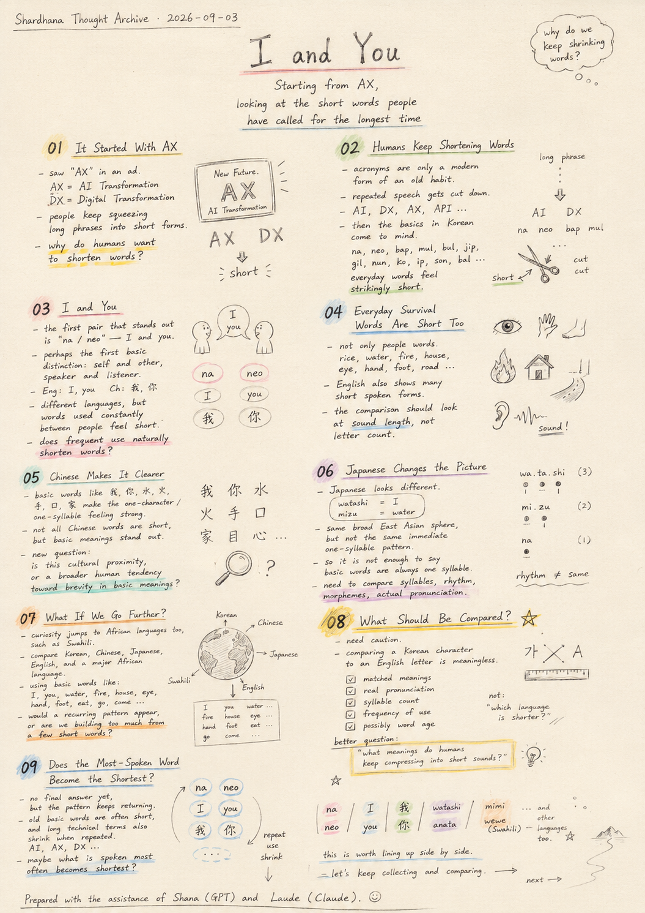
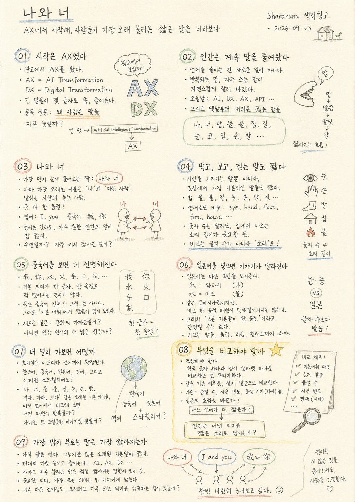

> Location: docs/thoughts/i-and-you.md

# I and You

## Starting From AX, Looking at the Shortest Words People Have Ever Called Each Other

*(Shardhana Thought Archive) · Date: 2026-09-03*

## 🎬 YouTube Video

[Watch on YouTube](https://youtu.be/XmB5VRR2dq4)

  

---

## 01. It Started With "AX"

I ran into the word AX in an ad this morning.

AX. I wondered what it meant — turns out it's short for AI Transformation.

DX is Digital Transformation. AX is AI Transformation.

A long phrase, squeezed down to two letters.

At first it just seemed like one more acronym the world had produced. But looking at it a little longer, something felt off. Why do people keep wanting to shorten things like this?

## 02. Humans Have Always Been Shortening Words

Making acronyms probably isn't a new behavior at all.

Say a long phrase often enough, and it gets cut down. Say something enough times, and it gets dropped. Get used to it, and it gets shorter still.

Today that shows up as AI, DX, AX, API. But the habit of shortening speech itself is almost certainly far older than any of that.

And then, out of nowhere, Korean words came to mind.

*Na* (I). *Neo* (you). *Bap* (rice). *Mul* (water). *Bul* (fire). *Jip* (house). *Gil* (road). *Nun* (eye). *Ko* (nose). *Ip* (mouth). *Son* (hand). *Bal* (foot).

The words a person would have used every single day, for as long as anyone can remember, turn out to be strangely short.

## 03. I and You

Out of all of them, the first two that stood out were *na* and *neo* — I and you.

*Na*. *Neo*.

These might be the very first two things a person ever needed to tell apart, looking out at the world: myself, and everyone who isn't me. The one speaking, and the one listening.

And both of those words are a single syllable.

English looks similar. I. You.

Chinese comes to mind too. 我. 你.

Completely different languages — and yet the words that pass between people most often, all the time, come out oddly short.

Is that a coincidence? Or is there something about frequent use that naturally shortens a word?

## 04. Eating, Seeing, Walking — Those Words Are Short Too

It's not just the words for people.

Rice. Water. Fire. House. Eye. Hand. Foot. Road.

These are the things closest to everyday survival.

English shows the same pattern. Eye. Hand. Foot. Fire. House.

The spelling looks longer than the Korean, but spoken aloud, a lot of these are still just one syllable.

Which shifts the whole comparison. It's probably not about letter count — it's about how long the sound actually takes to say.

## 05. Chinese Makes It Even Clearer

Chinese sharpens this feeling even further.

我. 你. 水. 火. 手. 口. 家.

A huge number of basic words line up one character to one syllable, almost exactly.

That doesn't mean every Chinese word is short — modern Chinese has plenty of two-syllable and longer words too.

But gather up the most basic meanings, and the short sounds stand out clearly.

Which raises the question again: is this because Korean and Chinese come from a related cultural sphere? Or is there some broader force across human language that pulls the most basic meanings toward brevity?

## 06. Japanese Tells a Different Story

Bring Japanese into the picture, and it looks a little different.

*Watashi* (私) is the usual word for "I." *Mizu* (水) is the usual word for "water."

Even within the same East Asian cultural sphere, Japanese doesn't show the same immediate one-character-one-syllable pattern that Korean and Chinese do for basic words.

So it's not as simple as "basic words are always one syllable."

Different languages build their sounds differently. A real comparison would need to look past letter count — at syllables, rhythm, morphemes, actual pronunciation.

## 07. What If This Goes Even Further

At this point, curiosity jumped all the way to African languages.

Korean. Chinese. Japanese. English.

And a major language from an entirely unrelated family — Swahili, say, spoken by a huge number of people.

I. You. Water. Fire. House. Eye. Hand. Foot. Eat. Go. Come.

Fix a set of old, basic meanings like these, and see how each language actually says them.

Would something recurring show up across completely unrelated language families? Or would this just be another case of building a nice-sounding story out of a handful of short words?

## 08. What Should Actually Get Compared

This is where things need to slow down a little.

Comparing one Korean character to one English letter doesn't mean anything — the writing systems aren't built the same way.

What's actually needed: matching basic vocabulary with the same meaning, real pronunciation, syllable count, frequency of use, and if possible, how old the word actually is.

Which shifts the question itself.

Not **which language is shorter**, but **what kinds of meaning does humanity keep compressing into short sounds?**

That version of the question is the more interesting one.

## 09. Does the Most-Spoken Word Become the Shortest

There's still no answer. But a strange pattern keeps showing up anyway.

A lot of old, basic words turn out to be short. Long modern technical terms shrink into acronyms the moment they get used often enough.

AI. AX. DX.

*I* and *you*, from thousands of years ago.

Completely different in form — but is there a similar force running underneath both? What gets called often gets shortened. What matters enough to say constantly ends up sitting closest to the mouth.

So maybe people who built entirely unrelated languages still ended up compressing their oldest, most frequently used meanings into similarly short sounds.

*Na* and *neo.*

I and you.

我 and 你.

And *I* and *you* in every other language out there.

I want to line them all up side by side. I should ask Shana about it.

This gets written down here, for now.

---

This document was prepared with the assistance of Shana (GPT) and Laude (Claude).

---
 
 

# 나와 너

## AX에서 시작해, 사람들이 가장 오래 불러온 짧은 말을 바라보다

*(Shardhana 생각창고) · Date: 2026-09-03*

## 🎬 YouTube Video

[Watch on YouTube](https://youtu.be/YMadieQeJug)

  

---

## 01. 시작은 AX였다

아침에 광고를 보다가 AX라는 말을 만났다.

AX.

무슨 뜻인가 했더니 AI Transformation을 줄여 부르는 말이라고 한다.

DX는 Digital Transformation. AX는 AI Transformation.

긴 말을 두 글자로 줄여 놓은 셈이다.

처음에는 그냥 요즘 세상에 또 하나 생긴 약자라고 생각했다.

그런데 가만히 보니 조금 이상했다. 사람은 왜 이렇게 말을 줄이고 싶어 할까.

## 02. 인간은 계속 말을 줄여왔다

생각해보면 약자를 만드는 일은 새로운 행동이 아닐지도 모른다.

긴 말을 반복해서 사용하다 보면 줄인다. 자주 부르면 생략하고, 익숙해지면 더 짧게 만든다.

현대에는 AI, DX, AX, API 같은 형태로 나타나지만, 사람이 말을 짧게 만드는 습관 자체는 훨씬 오래되었을 것이다.

그러다 문득 우리말이 떠올랐다.

나. 너. 밥. 물. 불. 집. 길. 눈. 코. 입. 손. 발.

사람이 살아가면서 아주 오래 사용했을 것 같은 말들이 이상할 만큼 짧다.

## 03. 나와 너

그중에서도 가장 먼저 눈에 들어온 것은 나와 너였다.

나. 너.

사람이 세상을 바라보면서 가장 먼저 구분해야 했을지도 모르는 두 존재다. 나와 다른 사람. 말하는 사람과 듣는 사람.

그런데 그 둘을 부르는 말이 둘 다 한 음절이다.

영어도 비슷하다. I. you.

중국어도 떠오른다. 我. 你.

언어는 서로 다른데, 사람과 사람 사이에서 가장 자주 오가는 말은 묘하게 짧아 보인다.

우연일까. 아니면 자주 쓰이는 말은 자연스럽게 짧아지는 걸까.

## 04. 먹고, 보고, 걷는 말도 짧다

사람을 나타내는 말만 그런 것도 아니다.

밥. 물. 불. 집. 눈. 손. 발. 길.

살아가는 데 아주 가까운 것들이다.

영어를 떠올려도 비슷한 모습이 보인다. eye. hand. foot. fire. house.

철자는 한국어보다 길지만 실제로 발음하면 한 음절인 말이 많다.

여기서 비교 기준이 조금 달라진다. 글자 수가 아니라 사람이 실제로 내는 소리의 길이를 봐야 할 것 같다.

## 05. 중국어를 보면 더 선명해진다

중국어를 보면 이 느낌은 더 강해진다.

我. 你. 水. 火. 手. 口. 家.

한 글자와 한 음절이 직접 맞물리는 기본어가 많이 보인다.

그렇다고 중국어가 모두 짧다는 뜻은 아니다. 현대 중국어에는 두 음절 이상의 단어도 많다.

다만 가장 기본적인 의미를 모아 놓으면 짧은 소리가 눈에 잘 들어온다.

여기서 다시 질문이 생긴다. 한국어와 중국어가 가까운 문화권이라서 그런 걸까. 아니면 인간 언어 전반에서 기본적인 의미가 짧아지는 힘이 있는 걸까.

## 06. 일본어를 넣으면 이야기가 달라진다

일본어를 떠올리면 조금 다른 모습이 나온다.

나를 뜻하는 私는 보통 와타시라고 한다. 물을 뜻하는 水는 미즈라고 한다.

같은 동아시아 언어권인데도 한국어나 중국어처럼 한 음절짜리 기본어가 바로 눈에 들어오지는 않는다.

그러면 단순히 "기본적인 말은 모두 한 음절이다"라고 말할 수는 없다.

언어마다 소리를 만드는 구조가 다르다. 비교하려면 글자 수보다 음절, 박자, 형태소, 실제 발음을 봐야 할 것 같다.

## 07. 더 멀리 가보면 어떨까

여기서 갑자기 아프리카 언어까지 궁금해졌다.

한국어. 중국어. 일본어. 영어.

그리고 전혀 다른 언어 계통의 대표적인 아프리카 언어. 예를 들어 스와힐리어를 함께 놓아보면 어떨까.

나. 너. 물. 불. 집. 눈. 손. 발. 먹다. 가다. 오다.

이런 오래된 기본 의미들을 정해놓고 각 언어에서 실제로 어떻게 말하는지 비교해보는 것이다.

그러면 언어권을 넘어 반복되는 무언가가 보일까. 아니면 몇 개의 짧은 단어만 보고 내가 또 그럴듯한 이야기를 만들고 있는 걸까.

## 08. 무엇을 비교해야 할까

여기서부터는 조금 조심해야 할 것 같다.

한글 한 글자와 영어 알파벳 한 글자를 비교하는 것은 의미가 없다. 문자의 구조가 다르기 때문이다.

같은 뜻의 기본어휘를 정하고, 실제 발음을 보고, 음절 수를 세고, 얼마나 자주 사용되는지 보고, 가능하다면 오래된 기본어인지도 함께 봐야 한다.

그러면 질문도 조금 달라진다.

**어느 언어가 더 짧은가.** 보다 **인간은 어떤 의미를 짧은 소리로 남기는가.**

이 질문이 더 재미있어 보인다.

## 09. 가장 많이 부르는 말은 가장 짧아지는가

아직 답은 모른다.

다만 이상하게 이어지는 모습은 있다. 오래된 기본어 가운데 짧은 말이 많이 보인다. 현대의 긴 기술용어도 자주 사용되기 시작하면 약자로 줄어든다.

AI. AX. DX.

수천 년 전의 나와 너.

형태는 완전히 다르지만 그 밑에는 비슷한 힘이 있는 것 아닐까. 자주 부르는 것은 짧아진다. 중요해서 자주 쓰는 말은 입에서 가장 가까운 곳에 남는다.

그렇다면 서로 전혀 다른 언어를 만든 사람들도 가장 오래되고 자주 사용한 의미만큼은 비슷하게 짧은 소리로 압축해왔을까.

나와 너.

I and you.

我와 你.

그리고 다른 언어의 나와 너.

한번 나란히 놓아보고 싶어졌다. 샤나한테 물어봐야겠다.

일단 여기까지 적어 둔다.

---

이 문서는 샤나(GPT)와 로드(Claude)의 도움으로 작성되었습니다.
