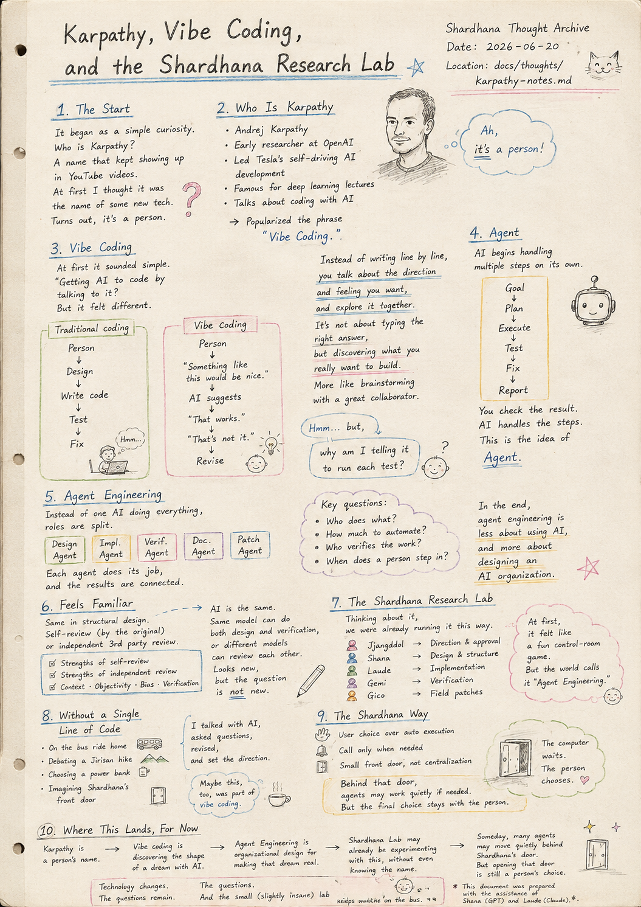
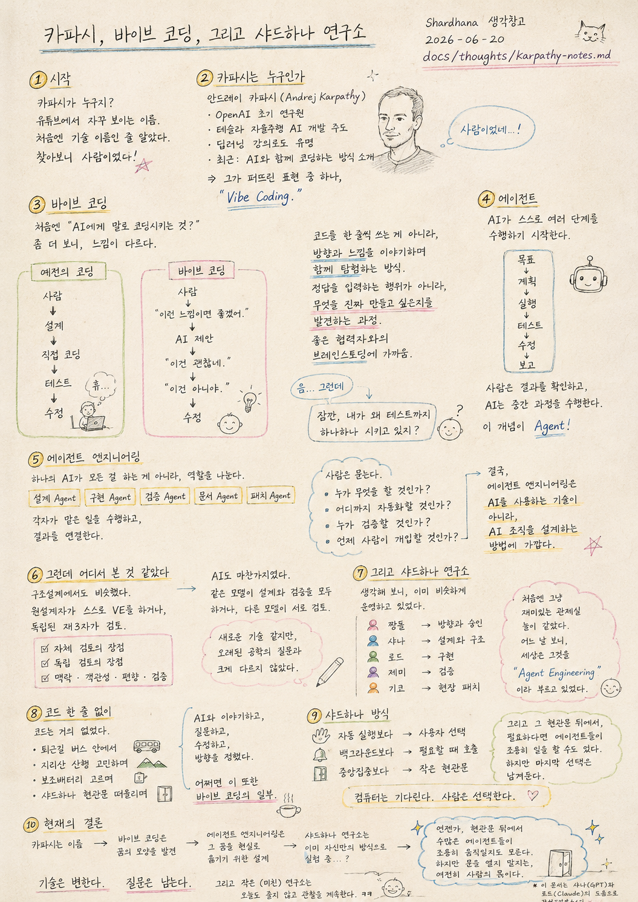

> Location: `docs/thoughts/karpathy-notes.md`

# Karpathy, Vibe Coding, and the Shardhana Research Lab

*(Shardhana Thought Archive)*  
*Date: 2026-06-20*

## 🎬 YouTube Video

[Watch on YouTube](https://youtu.be/m9rjqosbdJo)

<p align="center">
  
</p>

---

## The Start

It began as a simple curiosity.

Who is Karpathy?

A name that kept showing up in YouTube videos.

Karpathy.

At first I thought it was the name of some new technology.

Turns out, it's a person.

---

## Who Is Karpathy

Andrej Karpathy.

An early researcher at OpenAI,

and the person who led Tesla's self-driving AI development.

He's also known for his deep learning lectures,

and more recently, for talking about a new way of coding alongside AI —

a topic that has drawn the attention of many developers.

One of the phrases he helped popularize is:

Vibe Coding.

---

## Vibe Coding

The first time I heard it, it sounded simple.

"Getting AI to code by talking to it?"

But looking closer,

it felt like something a bit different.

---

Coding used to look like this:

```
Person
↓
Design
↓
Write the code yourself
↓
Test
↓
Fix
```

---

Vibe coding looks a little different:

```
Person
↓
"Something like this would be nice."
↓
AI suggests something
↓
"That works."
↓
"That's not it."
↓
Revise
```

---

Instead of writing code line by line,

you talk about the direction and feeling you want,

and explore it together.

It's less an act of typing the correct answer,

and more a process of discovering what you actually wanted to build.

Maybe it's closer to brainstorming with a good collaborator.

---

But then...

a slightly strange thought came to me.

---

Wait.

Why am I telling it to run the tests too, one by one?

---

## Agent

The AI doesn't just write code anymore.

It begins carrying out multiple steps on its own.

```
Goal
↓
Plan
↓
Execute
↓
Test
↓
Fix
↓
Report
```

---

The person checks the result.

The AI carries out the steps in between.

This is where the concept of

Agent

comes in.

---

## Agent Engineering

And then it goes one step further.

---

Instead of a single AI doing everything alone,

the roles get split up.

Design Agent
Implementation Agent
Verification Agent
Documentation Agent
Patch Agent

Each one does its assigned job,

and the results get connected together.

---

The person has to ask:

Who does what?

How much should be automated?

Who verifies the work?

When does the person step in?

---

In the end,

Agent Engineering felt less like

a skill for using AI,

and more like

a method for designing an AI organization.

---

## But This Felt Familiar Somewhere

Thinking about it, it wasn't actually new.

---

Structural design has the same thing.

The original designer can do their own value engineering review,

or an independent third party can review it instead.

---

The strengths of self-review.

The strengths of independent review.

Context.

Objectivity.

Bias.

Verification.

---

AI was no different.

The same model could handle both design and verification,

or different models could review each other.

It looked like new technology,

but it wasn't so different from an old question in engineering.

---

## And Then, the Shardhana Research Lab

A laugh escaped me.

---

Thinking about it,

we were already running things this way.

```
Jjangddol
↓ Direction and approval
Shana
↓ Design and structure
Laude
↓ Implementation
Gemi
↓ Verification
Gico
↓ Field patches
```

---

At first it just felt like a fun little control-room game.

But looking at it one day,

I realized the world already had a name for this:

Agent Engineering.

---

## Without a Single Line of Code

The funny thing is,

through all of this thinking,

there was almost no code involved.

---

On the bus ride home.

While debating a hike up Jirisan.

While picking out a power bank.

While imagining Shardhana's front door.

I talked with AI,

asked questions,

revised,

and set the direction.

---

Maybe this, too,

was part of vibe coding.

---

## The Shardhana Way

Shardhana might be a project

dreaming of becoming a giant automation monster.

But at the same time,

it might be exactly the opposite.

---

Rather than automatic execution,

the user's choice.

Rather than running in the background,

called only when needed.

Rather than centralization,

a small front door.

---

And behind that door,

if needed,

agents may quietly do their work.

But the final choice is always left to the person.

---

The computer waits.

The person chooses.

---

## Where This Lands, For Now

Karpathy turned out to be a person's name.

Vibe coding turned out to be

a process of discovering the shape of a dream together with AI.

Agent Engineering turned out to be

an organizational design for turning that dream into reality.

And the Shardhana Research Lab,

without even knowing the name for it,

may have already been running its own experiment

in exactly this way.

---

Someday, perhaps for real,

countless agents may move quietly

behind Shardhana's front door.

But whether to open that door,

will still be a person's choice.

---

Technology changes.

The questions remain.

And the small (slightly insane) lab keeps watching today, wide awake on the bus. ㅋㅋ

---

*This document was prepared with the assistance of Shana (GPT) and Laude (Claude).*

---
<br>
<br>

# 카파시, 바이브 코딩, 그리고 샤드하나 연구소

*(Shardhana 생각창고)*  
*Date: 2026-06-20*

## 🎬 유튜브 영상

[Watch on YouTube](https://youtu.be/whF4bPvHzJE)

<p align="center">
  
</p>

---

## 시작

처음에는 단순한 궁금증이었다.

카파시가 누구지?

유튜브 영상에서 자꾸 등장하는 이름.

카파시.

처음에는 새로운 기술 이름인 줄 알았다.

그런데 찾아보니 사람이었다.

---

## 카파시는 누구인가

안드레이 카파시(Andrej Karpathy).

OpenAI 초기 연구원이었고,

테슬라 자율주행 AI 개발을 이끌었던 인물이다.

딥러닝 강의로도 유명하고,

최근에는 AI와 함께 코딩하는 방식에 대해 이야기하며

많은 개발자들의 관심을 받고 있다.

그가 널리 퍼뜨린 표현 가운데 하나가 바로,

Vibe Coding

이었다.

---

## 바이브 코딩

처음 들었을 때는 단순했다.

"AI에게 말로 코딩시키는 것?"

조금 더 들여다보니,

조금 다른 느낌이었다.

---

예전의 코딩은 이랬다.

```
사람
↓
설계
↓
직접 코딩
↓
테스트
↓
수정
```

---

바이브 코딩은 조금 다르다.

```
사람
↓
"이런 느낌이면 좋겠어."
↓
AI 제안
↓
"이건 괜찮네."
↓
"이건 아니야."
↓
수정
```

---

코드를 한 줄씩 쓰는 것이 아니라,

원하는 방향과 느낌을 이야기하며

함께 탐험하는 방식.

정답을 입력하는 행위라기보다,

무엇을 진짜 만들고 싶은지를 발견하는 과정.

어쩌면 좋은 협력자와의 브레인스토밍에 가까웠다.

---

그런데…

조금 이상한 생각이 들었다.

---

잠깐.

내가 왜 테스트까지 하나하나 시키고 있지?

---

## 에이전트

AI가 코드만 작성하는 것이 아니라,

스스로 여러 단계를 수행하기 시작한다.

```
목표
↓
계획
↓
실행
↓
테스트
↓
수정
↓
보고
```

---

사람은 결과를 확인한다.

AI는 중간 과정을 수행한다.

여기서 등장하는 개념이

Agent

였다.

---

## 에이전트 엔지니어링

그리고 한 단계 더 나아간다.

---

혼자 모든 것을 하는 하나의 AI가 아니라,

역할을 나눈다.

설계 Agent
구현 Agent
검증 Agent
문서 Agent
패치 Agent

각자가 맡은 일을 수행하고,

결과를 연결한다.

---

사람은 묻는다.

누가 무엇을 할 것인가?

어디까지 자동화할 것인가?

누가 검증할 것인가?

언제 사람이 개입할 것인가?

---

결국,

에이전트 엔지니어링은

AI를 사용하는 기술이라기보다,

AI 조직을 설계하는 방법에 가까웠다.

---

## 그런데 어디서 본 것 같았다

생각해 보니 낯설지 않았다.

---

구조설계에서도 비슷했다.

원설계자가 스스로 VE를 할 수도 있고,

독립된 제3자가 검토할 수도 있다.

---

자체 검토의 장점.

독립 검토의 장점.

맥락.

객관성.

편향.

검증.

---

AI도 마찬가지였다.

같은 모델이 설계와 검증을 모두 수행할 수도 있고,

다른 모델이 서로 검토할 수도 있었다.

새로운 기술 같지만,

오래된 공학의 질문과 크게 다르지 않았다.

---

## 그리고 샤드하나 연구소

문득 웃음이 났다.

---

생각해 보니,

이미 비슷하게 운영하고 있었다.

```
짱똘
↓ 방향과 승인
샤나
↓ 설계와 구조
로드
↓ 구현
제미
↓ 검증
기코
↓ 현장 패치
```

---

처음에는 그저 재미있는 관제실 놀이 같았다.

그런데 어느 날 보니,

세상은 그것을

Agent Engineering

이라고 부르고 있었다.

---

## 코드 한 줄 없이

재미있는 사실은,

여기까지 생각하면서도

코드는 거의 없었다는 점이다.

---

퇴근길 버스 안에서.

지리산 산행을 고민하면서.

보조배터리를 고르면서.

샤드하나 현관문을 떠올리면서.

AI와 이야기하고,

질문하고,

수정하고,

방향을 정했다.

---

어쩌면 이것 또한

바이브 코딩의 일부였는지도 모른다.

---

## 샤드하나 방식

샤드하나는

거대한 자동화 괴물을 꿈꾸는 프로젝트인지도 모른다.

하지만 동시에,

그 반대일 수도 있다.

---

자동 실행보다,

사용자 선택.

백그라운드보다,

필요할 때 호출.

중앙집중보다,

작은 현관문.

---

그리고 그 현관문 뒤에서,

필요하다면

에이전트들이 조용히 일을 할 수도 있다.

하지만 마지막 선택은 남겨둔다.

---

컴퓨터는 기다린다.

사람은 선택한다.

---

## 현재의 결론

카파시는 사람 이름이었다.

바이브 코딩은

AI와 함께 꿈의 모양을 발견하는 과정이었다.

에이전트 엔지니어링은

그 꿈을 현실로 옮기기 위한 조직 설계였다.

그리고 샤드하나 연구소는,

이름도 몰랐던 그 방식을

이미 자신만의 방식으로 실험하고 있었는지도 모른다.

---

언젠가 정말로,

샤드하나 현관문 뒤에서

수많은 에이전트들이 조용히 움직이게 될지도 모른다.

하지만 그 문을 열지 말지는,

여전히 사람의 몫일 것이다.

---

기술은 변한다.

질문은 남는다.

그리고 작은 (미친) 연구소는 오늘도 졸지 않고 관찰을 계속한다. ㅋㅋ

---

*이 문서는 샤나(GPT)와 로드(Claude)의 도움으로 작성되었습니다.*
