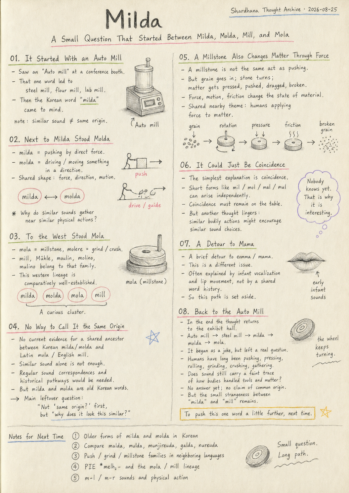
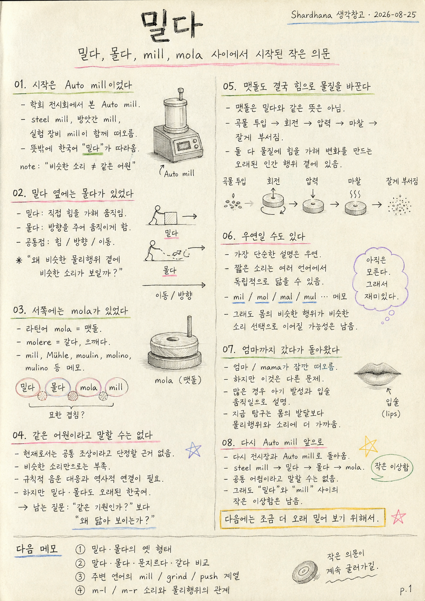

> Location: docs/thoughts/milda-en.md

# Milda

## A Small Question That Started Between Milda, Molda, Mill, and Mola

*(Shardhana Thought Archive) · Date: 2026-08-25*

  

---

## 01. It Started With an "Auto Mill"

It started at a conference exhibit hall.

A booth had a piece of equipment called an "Auto mill" sitting on display — a lab device that shreds plant and animal tissue into fine pieces.

Mill. Looking at that word, steel mill came to mind out of nowhere. A steel plant is a mill. A flour mill is a mill. A lab device that grinds up samples is also a mill.

And then, out of nowhere, a Korean word tagged along. *Milda* — "to push." Mill. Milda. The sounds sat too close together.

Sounding alike doesn't mean sharing an origin, of course. Still, it felt a little too odd to just smile and move on.

## 02. Next to Milda Stood Molda

Thinking about *milda* pulled *molda* — "to drive" — right along with it.

*Milda* applies direct force to move something. *Molda* moves something in a given direction. Different mechanics, but a shared shape: there's force, there's direction, there's motion.

And both start with an *m* sound, followed by something in the *l* family. Milda. Molda.

That's where the wordplay turned into a small real question: why do sounds like these keep showing up around similar physical actions?

## 03. To the West Stood Mola

Digging a little further turned up the Latin word *mola* — millstone. *Molere* means to grind, to crush.

This lineage has been studied in comparative linguistics for a long time. English *mill*, German *Mühle*, French *moulin*, Spanish *molino*, Italian *mulino* — all sit inside the same well-established family.

That part is fairly solid ground. But lining everything up side by side still felt strange: *milda*, *molda*, *mola*, *mill*. The sounds and the actions kept landing in the same spot.

## 04. There's No Way to Call It the Same Origin

This is where a line has to be drawn.

There's currently no evidence that Korean *milda*/*molda* and Latin *mola*/English *mill* descend from a common ancestor. Sounding alike isn't enough on its own — you'd need a regular pattern of sound change across multiple words, plus a documented historical path connecting them.

Still, *milda* and *molda* are old Korean words in their own right — not something that happened to converge in the modern era by coincidence.

So the question stays open, but in a different order: not *is it the same origin* first, but *why does it look this similar in the first place.*

## 05. A Millstone Also Changes Matter Through Force

*Mola* and *mill* don't mean the same thing as *milda*. A millstone isn't a tool for pushing something forward.

But look at what actually happens inside one: grain goes in, stone turns, and the grain gets pressed, pushed, dragged, and broken apart. Force, motion, and friction transform the state of the material.

*Milda* and a millstone aren't the same action. But both sit near something humans have repeated for an extremely long time — *applying force to matter to change it.*

## 06. It Could Just Be Coincidence

The simplest explanation is coincidence.

The sounds available to human speech aren't infinite, and the shorter a word is, the more likely it is to resemble something else by chance. *Mil, mol, mal, mul* — sounds like these could easily arise independently across many of the world's languages. Reading a shared ancestor into a handful of similar-sounding words is a risky move. Coincidence has to stay on the table, all the way through.

But another thought lingers alongside it. Humans have been pushing, pressing, grinding, crushing, rubbing, and driving things since long before language existed. Could similar bodily actions, across unrelated languages, have nudged people toward similar sound choices?

Nobody knows yet. Which is exactly what makes it interesting.

## 07. A Detour to "Mama," and Back

Following the *m* sound led, briefly, to *eomma* and *mama.*

But that turned out to be a different story entirely. The *m* sound showing up so often in words for "mother" across languages is usually explained by an infant's earliest vocalizations and the movement of closing and opening the lips — a shared condition of human speech anatomy, more than a shared word history.

So *mama* got set aside for now. What *milda*, *molda*, and *mola* are really asking about sits closer to *the relationship between physical action and sound* than to *the relationship between infant development and sound.*

## 08. Back to the Auto Mill

In the end, it circles back to the exhibit hall.

Auto mill. From that one name came *steel mill*, then *milda*, then *molda*, then *mola.*

It started as a joke. But lining up a handful of words left one real question behind. Humans have been pushing, pressing, rolling, grinding, crushing, and gathering for a very long time. Does the sound we use to name those actions still carry some faint trace of how our bodies once handled tools and matter?

There's no answer yet. There's no way to say Korean *milda*/*molda* and the European *mola*/*mill* share an origin.

But *milda*. Mill. The small strangeness that showed up the moment those two words were first placed side by side hasn't gone away.

So this gets written down here, for now — to push this one word a little further, next time.

---

**Notes for Next Time**

- Older attested forms of *milda* and *molda* in Korean
- Comparing *malda*, *mulda*, *munjireuda*, *galda*, *nureuda*
- Push/grind/millstone word families in neighboring languages
- PIE **melh₂-* and the *mola*/*mill* lineage
- The relationship between m-l / m-r sounds and physical action

---

This document was prepared with the assistance of Shana (GPT) and Laude (Claude).

---
 
 

# 밀다

## 밀다, 몰다, mill, mola 사이에서 시작된 작은 의문

*(Shardhana 생각창고) · Date: 2026-08-25*

  

---

## 01. 시작은 Auto mill이었다

시작은 학회 전시장이었다.

부스 한쪽에 Auto mill이라는 장비가 놓여 있었다. 동식물 조직을 잘게 파쇄하는 실험실 장비였다.

mill. 그 단어를 보다가 문득 steel mill이 떠올랐다. 제철소도 mill이고, 곡물을 가는 방앗간도 mill이고, 시료를 파쇄하는 장비도 mill이다.

그러다가 엉뚱하게 한국어 하나가 따라왔다. 밀다. mill. 밀다. 소리가 너무 가까웠다.

물론 소리가 닮았다고 같은 어원은 아니다. 그래도 그냥 웃고 지나가기에는 조금 이상했다.

## 02. 밀다 옆에는 몰다가 있었다

밀다를 생각하니 이번엔 몰다가 따라왔다.

밀다는 직접 힘을 가해 대상을 움직인다. 몰다는 대상을 어떤 방향으로 움직이게 한다. 둘은 다르지만 공통점이 있다. 힘이 있고, 방향이 있고, 이동이 있다.

그리고 둘 다 m 소리로 시작해 l 계열의 소리가 뒤따른다. 밀다. 몰다.

여기서 단순한 말장난이 작은 질문으로 바뀌었다. 왜 비슷한 물리행위 주변에 비슷한 소리가 보일까.

## 03. 서쪽에는 mola가 있었다

조금 더 찾아가니 라틴어 mola가 나타났다. 맷돌이라는 뜻이다. molere는 갈다, 으깨다.

이 계열은 오래전부터 비교언어학에서 연구되어 왔다. 영어 mill, 독일어 Mühle, 프랑스어 moulin, 스페인어 molino, 이탈리아어 mulino도 같은 큰 계통 안에 있다.

여기까지는 비교적 단단하다. 그런데 다시 나란히 놓아 보면 이상하다. 밀다. 몰다. mola. mill. 소리와 행위가 자꾸 같은 자리에서 겹쳐 보인다.

## 04. 같은 어원이라고 말할 수는 없다

여기서 선을 하나 그어야 한다.

한국어 밀다·몰다와 라틴어 mola·영어 mill이 같은 조상에서 나왔다는 근거는 현재 없다. 비슷하게 들린다는 것만으로는 부족하다. 규칙적인 음운 변화와 역사적인 연결 과정이 확인되어야 한다.

다만 밀다와 몰다 역시 오래된 한국어다. 현대에 와서 우연히 생긴 말은 아니다.

그러니 질문은 이렇게 남는다. 같은 어원인가? 보다 먼저, 왜 이렇게 닮아 보이는가?

## 05. 맷돌도 결국 힘으로 물질을 바꾼다

mola와 mill은 밀다와 같은 뜻이 아니다. 맷돌은 물체를 앞으로 미는 도구가 아니다.

하지만 맷돌 안에서 일어나는 일을 보면 조금 다르다. 곡물이 들어가고, 돌이 회전하고, 눌리고, 밀리고, 끌려가고, 부서진다. 힘과 이동과 마찰이 물질의 상태를 바꾼다.

밀다와 맷돌은 같은 행위는 아니지만, 둘 다 인간이 아주 오래전부터 반복해 온 *물질에 힘을 가해 변화를 만드는 행위* 주변에 있다.

## 06. 우연일 수도 있다

가장 단순한 설명은 우연이다.

사람이 낼 수 있는 소리는 무한하지 않고, 짧은 단어일수록 서로 닮을 가능성도 높다. mil, mol, mal, mul 같은 소리가 세계 여러 언어에서 따로 생겨도 이상하지 않다. 그래서 비슷한 단어 몇 개만 보고 공통조상을 상상하면 위험하다. 우연은 끝까지 옆에 두어야 한다.

그런데 한편으로는 이런 생각도 남는다. 인간은 오래전부터 밀고, 누르고, 갈고, 으깨고, 문지르고, 몰았다. 비슷한 몸의 행위가 서로 다른 언어에서 비슷한 소리 선택으로 이어지는 경우도 있을까.

아직은 모른다. 그래서 재미있다.

## 07. 엄마까지 갔다가 돌아왔다

m 소리를 보다 보니 잠깐 엄마, mama까지 갔다.

그런데 이쪽은 다른 이야기였다. 여러 언어에서 엄마를 뜻하는 말에 m 소리가 자주 나타나는 것은 아기의 초기 발성과 입술 움직임으로 설명되는 경우가 많다. 공통 어원보다는 인간의 발성기관이라는 공통 조건에 가까운 문제다.

그래서 엄마는 잠시 내려놓기로 했다. 밀다·몰다·mola가 묻는 것은 *몸의 발달과 소리*보다는 *물리행위와 소리* 쪽에 더 가깝다.

## 08. 다시 Auto mill 앞으로

결국 다시 전시장으로 돌아온다.

Auto mill. 그 이름 하나에서 steel mill이 나왔고, 밀다가 나왔고, 몰다가 나왔고, mola가 나왔다.

처음에는 농담이었다. 그런데 단어 몇 개를 나란히 놓고 보니 질문 하나가 남았다. 인간은 오래전부터 밀고, 누르고, 굴리고, 갈고, 으깨고, 모았다. 그 행위를 부르는 소리에도 몸과 도구와 물질을 다루던 오래된 흔적이 조금은 남아 있을까.

지금은 모른다. 한국어 밀다·몰다와 유럽어권의 mola·mill이 같은 어원이라고 말할 수도 없다.

다만, 밀다. mill. 처음 그 두 단어를 나란히 놓았을 때 생긴 작은 이상함은 아직 남아 있다.

그래서 일단 여기까지 적어 둔다. 다음에는 조금 더 오래 밀어 보기 위해서.

---

**다음 메모**

- 밀다·몰다의 오래된 한국어 형태
- 말다·물다·문지르다·갈다·누르다 비교
- 주변 언어의 밀기·갈기·맷돌 계열
- PIE *melh₂-*와 mola·mill 계열
- m-l / m-r 소리와 물리행위의 관계

---

이 문서는 샤나(GPT)와 로드(Claude)의 도움으로 작성되었습니다.
