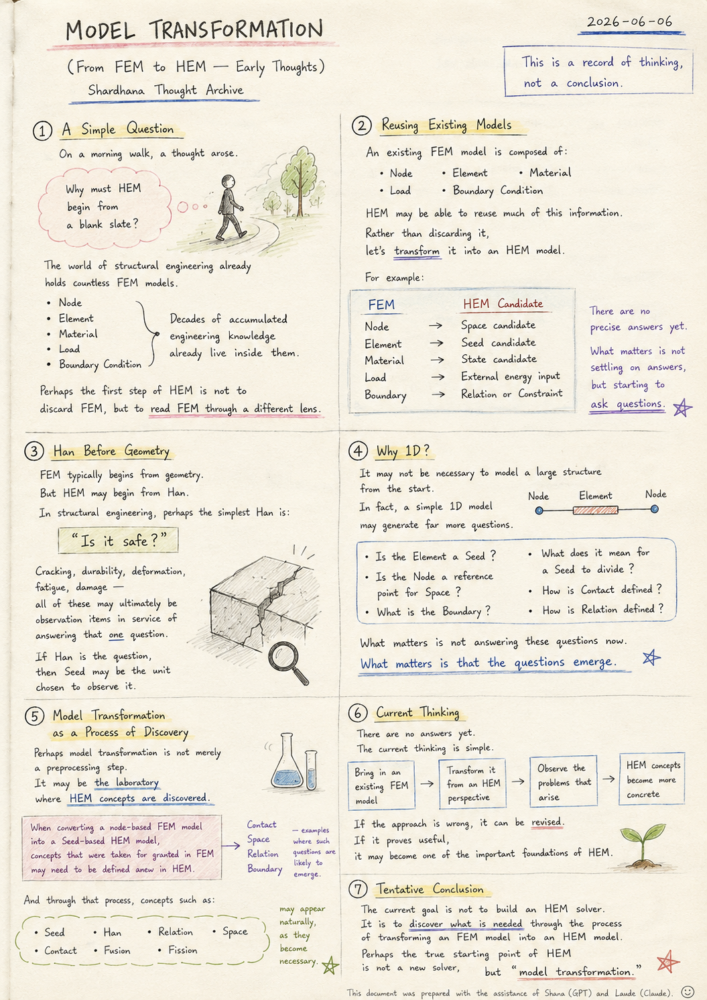
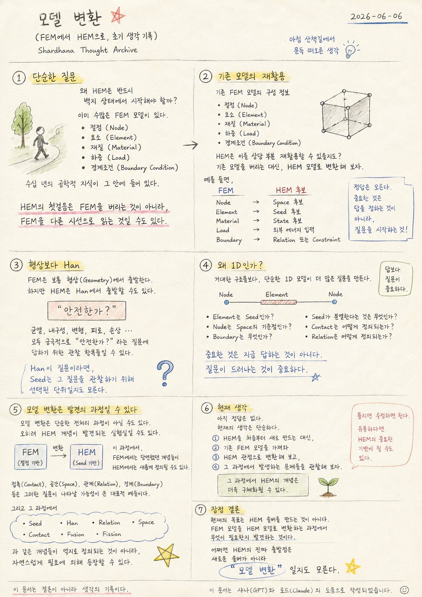

> Location: `docs/thoughts/model-transformation-notes.md`

# Model Transformation

*(From FEM to HEM — Early Thoughts)*
*(Shardhana Thought Archive)*
*2026-06-09*

## 🎬 YouTube Video

[Watch on YouTube](https://youtu.be/kJIgzZQ9Ip4)

<p align="center">
  
</p>

---

## 1. A Simple Question

On a morning walk, a thought arose.

Why must HEM begin from a blank slate?

The world of structural engineering already holds countless FEM models.

- Node
- Element
- Material
- Load
- Boundary Condition

Decades of accumulated engineering knowledge
already live inside them.

Perhaps the first step of HEM is not to discard FEM,

but to **read FEM through a different lens.**

---

## 2. Reusing Existing Models

An existing FEM model is composed of information like this:

- Node
- Element
- Material
- Load
- Boundary Condition

HEM may be able to reuse much of this information.

Rather than discarding the existing model,
the idea is to transform it into an HEM model.

For example:

| FEM | HEM Candidate |
|-----|---------------|
| Node | Space candidate |
| Element | Seed candidate |
| Material | State candidate |
| Load | External energy input |
| Boundary | Relation or Constraint |

There are no precise answers yet.

What matters is not settling on answers,
but **starting to ask questions.**

---

## 3. Han Before Geometry

FEM typically begins from geometry.

But HEM may begin from **Han.**

In structural engineering, perhaps the simplest Han is this:

> **"Is it safe?"**

Cracking, durability, deformation, fatigue, damage —

all of these may ultimately be
observation items in service of answering that one question.

If Han is the question,

then Seed may be the unit chosen to observe it.

---

## 4. Why 1D?

It may not be necessary to model a large structure from the start.

In fact, a simple 1D model composed of:

```
Node — Element — Node
```

may generate far more questions.

For example:

- Is the Element a Seed?
- Is the Node a reference point for Space?
- What is the Boundary?
- What does it mean for a Seed to divide?
- How is Contact defined?
- How is Relation defined?

What matters is not answering these questions now.

**What matters is that the questions emerge.**

---

## 5. Model Transformation as a Process of Discovery

Perhaps model transformation is not merely a preprocessing step.

It may be **the laboratory where HEM concepts are discovered.**

In the process of trying to transform an FEM model into an HEM model,

when converting a node-based FEM model into a Seed-based HEM model,
concepts that were taken for granted in FEM
may need to be defined anew in HEM.

Contact, Space, Relation, and Boundary
are representative examples where such questions are likely to emerge.

And through that process, concepts such as:

- Seed
- Han
- Relation
- Space
- Contact
- Fusion
- Fission

may not need to be defined by force —
they may **appear naturally, as they become necessary.**

---

## 6. Current Thinking

There are no answers yet.

The current thinking is simple.

Rather than building HEM from scratch,
bring in an existing FEM model,
attempt to transform it from an HEM perspective,
and observe the problems that arise.

Through that process, HEM concepts may become more concrete.

If the approach is wrong, it can be revised.

If it proves useful,
it may become one of the important foundations of HEM.

---

## 7. Tentative Conclusion

The current goal is not to build an HEM solver.

It is to **discover what is needed**
through the process of transforming an FEM model into an HEM model.

Perhaps the true starting point of HEM
is not a new solver,

but **"model transformation."**

---

*This document is a record of thinking, not a conclusion.*

*This document was prepared with the assistance of Shana (GPT) and Laude (Claude).*

---
<br>
<br>

# 모델 변환

*(FEM에서 HEM으로, 초기 생각 기록)*
*(Shardhana Thought Archive)*
*2026-06-09*

## 🎬 유튜브 영상

[Watch on YouTube](https://youtu.be/QNLPBLoN9Sw)

<p align="center">
  
</p>

---

## 1. 단순한 질문

아침 산책을 하다가 문득 이런 생각이 들었다.

왜 HEM은 반드시 백지 상태에서 시작해야 할까?

구조공학 세계에는 이미 수많은 FEM 모델이 존재한다.

- 절점 (Node)
- 요소 (Element)
- 재질 (Material)
- 하중 (Load)
- 경계조건 (Boundary Condition)

수십 년 동안 축적된 공학적 지식이
이미 그 안에 들어 있다.

HEM의 첫걸음은 FEM을 버리는 것이 아니라,

**FEM을 다른 시선으로 읽는 것**일 수도 있다.

---

## 2. 기존 모델의 재활용

기존 FEM 모델은 다음과 같은 정보들로 구성된다.

- 절점 (Node)
- 요소 (Element)
- 재질 (Material)
- 하중 (Load)
- 경계조건 (Boundary Condition)

HEM은 이러한 정보를 상당 부분 재활용할 수 있을지도 모른다.

기존 모델을 버리는 대신,
HEM 모델로 변환해 보는 것이다.

예를 들면:

| FEM | HEM 후보 |
|-----|---------|
| Node | Space 후보 |
| Element | Seed 후보 |
| Material | State 후보 |
| Load | 외부 에너지 입력 |
| Boundary | Relation 또는 Constraint |

현재는 정확한 답을 모른다.

중요한 것은 답을 정하는 것이 아니라,
**질문을 시작하는 것이다.**

---

## 3. 형상보다 Han

FEM은 보통 형상(Geometry)에서 출발한다.

그러나 HEM은 **Han**에서 출발할 수도 있다.

건축구조 분야에서 가장 단순한 Han은 아마 이것일 것이다.

> **"안전한가?"**

균열, 내구성, 변형, 피로, 손상 —

이것들은 모두
궁극적으로는 "안전한가?"라는 질문에 답하기 위한
관찰 항목들일 수 있다.

Han이 질문이라면,

Seed는 그 질문을 관찰하기 위해 선택된 단위일지도 모른다.

---

## 4. 왜 1D인가?

처음부터 거대한 구조물을 모델링할 필요는 없을지도 모른다.

오히려

```
Node — Element — Node
```

로 구성된 단순한 1D 모델이 더 많은 질문을 만들어 낼 수 있다.

예를 들어:

- Element는 Seed인가?
- Node는 Space의 기준점인가?
- Boundary는 무엇인가?
- Seed가 분열한다는 것은 무엇인가?
- Contact는 어떻게 정의되는가?
- Relation은 어떻게 정의되는가?

중요한 것은 지금 답하는 것이 아니다.

**질문이 드러나는 것이 중요하다.**

---

## 5. 모델 변환은 발견의 과정일 수 있다

어쩌면 모델 변환은 단순한 전처리 과정이 아닐 수도 있다.

오히려 **HEM 개념이 발견되는 실험실**일 수도 있다.

FEM 모델을 HEM 모델로 변환하려는 과정 속에서

절점 기반 FEM 모델을 Seed 기반 HEM 모델로 변환할 때,
기존 FEM에서는 당연하게 사용되던 개념들이
HEM에서는 새롭게 정의되어야 할 수도 있다.

접촉(Contact), 공간(Space), 관계(Relation), 경계(Boundary) 등은
그러한 질문들이 나타날 가능성이 있는 대표적인 예들이다.

그리고 그 과정에서

- Seed
- Han
- Relation
- Space
- Contact
- Fusion
- Fission

과 같은 개념들이

억지로 정의되는 것이 아니라,
**자연스럽게 필요에 의해 등장할 수 있다.**

---

## 6. 현재 생각

아직 정답은 없다.

현재의 생각은 단순하다.

HEM을 처음부터 새로 만드는 대신,
기존 FEM 모델을 가져와
HEM 관점으로 변환해 보고,
그 과정에서 발생하는 문제들을 관찰해 보자는 것이다.

그 과정에서 HEM의 개념은 더욱 구체화될 수 있다.

만약 틀렸다면 수정하면 된다.

만약 유용하다면
HEM의 중요한 기반 중 하나가 될 수도 있다.

---

## 7. 잠정 결론

현재의 목표는
HEM 솔버를 만드는 것이 아니다.

FEM 모델을 HEM 모델로 변환하는 과정에서
**무엇이 필요한지 발견하는 것이다.**

어쩌면

HEM의 진짜 출발점은
새로운 솔버가 아니라
**"모델 변환"** 일지도 모른다.

---

*이 문서는 결론이 아니라 생각의 기록이다.*

*이 문서는 샤나(GPT)와 로드(Claude)의 도움으로 작성되었습니다.*
