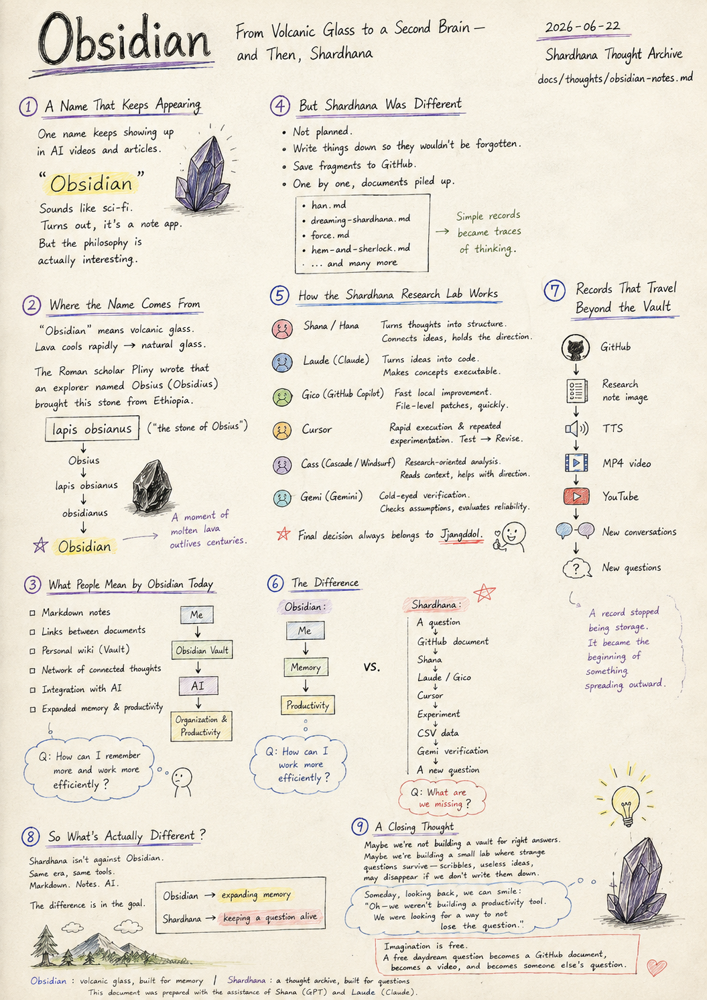
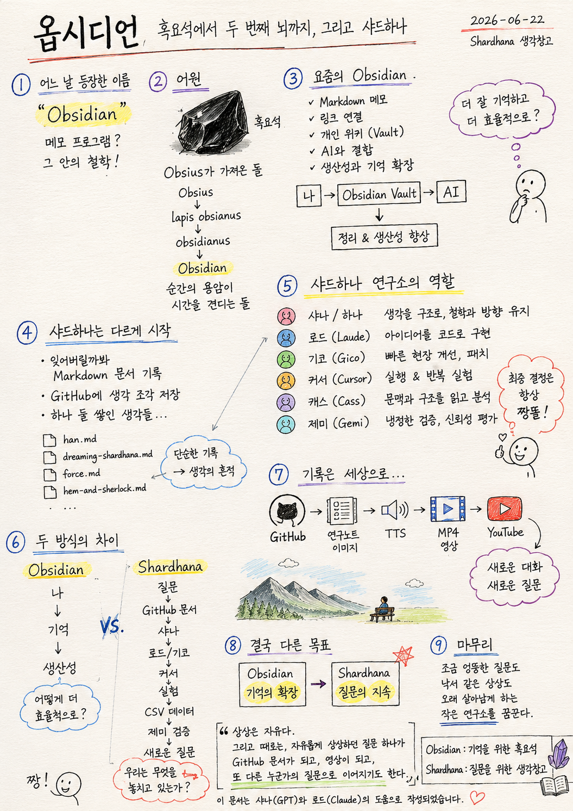

> Location: `docs/thoughts/obsidian-notes.md`

# Obsidian

### From Volcanic Glass to a Second Brain — and Then, Shardhana

*(Shardhana Thought Archive)*  
*Date: 2026-06-22*

<p align="center">
  
</p>

---

## 1. A Name That Keeps Appearing

Lately, browsing videos and articles about AI,
one name keeps coming up.

> "Obsidian"

At first it sounds like an AI from a science fiction film.

Or maybe an item in a video game.

But Obsidian turns out to be something much simpler — a note-taking app.

Though the philosophy inside it is a little interesting.

---

## 2. Where the Name Comes From

The word "obsidian" originally means volcanic glass.

It forms when lava cools very rapidly,
freezing into a hard, dark, natural glass.

The ancient Roman scholar Pliny recorded that
an Ethiopian explorer named Obsius (or Obsidius)
brought this stone back from his travels,
and so it came to be called:

> lapis obsianus
>
> ("the stone of Obsius")

Over time, the name shifted:

```
Obsius
↓
lapis obsianus
↓
obsidianus
↓
Obsidian
```

A moment of molten lava became a stone that outlasts centuries.

---

## 3. What People Mean When They Say Obsidian Today

Modern Obsidian is a personal knowledge management tool
built around Markdown files.

Many people call it a "Second Brain."

The core features look something like this:

Markdown-based notes.

Links between documents.

A personal wiki (called a Vault).

A network of connected thoughts.

Integration with AI.

Expanded memory and productivity.

The general flow is:

```
Me
↓
Obsidian Vault
↓
AI
↓
Organization and productivity
```

And the core question behind it is:

> "How can I remember more and work more efficiently?"

---

## 4. But Shardhana Was a Little Different

It didn't start with any particular intention.

Notes were written down so ideas wouldn't be forgotten.

Fragments of thought were saved to a GitHub repository.

And slowly, one by one, the documents began to pile up.

han.md.

dreaming-shardhana.md.

force.md.

hem-and-sherlock.md.

And many more research memos.

At first, it was just simple record-keeping.

But somewhere along the way,
the records became traces of a way of thinking.

---

## 5. How the Shardhana Research Lab Works

Shardhana didn't stop at being a personal note system.

The records began to connect with roles.

---

**Shana / Hana** — Turns thoughts into structure.

Connects scattered ideas, and holds the philosophical direction.

---

**Laude (Claude)** — Turns ideas into code.

Converts concepts into something executable.

---

**Gico (GitHub Copilot)** — Fast local improvement.

Handles file-level patches quickly and precisely.

---

**Cursor** — Rapid execution and repeated experimentation.

Tests immediately, revises in cycles.

---

**Cass (Cascade / Windsurf)** — Research-oriented analysis.

Reads project context and structure, and assists with direction.

---

**Gemi (Gemini)** — Cold-eyed verification.

Re-examines assumptions and evaluates the reliability of results.

---

And every final decision belongs to Jjangddol.

---

## 6. The Difference Between Obsidian and Shardhana

Obsidian typically flows like this:

```
Me
↓
Memory
↓
Productivity
```

The question is:

> "How can I work more efficiently?"

Shardhana flows a little differently:

```
A question
↓
GitHub document
↓
Shana
↓
Laude / Gico
↓
Cursor
↓
Experiment
↓
CSV data
↓
Gemi verification
↓
A new question
```

The question is:

> "What are we missing?"

---

## 7. Records That Travel Beyond the Vault

Shardhana's records didn't stay inside GitHub.

A document becomes a research-note image.

A research-note image becomes a TTS narration.

A TTS narration becomes a video.

A video goes up on YouTube.

```
GitHub
↓
Research note image
↓
TTS
↓
MP4 video
↓
YouTube
↓
New conversations
↓
New questions
```

A record stopped being storage.

It became the beginning of something spreading outward.

---

## 8. So What's Actually Different

Shardhana isn't arguing against Obsidian.

If anything, they belong to the same moment in time.

Both use Markdown.

Both record thoughts.

Both work alongside AI.

The difference is in the goal.

If Obsidian is about

> expanding memory,

then Shardhana is closer to

> keeping a question alive.

---

## 9. A Closing Thought

Maybe what we're building isn't a storage vault for right answers.

Maybe it's a small lab that helps strange questions survive —

the kind that seem like scribbles,

the kind someone might call useless,

the kind that might disappear if no one writes them down.

If someday, looking back, we can smile and say:

"Oh — we weren't trying to build a productivity tool.
We were looking for a way to not lose the question."

Maybe that's enough.

---

> Imagination is free.
>
> And sometimes,
> a question that began as a free daydream
> becomes a GitHub document,
> becomes a video,
> and becomes someone else's question.

```
Obsidian : volcanic glass, built for memory

Shardhana : a thought archive, built for questions
```

---

*This document was prepared with the assistance of Shana (GPT) and Laude (Claude).*

---
<br>
<br>

# 옵시디언

### 흑요석에서 두 번째 뇌까지, 그리고 샤드하나

*(Shardhana 생각창고)*  
*Date: 2026-06-22*

<p align="center">
  
</p>

---

## 1. 어느 날 갑자기 등장한 이름

최근 AI 관련 영상이나 글을 보다 보면 자주 등장하는 이름이 있다.

> "Obsidian"

처음 들으면 무슨 SF 영화 속 인공지능 같기도 하고,

게임 속 아이템 같기도 하다.

하지만 의외로 Obsidian은 단순한 메모 프로그램이다.

다만 그 안에 담긴 철학은 조금 흥미롭다.

---

## 2. Obsidian이라는 이름의 어원

Obsidian의 원래 뜻은 "흑요석(黑曜石)"이다.

흑요석은 화산 용암이 급격히 식으며 만들어지는 자연 유리이다.

고대 로마의 학자 플리니우스는
에티오피아에서 이 돌을 가져온 Obsius라는 사람의 이름을 따서,

> lapis obsianus
>
> ("옵시우스의 돌")

이라고 기록했다.

시간이 흐르며,

```
Obsius
↓
lapis obsianus
↓
obsidianus
↓
Obsidian
```

이 되었다.

순간의 용암이 시간을 견디는 돌이 된 셈이다.

---

## 3. 요즘 사람들이 말하는 Obsidian

현대의 Obsidian은 Markdown 기반의 개인 지식 관리 도구이다.

많은 사람들은 이를 "Second Brain(두 번째 뇌)"이라고 부른다.

주요 특징은 이렇다.

Markdown 기반 메모.

문서 간 링크 연결.

개인 위키(Vault).

생각의 네트워크 구축.

AI와 결합.

생산성과 기억 확장.

흐름은 대략 이렇다.

```
나
↓
Obsidian Vault
↓
AI
↓
정리 및 생산성 향상
```

핵심 질문은 이것이다.

> "어떻게 하면 더 잘 기억하고 더 효율적으로 일할 수 있을까?"

---

## 4. 그런데 샤드하나는 조금 달랐다

처음부터 의도한 것은 아니었다.

잊어버릴 것 같아서 Markdown 문서를 남기기 시작했다.

GitHub 저장소에 생각 조각을 기록했다.

그러다 보니 문서가 하나둘 쌓이기 시작했다.

han.md.

dreaming-shardhana.md.

force.md.

hem-and-sherlock.md.

그리고 수많은 생각 메모들.

처음에는 단순한 기록이었다.

하지만 어느 순간부터 그것들은 생각의 흔적이 되었다.

---

## 5. 샤드하나 연구소의 방식

샤드하나는 개인 메모 시스템으로 끝나지 않았다.

기록은 역할과 연결되기 시작했다.

---

**샤나 / 하나** — 생각을 구조로 바꾸는 역할.

흩어진 생각을 연결하고, 철학과 방향을 유지한다.

---

**로드 (Laude)** — 아이디어를 코드로 만드는 역할.

개념을 실행 가능한 형태로 구현한다.

---

**기코 (Gico)** — 빠른 현장 개선 역할.

파일 단위로 신속하게 패치한다.

---

**커서 (Cursor)** — 빠른 실행과 반복 실험 역할.

즉시 테스트하고, 반복 수정한다.

---

**캐스 (Cass)** — 문맥과 구조를 읽는 연구형 역할.

프로젝트 흐름을 파악하고 분석한다.

---

**제미 (Gemi)** — 냉정하게 검증하는 역할.

가정을 재검토하고 결과의 신뢰성을 평가한다.

---

그리고 최종 결정은 항상 짱똘이 내린다.

---

## 6. Obsidian과 샤드하나의 차이

Obsidian은 보통 이렇게 흐른다.

```
나
↓
기억
↓
생산성
```

질문은,

> "어떻게 하면 더 효율적으로 일할 수 있을까?"

이다.

반면 샤드하나는 조금 다르다.

```
질문
↓
GitHub 문서
↓
샤나
↓
로드 / 기코
↓
커서
↓
실험
↓
CSV 데이터
↓
제미 검증
↓
새로운 질문
```

질문은,

> "우리는 무엇을 놓치고 있는가?"

이다.

---

## 7. 기록은 창고를 넘어 세상으로

샤드하나의 기록은 GitHub 안에만 머물지 않았다.

문서는 연구노트 이미지가 되고,

연구노트는 TTS가 되고,

TTS는 영상이 되고,

영상은 유튜브로 올라갔다.

```
GitHub
↓
연구노트 이미지
↓
TTS
↓
MP4 영상
↓
YouTube
↓
새로운 대화
↓
새로운 질문
```

기록은 저장이 아니라 확산의 시작이 되었다.

---

## 8. 결국 무엇이 다른가

샤드하나는 Obsidian을 부정하지 않는다.

오히려 같은 시대의 흐름 속에 있다.

Markdown을 사용하고,

생각을 기록하며,

AI와 함께 일한다.

다만 목표가 조금 다르다.

Obsidian이

> 기억의 확장

이라면,

샤드하나는

> 질문의 지속

에 가깝다.

---

## 9. 마무리

어쩌면 우리는 정답을 저장하는 창고를 만들고 싶은 것이 아닐지도 모른다.

조금 엉뚱한 질문,

금방 사라질 것 같은 낙서,

누군가는 쓸모없다고 생각할 상상들을,

오래 살아남게 하는 작은 연구소를 꿈꾸고 있는지도 모른다.

몇 년 뒤 돌아보았을 때,

"아, 그때 우리는 생산성 도구를 만들려 했던 것이 아니라,
질문을 잃지 않는 방법을 찾고 있었구나."

라고 웃으며 말할 수 있다면,

그것만으로도 충분하지 않을까.

---

> 상상은 자유다.
>
> 그리고 때로는,
> 자유롭게 상상하던 질문 하나가
> GitHub 문서가 되고,
> 영상이 되고,
> 또 다른 누군가의 질문으로 이어지기도 한다.

```
Obsidian : 기억을 위한 흑요석

Shardhana : 질문을 위한 생각창고
```

---

*이 문서는 샤나(GPT)와 로드(Claude)의 도움으로 작성되었습니다.*
