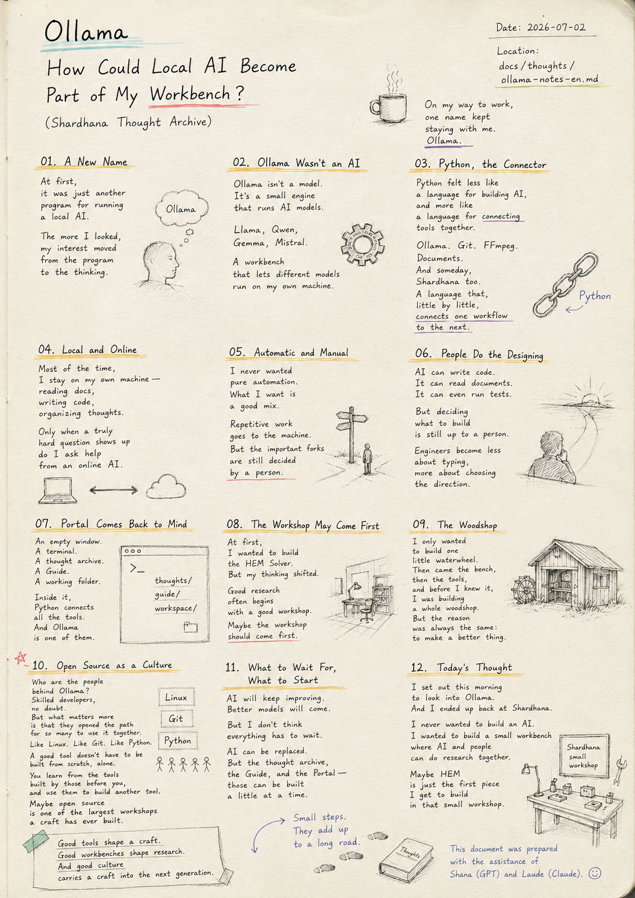
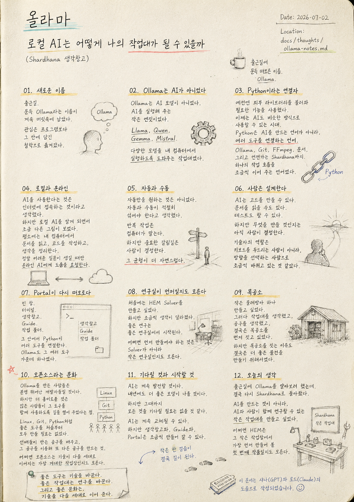

> Location: `docs/thoughts/ollama-notes-en.md`

# Ollama

## How Could Local AI Become Part of My Workbench

*(Shardhana Thought Archive)*
*Date: 2026-07-02*

  

---

# 01. A New Name

On the way to work.

The name Ollama kept sitting in my head.

At first,

I thought of it as just another program

for running a local AI.

But the more I learned about it,

my interest drifted —

away from the program itself,

toward the thinking behind it.

---

# 02. Ollama Wasn't an AI

At first,

I assumed Ollama was an AI.

But looking closer,

Ollama wasn't a model at all.

It was a small engine

that runs AI models.

Llama,

Qwen,

Gemma,

Mistral.

A workbench

that lets different models

run right on my own machine.

---

# 03. Python, the Connector

Then Python came to mind.

I used to think of it

as a way to pull in outside libraries

for whatever function I needed.

Now,

it feels like we're entering an age

where AI can be used the same way.

Python felt less like

a language for building AI,

and more like

a language for connecting tools together.

Python wasn't a stand-in for AI itself.

It felt more like a connector —

something that links AI models and programs together.

Ollama.

Git.

FFmpeg.

Documents.

And someday,

Shardhana too.

A language that,

little by little,

connects one workflow

to the next.

---

# 04. Local and Online

Until now,

using AI meant

connecting to the internet.

But learning about local AI

showed me a slightly different picture.

Most of the time,

everything happens

right on my own machine —

reading documents,

writing code,

organizing thoughts.

Only when a genuinely hard question comes up

do I reach out to an online AI for help.

---

# 05. Automatic and Manual

I never wanted

pure automation to begin with.

What I wanted

was automatic and manual,

mixed in the right proportion.

Repetitive work

goes to the machine.

But the important forks in the road

are still decided by a person.

That balance

felt like the natural one.

---

# 06. People Do the Designing

AI can write code.

It can read documents.

It can even run tests.

But deciding what to build

is still up to a person.

An engineer's role

seems to be shifting —

less about typing on a keyboard,

more about choosing which direction to go.

---

# 07. Portal Comes Back to Mind

Then Portal

came back to mind.

An empty window.

A terminal.

A thought archive.

A Guide.

A working folder.

Inside it,

Python connects all the different tools.

And Ollama

is just one of them.

---

# 08. The Workshop May Come First

At first,

I wanted to build the HEM Solver.

But my thinking shifted, little by little.

Good research

often begins

with a good workshop.

Maybe

what needs to be built first

isn't the Solver —

it's the small workshop itself.

---

# 09. The Woodshop

A small laugh escaped me.

I only wanted

to build one little waterwheel.

Then I started thinking about a workbench,

then about tools,

and before I knew it,

I was building a whole woodshop first.

But the reason for building the woodshop

was always the same —

to make a better thing, eventually.

---

# 10. Open Source as a Culture

Who are the people

behind Ollama?

Skilled developers, no doubt.

But what interests me more

is that they opened a path

for so many others

to use the same tool together.

Like Linux.

Like Git.

Like Python.

A good tool

didn't have to be built from scratch, alone.

You learn

from the tools

built by those before you,

and use them

to build another tool.

Maybe

open source

is one of the largest workshops

a craft has ever built.

---

# 11. What to Wait For, What to Start

AI will keep improving.

Better models

will show up again next year.

But I don't think

everything has to wait until then.

AI can keep getting replaced.

But the thought archive,

the Guide,

and the Portal —

those can be built, a little at a time, starting now.

---

# 12. Today's Thought

I set out this morning

to look into Ollama.

And somehow,

I ended up back at Shardhana.

I never wanted to build an AI.

I wanted to build a small workbench

where AI and people

could do research together.

Maybe

HEM

is just the first piece

I get to build

in that small workshop.

---

*A good tool changes a craft.*

*A good workbench changes research.*

*And a good culture carries a craft into the next generation.*

---

*This document was prepared with the assistance of Shana (GPT) and Laude (Claude).*

---
 
 

# 올라마

## 로컬 AI는 어떻게 나의 작업대가 될 수 있을까

*(Shardhana 생각창고)*  
*Date: 2026-07-02*

  

---

# 01. 새로운 이름

출근길.

문득 Ollama라는 이름이 계속 머릿속에 남았다.

처음에는 단순히

로컬 AI를 실행하는 프로그램 정도로만 생각했다.

하지만 조금씩 알아갈수록

관심은 프로그램보다

그 안에 담긴 철학으로 옮겨갔다.

---

# 02. Ollama는 AI가 아니었다

처음에는

Ollama가 하나의 AI라고 생각했다.

하지만 조금 더 알아보니

Ollama는 AI 모델이 아니었다.

AI를 실행해 주는 작은 엔진이었다.

Llama,

Qwen,

Gemma,

Mistral.

다양한 모델을

내 컴퓨터에서 실행하도록 도와주는 작업대였다.

---

# 03. Python이라는 연결자

그러다 문득

Python이 떠올랐다.

예전에는

외부 라이브러리를 불러와

필요한 기능을 사용했다.

지금은

AI도 비슷한 방식으로

사용할 수 있는 시대가 되어가고 있었다.

Python은

AI를 만드는 언어라기보다,

여러 도구를 연결하는 언어처럼 느껴졌다.

Python은

AI를 대신하는 존재가 아니라,

여러 AI와 프로그램을 연결하는 연결자처럼 느껴졌다.

Ollama,

Git,

FFmpeg,

문서,

그리고 언젠가는

Shardhana까지.

하나의 작업 흐름을

조금씩 이어 주는 언어였다.

---

# 04. 로컬과 온라인

그동안은

AI를 사용한다는 것은

인터넷에 접속하는 것이라고 생각했다.

하지만

로컬 AI를 알게 되면서

조금 다른 그림이 보였다.

평소에는

내 컴퓨터에서

문서를 읽고,

코드를 작성하고,

생각을 정리한다.

정말 어려운 질문이 생길 때만

온라인 AI에게 도움을 요청한다.

---

# 05. 자동과 수동

예전부터

자동만을 원하는 것은 아니었다.

오히려

자동과 수동이

적절히 섞여야 한다고 생각했다.

반복 작업은

컴퓨터가 맡는다.

하지만

중요한 갈림길은

사람이 결정한다.

그 균형이

더 자연스럽게 느껴졌다.

---

# 06. 사람은 설계한다

AI는

코드를 만들 수 있다.

문서를 읽을 수도 있다.

테스트도 할 수 있다.

하지만

무엇을 만들 것인지는

아직 사람이 결정한다.

기술자의 역할은

점점 키보드를 두드리는 사람이 아니라,

방향을 선택하는 사람으로

조금씩 바뀌고 있는 것 같았다.

---

# 07. Portal이 다시 떠오르다

그러다

Portal을 다시 떠올렸다.

빈 창.

터미널.

생각창고.

Guide.

작업 폴더.

그 안에서

Python이 여러 도구를 연결한다.

Ollama도

그 여러 도구 가운데 하나였다.

---

# 08. 연구실이 먼저일지도 모른다

처음에는

HEM Solver를 만들고 싶었다.

하지만

조금씩 생각이 달라졌다.

좋은 연구는

좋은 연구실에서 시작된다.

어쩌면

먼저 만들어야 하는 것은

Solver가 아니라

작은 연구실인지도 모른다.

---

# 09. 목공소

문득

웃음이 나왔다.

처음에는

작은 물레방아 하나 만들고 싶었다.

그러다

작업대를 생각했고,

공구를 생각했고,

결국은

목공소를 먼저 짓고 있었다.

하지만

목공소를 짓는 이유도

결국은

더 좋은 물건을 만들기 위해서였다.

---

# 10. 오픈소스라는 문화

Ollama를 만든 사람들은

어떤 사람들일까.

분명 뛰어난 개발자들일 것이다.

하지만

조금 더 흥미로운 것은

많은 사람들이

그 도구를 함께 사용하도록

길을 열어 주었다는 점이었다.

Linux,

Git,

Python처럼

좋은 도구를

직접 처음부터 모두 만들 필요는 없었다.

선배들이 만든 공구를 배우고,

그 공구를 이용해

또 다른 공구를 만드는 것.

어쩌면

오픈소스는

기술이 다음 세대로 이어지는

가장 거대한 작업장인지도 모른다.

---

# 11. 기다릴 것과 시작할 것

AI는

계속 발전할 것이다.

내년에도

더 좋은 모델이 나올 것이다.

하지만

그때까지

모든 것을 기다릴 필요는 없을 것 같다.

AI는

계속 교체될 수 있다.

하지만

생각창고와,

Guide와,

Portal은

조금씩 만들어 갈 수 있다.

---

# 12. 오늘의 생각

출근길에

Ollama를 알아보려 했는데,

결국 다시

Shardhana로 돌아왔다.

AI를 만드는 것이 아니라,

AI와 사람이 함께 연구할 수 있는

작은 작업대를 만들고 싶었다.

어쩌면

HEM은

그 작은 작업장에서

가장 먼저 만들어 볼

첫 번째 작품일지도 모른다.

---

*좋은 도구는 기술을 바꾼다.*

*좋은 작업대는 연구를 바꾼다.*

*그리고 좋은 문화는, 기술을 다음 세대로 이어 준다.*

---

*이 문서는 샤나(GPT)와 로드(Claude)의 도움으로 작성되었습니다.*
