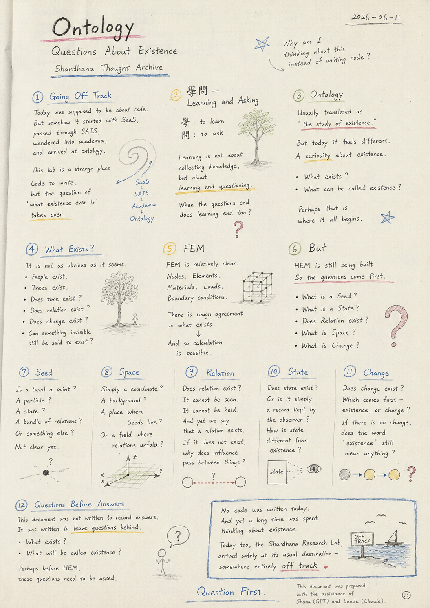
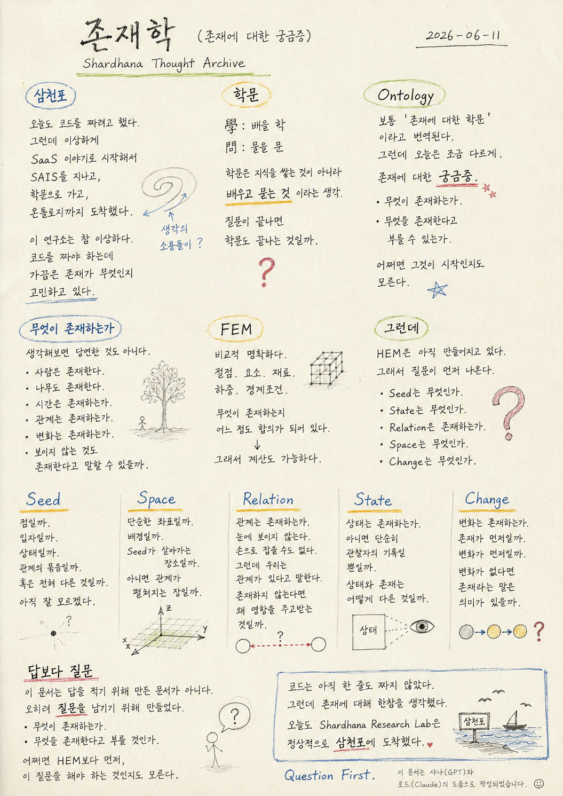

> Location: `docs/thoughts/ontology-notes.md`

# Ontology

*(Questions About Existence)*
*(Shardhana Thought Archive)*
*2026-06-11*

  

---

## Going Off Track

Today was supposed to involve writing code.

But somehow it started with SaaS,

passed through SAIS,

wandered into academia,

and arrived at ontology.

Come to think of it, this research lab is a strange place.

Code needs to be written,

and yet sometimes the question of what existence even is takes over.

---

## 學問 — Learning and Asking

The word for "learning" in Korean and Chinese characters was worth a second look.

學. The character for *to learn*.

問. The character for *to ask*.

It began to feel like learning is not about accumulating knowledge,

but about **learning and questioning.**

When the questions end,

does learning end too?

---

## Ontology

Ontology is usually translated as

**the study of existence.**

But today it felt a little different.

A *curiosity* about existence.

What exists?

What can be called existence?

Perhaps that is where it all begins.

---

## What Exists?

It is not as obvious as it seems.

People exist.

Trees exist.

But does time exist?

Does relation exist?

Does change exist?

Can something invisible still be said to exist?

---

## FEM

FEM is relatively clear.

Nodes. Elements. Materials. Loads. Boundary conditions.

There is rough agreement on what exists.

And so calculation is possible.

---

## But

HEM is still being built.

So the questions come first.

What is a Seed?

What is a State?

Does Relation exist?

What is Space?

What is Change?

---

## Seed

Is a Seed a point?

A particle?

A state?

A bundle of relations?

Or something else entirely?

It is not clear yet.

---

## Space

Is Space simply a coordinate?

A background?

A place where Seeds live?

Or a field where relations unfold?

Space may not be as simple as it first appears.

---

## Relation

Does relation exist?

It cannot be seen.

It cannot be held.

And yet we say that a relation exists.

If it does not exist,

why does influence pass between things?

---

## State

Does state exist?

Or is it simply a record kept by the observer?

How is state different from existence?

---

## Change

Does change exist?

Which comes first — existence, or change?

If there is no change,

does the word *existence* still mean anything?

---

## Questions Before Answers

This document was not written to record answers.

It was written to **leave questions behind.**

What exists?

What will be called existence?

Perhaps before HEM,

these questions need to be asked.

---

No code was written today.

And yet a long time was spent thinking about existence.

Today too, the Shardhana Research Lab

arrived safely at its usual destination — somewhere entirely off track.

---

*Question First.*

*This document was prepared with the assistance of Shana (GPT) and Laude (Claude).*

---
 
 

# 존재학

*(존재에 대한 궁금증)*
*(Shardhana Thought Archive)*
*2026-06-11*

  

---

## 삼천포

오늘도 코드를 짜려고 했다.

그런데 이상하게 SaaS 이야기로 시작해서

SAIS를 지나고,

학문으로 가고,

온톨로지까지 도착했다.

생각해보면 이 연구소는 참 이상하다.

코드를 짜야 하는데

가끔은 존재가 무엇인지 고민하고 있다.

---

## 학문

학문이라는 단어를 다시 보게 되었다.

學. 배울 학.

問. 물을 문.

학문은 지식을 쌓는 것이 아니라

**배우고 묻는 것**이라는 생각이 들었다.

질문이 끝나면

학문도 끝나는 것일까.

---

## Ontology

Ontology는 보통

**존재에 대한 학문**

이라고 번역된다.

그런데 오늘은 조금 다르게 느껴졌다.

존재에 대한 **궁금증**.

무엇이 존재하는가.

무엇을 존재한다고 부를 수 있는가.

어쩌면 그것이 시작인지도 모른다.

---

## 무엇이 존재하는가

생각해보면 당연한 것도 아니다.

사람은 존재한다.

나무도 존재한다.

그렇다면 시간은 존재하는가.

관계는 존재하는가.

변화는 존재하는가.

보이지 않는 것도 존재한다고 말할 수 있을까.

---

## FEM

FEM은 비교적 명확하다.

절점. 요소. 재료. 하중. 경계조건.

무엇이 존재하는지 어느 정도 합의가 되어 있다.

그래서 계산도 가능하다.

---

## 그런데

HEM은 아직 만들어지고 있다.

그래서 질문이 먼저 나온다.

Seed는 무엇인가.

State는 무엇인가.

Relation은 존재하는가.

Space는 무엇인가.

Change는 무엇인가.

---

## Seed

Seed는 점일까.

입자일까.

상태일까.

관계의 묶음일까.

혹은 전혀 다른 것일까.

아직 잘 모르겠다.

---

## Space

Space는 단순한 좌표일까.

배경일까.

Seed가 살아가는 장소일까.

아니면 관계가 펼쳐지는 장일까.

공간이라는 것이 생각보다 단순하지 않을 수도 있다.

---

## Relation

관계는 존재하는가.

눈에 보이지 않는다.

손으로 잡을 수도 없다.

그런데 우리는 관계가 있다고 말한다.

존재하지 않는다면

왜 영향을 주고받는 것일까.

---

## State

상태는 존재하는가.

아니면 단순히 관찰자의 기록일 뿐일까.

상태와 존재는 어떻게 다른 것일까.

---

## Change

변화는 존재하는가.

존재가 먼저일까.

변화가 먼저일까.

변화가 없다면

존재라는 말은 의미가 있을까.

---

## 답보다 질문

이 문서는 답을 적기 위해 만든 문서가 아니다.

오히려 **질문을 남기기 위해** 만들었다.

무엇이 존재하는가.

무엇을 존재한다고 부를 것인가.

어쩌면 HEM보다 먼저,

이 질문을 해야 하는 것인지도 모른다.

---

코드는 아직 한 줄도 짜지 않았다.

그런데 존재에 대해 한참을 생각했다.

오늘도 Shardhana Research Lab은

정상적으로 삼천포에 도착했다.

---

*Question First.*

*이 문서는 샤나(GPT)와 로드(Claude)의 도움으로 작성되었습니다.*
