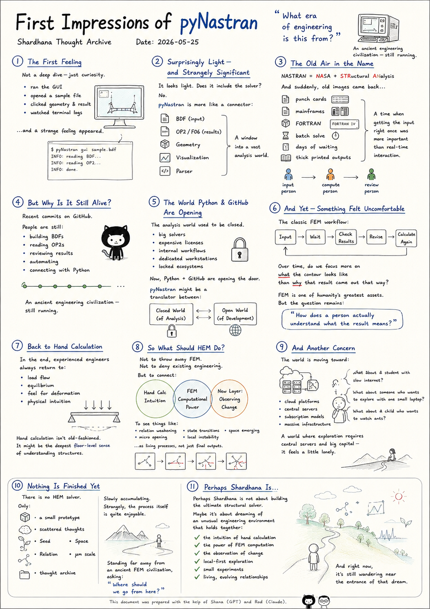
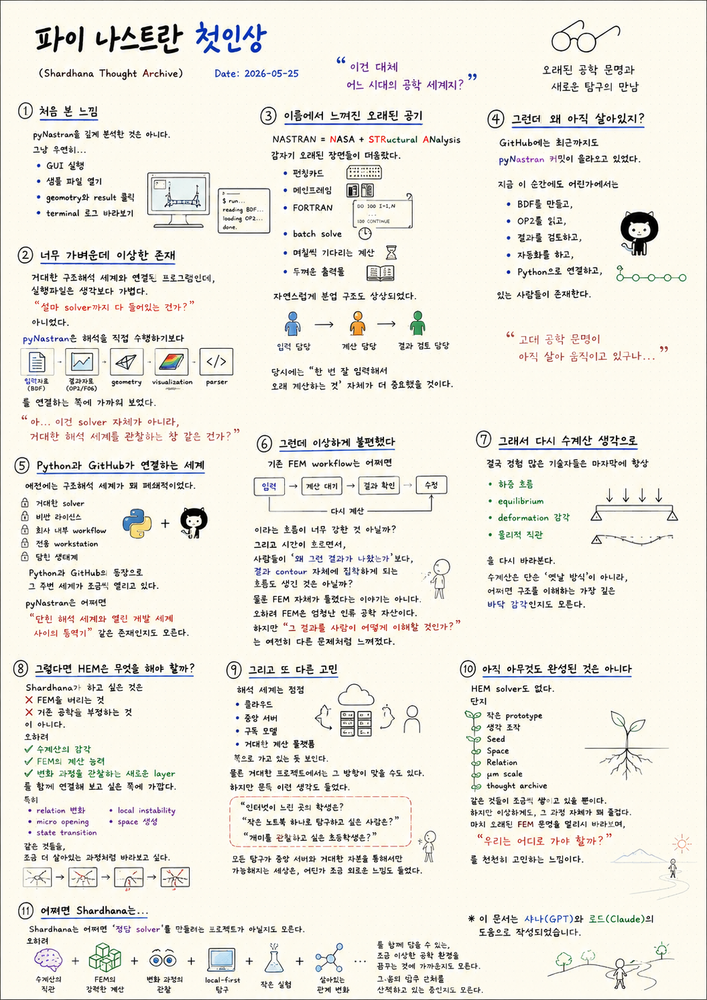

> Location: `docs/thoughts/pynastran-first-impression-notes.md`

> Reference:
> pyNastran GitHub repository — a small window into the long-running world of Nastran-based structural analysis.
<br>
https://github.com/SteveDoyle2/pyNastran

# First Impressions of pyNastran

*(Shardhana Thought Archive)*  
*Date: 2026-05-25*

<p align="center">
  
</p>
---

## 1. The First Feeling

To be honest — this wasn't a deep analysis of pyNastran.

It was more like stumbling into it:

- Running the GUI out of curiosity,
- Opening a sample file,
- Clicking through geometry and result views,
- Watching terminal logs scroll by,

and then, somewhere in the middle of that,
a strange feeling arrived.

> *"What era of engineering is this from?"*

---

## 2. Surprisingly Light — and Strangely Significant

The first surprise was how lightweight it felt.

A tool connected to the enormous world of structural analysis —
and yet the application itself was smaller than expected.

The first thought was:

> *"Does this actually contain the solver too?"*

A little exploration answered that — no, it doesn't.

pyNastran isn't really about running analysis.
It's more about connecting things:

- Input data (BDF)
- Result data (OP2 / F06)
- Geometry
- Visualization
- Parsing

And then a different thought arrived:

> *"Ah — this isn't the solver itself.  
> This is more like a window  
> for looking into a vast analysis world."*

---

## 3. The Old Air in the Name

At first, NASTRAN just looked like a strange word.

Then it clicked:

> **NASA** + **STR**uctural **AN**alysis

And suddenly, a set of old images started surfacing.

- Punch cards
- Mainframes
- FORTRAN
- Batch solves
- Calculations that ran for days
- Thick stacks of printed output

And along with those images,
a kind of organizational structure also appeared:

- Someone in charge of input
- Someone in charge of running the calculation
- Someone in charge of reviewing results

Back then, real-time GUI probably wasn't the point.
What mattered was:  
*getting the input right the first time,*  
*and waiting patiently for the answer.*

---

## 4. But Why Is It Still Alive?

The stranger thing was this:  
the world hadn't died.

Recent commits were still showing up on the pyNastran GitHub.

Which meant that right now, somewhere in the world, people are:

- Building BDF files,
- Reading OP2 outputs,
- Reviewing results,
- Automating workflows,
- Connecting it all through Python.

And that produced a strange, quiet feeling.

> *"An ancient engineering civilization —  
> still running."*

---

## 5. The World That Python and GitHub Are Opening

The structural analysis world used to feel fairly closed.

- Massive solvers
- Expensive licenses
- Internal company workflows
- Dedicated workstations
- Locked ecosystems

But with Python and GitHub in the picture,
that world has been slowly cracking open.

Tools like pyNastran might be something like:

> *"A translator between the closed world of analysis  
> and the open world of development."*

---

## 6. And Yet — Something Felt Uncomfortable

But alongside that, a quiet discomfort also appeared.

The classic FEM workflow has a strong pull to it:

```text
Input
→ Wait for calculation
→ Check results
→ Revise
→ Calculate again
```

And over time — is it possible that engineers started focusing more on
*what the contour plot looks like*
than on
*why that result came out that way?*

This isn't an argument that FEM is wrong.

FEM is one of humanity's greatest engineering achievements.

But the question of:

> *"How does a person actually understand what the result means?"*

still feels like a separate problem —
one that hasn't been fully answered.

---

## 7. And So — Back to Hand Calculation

The thought drifted back to something older.

Experienced engineers, in the end, always return to:

- Load flow
- Equilibrium
- A feel for deformation
- Physical intuition

Hand calculation isn't just an "old way of doing things."

It might be the deepest floor-level sense
of what it means to understand a structure.

---

## 8. So What Should HEM Do?

From there, the thinking connected back to HEM.

What Shardhana wants to do is not:

- Throw away FEM
- Deny the value of existing engineering

It's closer to:

- Keeping the intuition of hand calculation
- Keeping the computational power of FEM
- Adding a new layer for *observing the process of change*

Particularly things like:

- Relation weakening
- Micro opening
- State transitions
- Local instability
- Space emerging

— seen not as static outputs,
but as living processes unfolding over time.

---

## 9. And Another Concern

In the middle of all this, another concern surfaced.

The analysis world seems to be moving toward:

- Cloud platforms
- Central servers
- Subscription models
- Massive computational infrastructure

For large projects, that direction probably makes sense.

But then these questions arrived, uninvited:

> *"What about a student with a slow internet connection?"*
>
> *"What about someone who just wants to explore with one small laptop?"*
>
> *"What about a child who wants to watch ants?"*

A world where all exploration requires  
central servers and large capital —  
feels a little lonely, somehow.

---

## 10. Nothing Is Finished Yet

To be clear — nothing is finished.

There is no HEM solver.

Only:

- A small prototype
- Scattered thoughts
- Seed
- Space
- Relation
- μm scale
- A thought archive

slowly accumulating.

And yet, strangely —  
the process itself is quite enjoyable.

It feels like standing far away from an ancient FEM civilization,
watching it quietly,
and asking:

> *"Where should we go from here?"*

---

## 11. Perhaps Shardhana Is…

Shardhana may not be a project to build  
the definitive structural solver.

It might be closer to dreaming of  
a slightly unusual engineering environment —  
one that holds together:

- The intuition of hand calculation
- The power of FEM computation
- The observation of change as it happens
- Local-first exploration
- Small experiments
- Living, evolving relationships

And right now,  
it's still wandering near the entrance of that dream.

---

*This document was prepared with the assistance of Shana (GPT) and Laude (Claude).*

---
<br>
<br>

# 파이나스트란 첫인상

*(Shardhana Thought Archive)*  
*Date: 2026-05-25*

<p align="center">
  
</p>

---

## 1. 처음 본 느낌

사실 pyNastran을 깊게 분석한 것은 아니다.

그냥 우연히:

- GUI를 실행해 보고,
- 샘플 파일을 열어 보고,
- geometry와 result를 눌러 보고,
- terminal 로그를 바라보다가,

문득 이상한 기분이 들었다.

> "이건 대체 어느 시대의 공학 세계지?"

---

## 2. 너무 가벼운데 이상한 존재

처음에는 조금 놀랐다.

거대한 구조해석 세계와 연결되어 있는 프로그램인데,
실행파일은 생각보다 가볍다.

처음에는:

> "설마 solver까지 다 들어있는 건가?"

싶었는데,
조금 살펴보니 아니었다.

pyNastran은 해석을 직접 수행하기보다:

- 입력자료(BDF)
- 결과자료(OP2/F06)
- geometry
- visualization
- parser

를 연결하는 쪽에 가까워 보였다.

그 순간 또 다른 생각이 들었다.

> "아… 이건 solver 자체가 아니라,  
> 거대한 해석 세계를 관찰하는 창 같은 건가?"

---

## 3. 이름에서 느껴진 오래된 공기

NASTRAN이라는 이름도 처음에는 그냥 이상한 단어처럼 보였다.

그런데 알고 보니:

> NASA + STRuctural ANalysis

였다.

갑자기 머릿속에 오래된 장면들이 떠오르기 시작했다.

- 펀칭카드
- 메인프레임
- FORTRAN
- batch solve
- 며칠씩 기다리는 계산
- 두꺼운 출력물

그리고 자연스럽게:

- 입력 담당
- 계산 담당
- 결과 검토 담당

같은 분업 구조도 상상되었다.

아마 당시에는:  
실시간 GUI보다,  
"한 번 잘 입력해서 오래 계산하는 것"  
자체가 더 중요했을 것이다.

---

## 4. 그런데 왜 아직 살아있지?

더 이상한 건,
이 세계가 아직 죽지 않았다는 점이었다.

GitHub에는 최근까지도 pyNastran 커밋이 올라오고 있었다.

즉 지금 이 순간에도 어딘가에서는:

- BDF를 만들고,
- OP2를 읽고,
- 결과를 검토하고,
- 자동화를 하고,
- Python으로 연결하고,

있는 사람들이 존재한다는 뜻이다.

이상하게도 여기서 묘한 감정을 느꼈다.

> "고대 공학 문명이 아직 살아 움직이고 있구나…"

---

## 5. Python과 GitHub가 연결하는 세계

예전에는 이런 구조해석 세계가 꽤 폐쇄적으로 느껴졌다.

- 거대한 solver
- 비싼 라이선스
- 회사 내부 workflow
- 전용 workstation
- 닫힌 생태계

그런데 Python과 GitHub가 등장하면서,
그 주변 세계가 조금씩 열리고 있는 느낌을 받았다.

pyNastran 같은 도구는 어쩌면:

> "닫힌 해석 세계와 열린 개발 세계 사이의 통역기"

같은 존재인지도 모른다.

---

## 6. 그런데 이상하게 불편했다

하지만 동시에 조금 이상한 불편함도 느껴졌다.

기존 FEM workflow는 어쩌면:

```text
입력
→ 계산 대기
→ 결과 확인
→ 수정
→ 다시 계산
```

이라는 흐름이 너무 강한 것 아닐까?

그리고 시간이 흐르면서,
사람들이 "왜 그런 결과가 나왔는가"보다,
결과 contour 자체에 집착하게 되는 흐름도 생긴 것은 아닐까?

물론 FEM 자체가 틀렸다는 이야기는 아니다.

오히려 FEM은 엄청난 인류 공학 자산이다.

하지만:

> "그 결과를 사람이 어떻게 이해할 것인가?"

는 여전히 다른 문제처럼 느껴졌다.

---

## 7. 그래서 다시 수계산 생각으로 돌아갔다

생각은 다시 오래된 수계산 감각으로 돌아갔다.

결국 경험 많은 기술자들은 마지막에 항상:

- 하중 흐름
- equilibrium
- deformation 감각
- 물리적 직관

을 다시 바라본다.

수계산은 단순 "옛날 방식"이 아니라,
어쩌면 구조를 이해하는 가장 깊은 바닥 감각인지도 모른다.

---

## 8. 그렇다면 HEM은 무엇을 해야 할까?

여기서 다시 HEM 생각으로 이어졌다.

Shardhana가 하고 싶은 것은:

- FEM을 버리는 것
- 기존 공학을 부정하는 것

이 아니다.

오히려:

- 수계산의 감각
- FEM의 계산 능력
- 변화 과정을 관찰하는 새로운 layer

를 함께 연결해 보고 싶은 쪽에 가깝다.

특히:

- relation 변화
- micro opening
- state transition
- local instability
- space 생성

같은 것들을,
조금 더 살아있는 과정처럼 바라보고 싶다.

---

## 9. 그리고 또 다른 고민

그 와중에 또 다른 고민도 생겼다.

해석 세계는 점점:

- 클라우드
- 중앙 서버
- 구독 모델
- 거대한 계산 플랫폼

쪽으로 가고 있는 듯 보인다.

물론 거대한 프로젝트에서는 그 방향이 맞을 수도 있다.

하지만 문득 이런 생각도 들었다.

> "인터넷이 느린 곳의 학생은?"
>
> "작은 노트북 하나로 탐구하고 싶은 사람은?"
>
> "개미를 관찰하고 싶은 초등학생은?"

모든 탐구가 중앙 서버와 거대한 자본을 통해서만 가능해지는 세상은,
어딘가 조금 외로운 느낌도 들었다.

---

## 10. 아직 아무것도 완성된 것은 아니다

사실 지금은 아직 아무것도 완성되지 않았다.

HEM solver도 없다.

단지:

- 작은 prototype
- 생각 조각
- Seed
- Space
- Relation
- μm scale
- thought archive

같은 것들이 조금씩 쌓이고 있을 뿐이다.

하지만 이상하게도,
그 과정 자체가 꽤 즐겁다.

마치 오래된 FEM 문명을 멀리서 바라보며:

> "우리는 어디로 가야 할까?"

를 천천히 고민하는 느낌이다.

---

## 11. 어쩌면 Shardhana는…

Shardhana는 어쩌면
"정답 solver"를 만들려는 프로젝트가 아닐지도 모른다.

오히려:

- 수계산의 직관
- FEM의 강력한 계산
- 변화 과정의 관찰
- local-first 탐구
- 작은 실험
- 살아있는 관계 변화

를 함께 담을 수 있는,
조금 이상한 공학 환경을 꿈꾸는 것에 가까운지도 모른다.

그리고 지금은 아직,
그 꿈의 입구 근처를 산책하고 있는 중인지도 모른다.

---

*이 문서는 샤나(GPT)와 로드(Claude)의 도움으로 작성되었습니다.*
