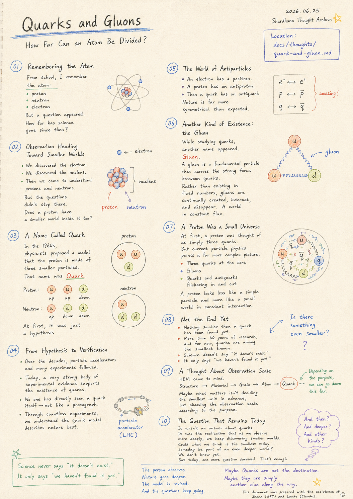
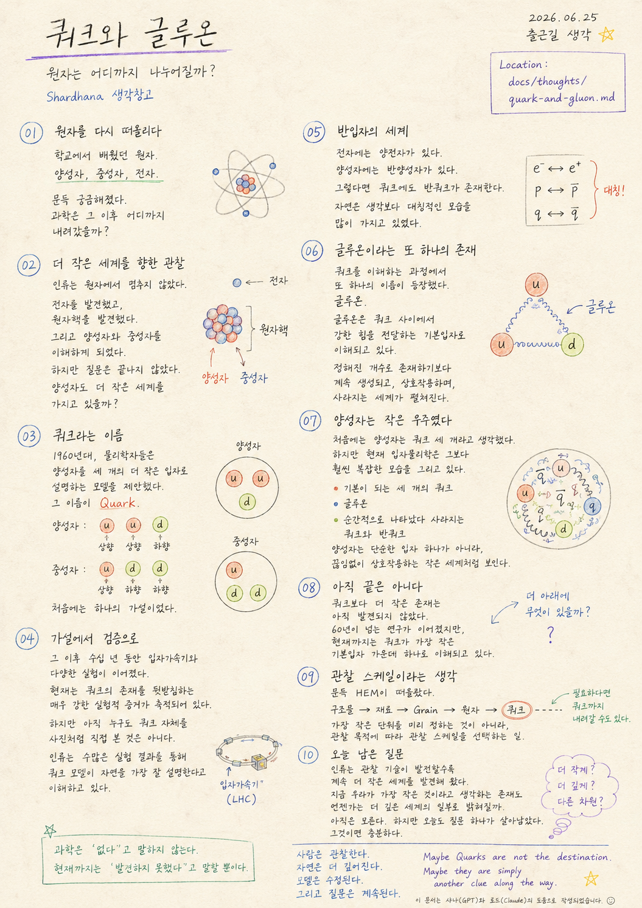

> Location: `docs/thoughts/quark-and-gluon.md`

# Quarks and Gluons

### How Far Can an Atom Be Divided?

*(Shardhana Thought Archive)*  
*Date: 2026-06-25*

  

---

## 01. Remembering the Atom

Today's commute to work began

with a memory from school —

the atom.

---

An atom is made of

a proton,

a neutron,

and electrons.

---

For a long time,

that's how it stayed in memory.

---

But then a question appeared.

How far down has science gone

since then?

---

## 02. Observation Heading Toward Smaller Worlds

Humanity didn't stop at the atom.

---

The electron was discovered.

The nucleus was discovered.

---

And gradually,

protons and neutrons came to be understood.

---

But the questions didn't stop there.

---

Does a proton

have a smaller world inside it too?

---

## 03. A Name Called Quark

In the 1960s,

physicists proposed a model

that described the proton as being made of three smaller particles.

---

That name was

Quark.

---

A proton:

two up quarks

and one down quark.

---

A neutron:

one up quark

and two down quarks.

---

At first,

it was just a hypothesis.

---

## 04. From Hypothesis to Verification

Over the following decades,

particle accelerators and a wide range of experiments followed.

---

Today,

a very strong body of experimental evidence

supports the existence of quarks.

---

And yet

no one has directly seen a quark itself —

not the way you'd take a photograph.

---

Through an enormous accumulation of experimental results,

humanity has come to understand

that the quark model describes nature most accurately.

---

## 05. The World of Antiparticles

An electron has a positron.

---

A proton has an antiproton.

---

And so

a quark has an antiquark.

---

Nature turned out to be

far more symmetrical

than expected.

---

## 06. Another Kind of Existence: the Gluon

While working to understand quarks,

another name appeared.

---

Gluon.

---

A gluon is understood as a fundamental particle

that carries the strong force between quarks.

---

Rather than existing in fixed numbers,

gluons are continuously created,

interact,

and disappear.

---

A world in constant flux.

---

## 07. A Proton Was a Small Universe

At first,

a proton was thought of as

simply three quarks.

---

But current particle physics

paints a far more complex picture.

---

Three quarks at the core.

---

Gluons.

---

Quarks and antiquarks

flickering in and out of existence.

---

A proton looks less like a simple particle

and more like a small world

in constant interaction.

---

## 08. Not the End Yet

What's interesting is that

nothing smaller than a quark

has been found yet.

---

More than sixty years of research have followed,

and for now,

quarks are understood as among the smallest fundamental particles known.

---

But science doesn't say "it doesn't exist."

---

It only says "we haven't found it yet."

---

## 09. A Thought About Observation Scale

And then HEM came to mind.

---

Observing a structure,

then looking at the material,

---

then the grain,

---

then the atom,

---

and if needed,

going all the way down to quarks.

---

Maybe what matters

isn't deciding in advance what the smallest unit is,

but choosing the observation scale

according to the purpose of the observation.

---

## 10. The Question That Remains Today

What today produced

was not a correct answer about quarks.

---

It was something else —

the realization that as observation technology advances,

humanity keeps discovering smaller and smaller worlds.

---

And one question was left behind.

---

Could what we now think of

as the smallest thing

someday turn out to be

part of an even deeper world?

---

We don't know yet.

---

But today, one more question survived.

That's enough.

---

*The person observes.*

*Nature goes deeper.*

*The model is revised.*

*And the questions keep going.*

---

*Maybe Quarks are not the destination.*

*Maybe they are simply another clue along the way.*

---

*This document was prepared with the assistance of Shana (GPT) and Laude (Claude).*

---
 
 

# 쿼크와 글루온

### 원자는 어디까지 나누어질까?

*(Shardhana 생각창고)*  
*Date: 2026-06-25*

  

---

## 01. 원자를 다시 떠올리다

오늘 출근길은

학교에서 배웠던 원자를 다시 떠올리는 것으로 시작했다.

---

원자는

양성자,

중성자,

전자.

---

오랫동안

원자는 그렇게 기억 속에 남아 있었다.

---

하지만 문득 궁금해졌다.

과학은 그 이후

어디까지 내려갔을까.

---

## 02. 더 작은 세계를 향한 관찰

인류는

원자에서 멈추지 않았다.

---

전자를 발견했고,

원자핵을 발견했다.

---

그리고

양성자와 중성자를 이해하게 되었다.

---

하지만 질문은 끝나지 않았다.

---

양성자도

더 작은 세계를 가지고 있을까.

---

## 03. 쿼크라는 이름

1960년대,

물리학자들은

양성자를 세 개의 더 작은 입자로 설명하는 모델을 제안했다.

---

그 이름이

Quark.

---

양성자는

상향쿼크 두 개와

하향쿼크 한 개.

---

중성자는

상향쿼크 한 개와

하향쿼크 두 개.

---

처음에는

하나의 가설이었다.

---

## 04. 가설에서 검증으로

그 이후

수십 년 동안

입자가속기와 다양한 실험이 이어졌다.

---

현재는

쿼크의 존재를 뒷받침하는

매우 강한 실험적 증거가 축적되어 있다.

---

하지만

아직 누구도

쿼크 자체를 사진처럼 직접 본 것은 아니다.

---

인류는

수많은 실험 결과를 통해

쿼크 모델이 자연을 가장 잘 설명한다고 이해하고 있다.

---

## 05. 반입자의 세계

전자에는

양전자가 있다.

---

양성자에는

반양성자가 있다.

---

그렇다면

쿼크에도

반쿼크가 존재한다.

---

자연은

생각보다

대칭적인 모습을 많이 가지고 있었다.

---

## 06. 글루온이라는 또 하나의 존재

쿼크를 이해하는 과정에서

또 하나의 이름이 등장했다.

---

글루온.

---

글루온은

쿼크 사이에서

강한 힘을 전달하는 기본입자로 이해되고 있다.

---

정해진 개수로 존재하기보다

계속 생성되고,

상호작용하며,

사라지는 세계가 펼쳐진다.

---

## 07. 양성자는 작은 우주였다

처음에는

양성자는

쿼크 세 개라고 생각했다.

---

하지만

현재 입자물리학은

그보다 훨씬 복잡한 모습을 그리고 있다.

---

기본이 되는 세 개의 쿼크.

---

그리고

글루온.

---

순간적으로 나타났다 사라지는

쿼크와 반쿼크.

---

양성자는

단순한 입자 하나가 아니라,

끊임없이 상호작용하는

작은 세계처럼 보인다.

---

## 08. 아직 끝은 아니다

흥미로운 점은

쿼크보다 더 작은 존재는

아직 발견되지 않았다는 사실이다.

---

60년이 넘는 연구가 이어졌지만,

현재까지는

쿼크가 가장 작은 기본입자 가운데 하나로 이해되고 있다.

---

하지만

과학은

'없다'고 말하지 않는다.

---

현재까지는

'발견하지 못했다'고 말할 뿐이다.

---

## 09. 관찰 스케일이라는 생각

문득

HEM이 떠올랐다.

---

구조물을 관찰하다가

재료를 보고,

---

Grain을 보고,

---

원자를 보고,

---

필요하다면

쿼크까지 내려갈 수도 있다.

---

중요한 것은

가장 작은 단위를 미리 정하는 것이 아니라,

관찰 목적에 따라

관찰 스케일을 선택하는 일인지도 모른다.

---

## 10. 오늘 남은 질문

오늘 얻은 것은

쿼크에 대한 정답이 아니었다.

---

오히려

인류는 관찰 기술이 발전할수록

계속 더 작은 세계를 발견해 왔다는 사실이었다.

---

그리고

문득 이런 질문이 남았다.

---

지금 우리가

가장 작은 것이라고 생각하는 존재도

언젠가는

더 깊은 세계의 일부로 밝혀질까.

---

아직은 모른다.

---

하지만

오늘도 질문 하나가 살아남았다.

그것이면 충분하다.

---

*사람은 관찰한다.*

*자연은 더 깊어진다.*

*모델은 수정된다.*

*그리고 질문은 계속된다.*

---

*Maybe Quarks are not the destination.*

*Maybe they are simply another clue along the way.*

---

*이 문서는 샤나(GPT)와 로드(Claude)의 도움으로 작성되었습니다.*
