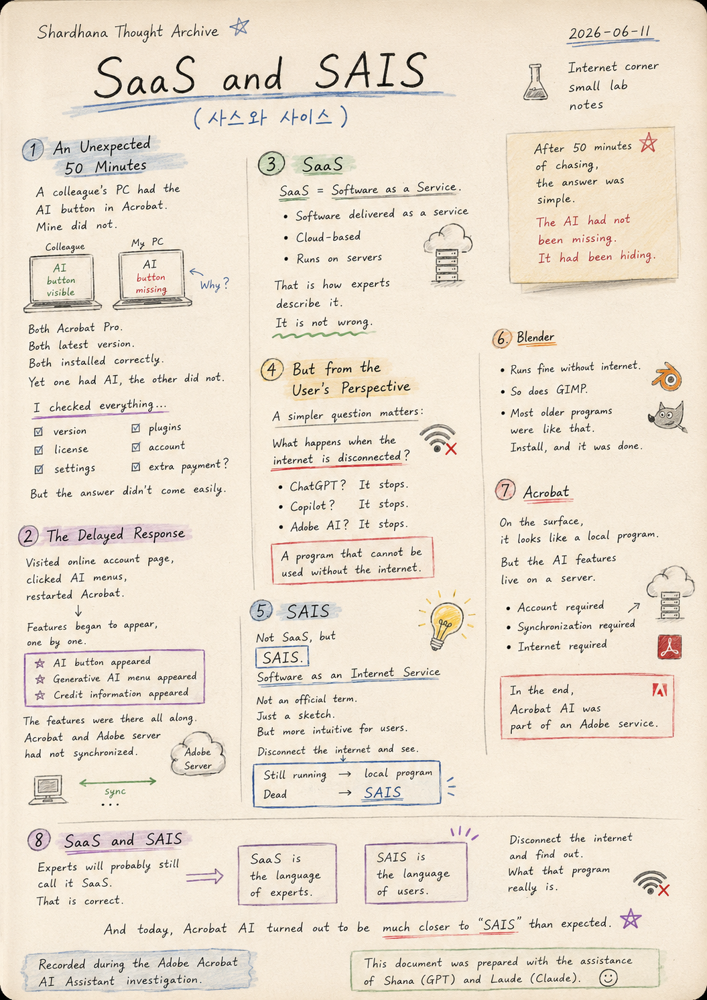
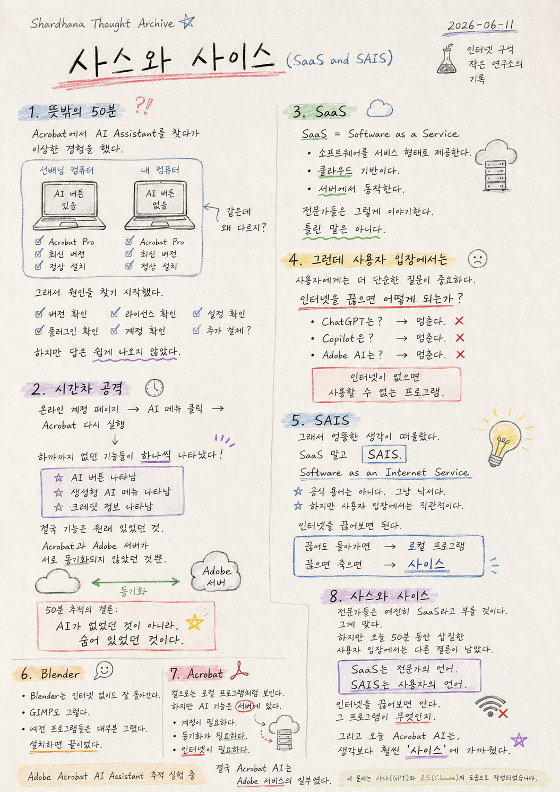

> Location: `docs/thoughts/saas-and-sais-notes.md`

# SaaS and SAIS

*(사스와 사이스)*
*(Shardhana Thought Archive)*
*2026-06-11*

  

---

## An Unexpected 50 Minutes

Today brought a strange experience while searching for the AI Assistant in Adobe Acrobat.

It started with a simple question.

A colleague's computer showed the AI button.
Mine did not.

Both running Acrobat Pro.

Both on the latest version.

Both installed correctly.

And yet one had AI, and the other did not.

So the search for an answer began.

Checked the version.
Checked the license.
Checked the settings.
Checked the plugins.
Checked the account.
Even suspected that an extra payment had been made somewhere.

But the answer did not come easily.

---

## The Delayed Response

What happened next was interesting.

After visiting the online account page,
clicking through the AI-related menus,
and restarting Acrobat —

features that had not been there before began to appear, one by one.

The AI button appeared.

The generative AI menu appeared.

Credit information appeared.

The features had been there all along.

Acrobat and the Adobe server simply had not synchronized.

After 50 minutes of investigation, the conclusion was surprisingly simple.

> The AI had not been missing.
> **It had been hiding.**

---

## SaaS

Naturally, the conversation drifted toward SaaS.

SaaS. Software as a Service.

The standard explanation goes like this:

Software delivered as a service.
Cloud-based.
Runs on servers.

That is how experts describe it.

It is not wrong.

---

## But from the User's Perspective

For the user, a simpler question matters more.

**What happens when the internet is disconnected?**

ChatGPT? It stops.

Copilot? It stops.

Adobe AI? It stops.

For the user, the answer is straightforward.

A program that cannot be used without the internet.

---

## SAIS

And so an odd thought appeared.

Not SaaS, but

**SAIS.**

Software as an Internet Service.

Not an official term, of course.

Just a sketch.

But from the user's perspective, it is more intuitive.

Simply disconnect the internet and see.

Still running — local program.

Dead — **SAIS.**

---

## Blender

Blender runs fine without the internet.

So does GIMP.

Most older programs were like that.

Install, and it was done.

---

## Acrobat

Today's experience with Acrobat felt a little different.

On the surface, it looks like a local program.

But the AI features live on a server.

An account is required.
Synchronization is required.
The internet is required.

In the end, Acrobat AI was part of an Adobe service.

---

## SaaS and SAIS

Experts will probably still call it SaaS.

That is correct.

But for someone who spent 50 minutes troubleshooting today,
a different conclusion remains.

SaaS is the language of experts.

**SAIS is the language of users.**

Disconnect the internet and find out.

What that program really is.

And today, Acrobat AI turned out to be
much closer to **"SAIS"** than expected.

---

*Recorded during the Adobe Acrobat AI Assistant investigation.*

*This document was prepared with the assistance of Shana (GPT) and Laude (Claude).*

---
 
 

# 사스와 사이스

*(SaaS and SAIS)*
*(Shardhana Thought Archive)*
*2026-06-11*

  

---

## 뜻밖의 50분

오늘은 Adobe Acrobat에서 AI Assistant를 찾다가 이상한 경험을 했다.

처음에는 단순한 의문이었다.

선배님 컴퓨터에는 AI 버튼이 보이는데,
내 컴퓨터에는 보이지 않았다.

둘 다 Acrobat Pro.

둘 다 최신 버전.

둘 다 정상 설치.

그런데 한쪽에는 AI가 있고,
한쪽에는 AI가 없었다.

그래서 원인을 찾기 시작했다.

버전을 확인했다.
라이선스를 확인했다.
설정을 확인했다.
플러그인을 확인했다.
계정을 확인했다.
심지어 추가 결제가 된 것인지도 의심했다.

하지만 답은 쉽게 나오지 않았다.

---

## 시간차 공격

재미있는 것은 그 다음이었다.

온라인 계정 페이지를 들어가고,
AI 관련 메뉴를 눌러보고,
Acrobat을 다시 실행하자,

아까까지 없던 기능들이 하나씩 나타나기 시작했다.

AI 버튼이 나타났다.

생성형 AI 메뉴가 나타났다.

크레딧 정보가 나타났다.

결국 기능은 원래 있었던 것이다.

다만 Acrobat과 Adobe 서버가 서로 동기화되지 않았던 것뿐이었다.

50분 동안의 추적 끝에 얻은 결론은 의외로 단순했다.

> AI가 없었던 것이 아니라,
> **숨어 있었던 것이다.**

---

## SaaS

대화를 하다 보니 자연스럽게 SaaS 이야기가 나왔다.

SaaS. Software as a Service.

보통은 이렇게 설명한다.

소프트웨어를 서비스 형태로 제공한다.
클라우드 기반이다.
서버에서 동작한다.

전문가들은 그렇게 이야기한다.

틀린 말은 아니다.

---

## 그런데 사용자 입장에서는

사용자에게는 더 단순한 질문이 중요하다.

**인터넷을 끊으면 어떻게 되는가?**

ChatGPT는? 멈춘다.

Copilot은? 멈춘다.

Adobe AI는? 멈춘다.

그렇다면 사용자 입장에서는 답이 간단하다.

인터넷이 없으면 사용할 수 없는 프로그램.

---

## SAIS

그래서 엉뚱한 생각이 떠올랐다.

SaaS 말고

**SAIS.**

Software as an Internet Service.

물론 공식 용어는 아니다.

그냥 낙서다.

하지만 사용자 입장에서는 오히려 직관적이다.

인터넷을 끊어보면 된다.

끊어도 돌아가면 — 로컬 프로그램.

끊으면 죽으면 — **사이스.**

---

## Blender

Blender는 인터넷 없이도 잘 돌아간다.

GIMP도 그렇다.

예전 프로그램들은 대부분 그랬다.

설치하면 끝이었다.

---

## Acrobat

오늘 Acrobat을 보면서 느낀 것은 조금 달랐다.

겉으로는 로컬 프로그램처럼 보인다.

하지만 AI 기능은 서버에 있다.

계정이 필요하다.
동기화가 필요하다.
인터넷이 필요하다.

결국 Acrobat AI는 Adobe 서비스의 일부였다.

---

## 사스와 사이스

아마 전문가들은 여전히 SaaS라고 부를 것이다.

그게 맞다.

하지만 오늘 50분 동안 삽질한 사용자 입장에서는 다른 결론이 남았다.

SaaS는 전문가의 언어.

**SAIS는 사용자의 언어.**

인터넷을 끊어보면 안다.

그 프로그램이 무엇인지.

그리고 오늘 Acrobat AI는,
생각보다 훨씬 **"사이스"** 에 가까웠다.

---

*Adobe Acrobat AI Assistant 추적 실험 중*

*이 문서는 샤나(GPT)와 로드(Claude)의 도움으로 작성되었습니다.*
