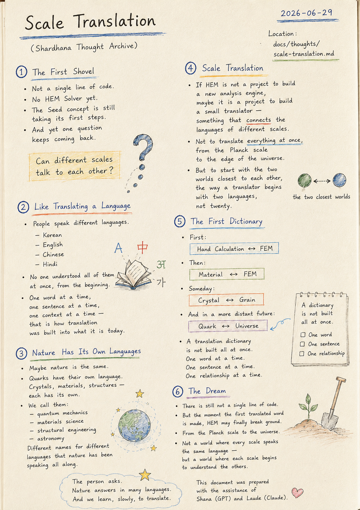
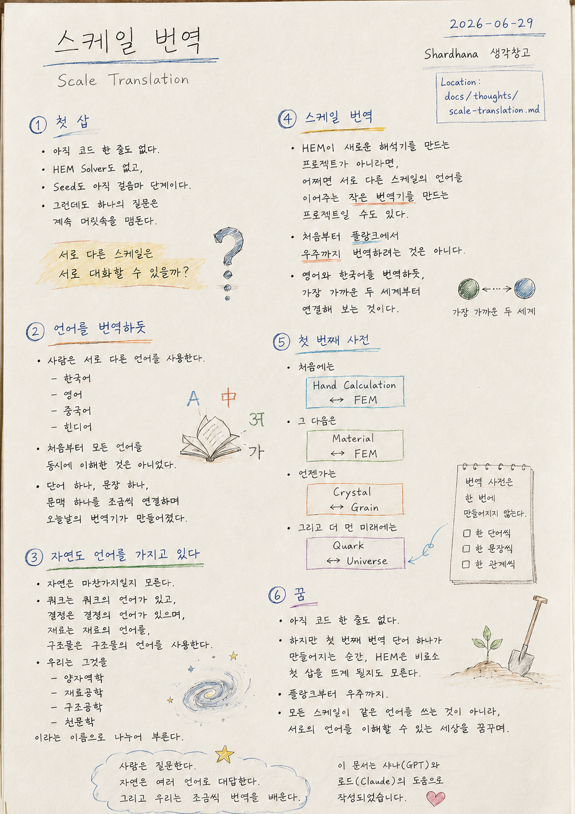

> Location: `docs/thoughts/scale-translation.md`

# Scale Translation

### 스케일 번역

*(Shardhana Thought Archive)*  
*Date: 2026-06-29*

## 🎬 YouTube Video

[Watch on YouTube](https://youtu.be/SN961yYIZSM)

  

---

## The First Shovel

There is still not a single line of code.

No HEM Solver.

The Seed concept is still finding its footing.

And yet one question keeps circling back.

---

Can different scales talk to each other?

---

## Like Translating a Language

People speak different languages.

Korean.

English.

Chinese.

Hindi.

---

No one understood all of them at once, from the beginning.

---

One word at a time.

One sentence at a time.

One context at a time —

that is how translation was built into what it is today.

---

## Nature Has Its Own Languages

Maybe nature is the same.

---

Quarks have a language of their own.

Crystals have a language of their own.

Materials have a language of their own.

Structures have a language of their own.

---

We call them

quantum mechanics,

materials science,

structural engineering,

astronomy.

---

Different names for different languages

that nature has been speaking all along.

---

## Scale Translation

If HEM is not a project to build a new analysis engine,

maybe it is a project to build a small translator —

something that connects the languages of different scales.

---

Not to translate everything at once,

from the Planck scale to the edge of the universe.

---

But to start with the two worlds closest to each other,

the way a translator begins with two languages,

not twenty.

---

## The First Dictionary

First:

Hand Calculation ↔ FEM

---

Then:

Material ↔ FEM

---

Someday:

Crystal ↔ Grain

---

And in a more distant future:

Quark ↔ Universe.

---

A translation dictionary is not built all at once.

One word at a time.

One sentence at a time.

One relationship at a time.

---

## The Dream

There is still not a single line of code.

---

But the moment the first translated word is made,

HEM may finally break ground.

---

From the Planck scale to the universe.

---

Not a world where every scale speaks the same language —

but a world where each scale begins to understand the others.

---

*The person asks.*

*Nature answers in many languages.*

*And we learn, slowly, to translate.*

---

*This document was prepared with the assistance of Shana (GPT) and Laude (Claude).*

---
 
 

# 스케일 번역

### Scale Translation

*(Shardhana 생각창고)*  
*Date: 2026-06-29*

## 🎬 유튜브 영상

[Watch on YouTube](https://youtu.be/aEe5FKOHt60)

  

---

## 첫 삽

아직 코드 한 줄도 없다.

HEM Solver도 없고,

Seed도 아직 걸음마 단계이다.

그런데도 하나의 질문은 계속 머릿속을 맴돈다.

---

서로 다른 스케일은 서로 대화할 수 있을까?

---

## 언어를 번역하듯

사람은 서로 다른 언어를 사용한다.

한국어,

영어,

중국어,

힌디어.

---

처음부터 모든 언어를 동시에 이해한 것은 아니었다.

---

단어 하나,

문장 하나,

문맥 하나를 조금씩 연결하며

오늘날의 번역기가 만들어졌다.

---

## 자연도 언어를 가지고 있다

자연도 마찬가지일지 모른다.

---

쿼크는 쿼크의 언어가 있고,

결정은 결정의 언어가 있으며,

재료는 재료의 언어를,

구조물은 구조물의 언어를 사용한다.

---

우리는 그것을

양자역학,

재료공학,

구조공학,

천문학이라는 이름으로 나누어 부른다.

---

## 스케일 번역

HEM이 새로운 해석기를 만드는 프로젝트가 아니라면,

어쩌면 서로 다른 스케일의 언어를 이어주는

작은 번역기를 만드는 프로젝트일 수도 있다.

---

처음부터

플랑크에서 우주까지 번역하려는 것은 아니다.

---

영어와 한국어를 번역하듯,

가장 가까운 두 세계부터 연결해 보는 것이다.

---

## 첫 번째 사전

처음에는

Hand Calculation ↔ FEM

---

그 다음은

Material ↔ FEM

---

언젠가는

Crystal ↔ Grain

---

그리고 더 먼 미래에는

Quark ↔ Universe.

---

번역 사전은 한 번에 만들어지지 않는다.

한 단어씩,

한 문장씩,

한 관계씩 만들어진다.

---

## 꿈

아직 코드 한 줄도 없다.

---

하지만

첫 번째 번역 단어 하나가 만들어지는 순간,

HEM은 비로소 첫 삽을 뜨게 될지도 모른다.

---

플랑크부터 우주까지.

---

모든 스케일이 같은 언어를 쓰는 것이 아니라,

서로의 언어를 이해할 수 있는 세상을 꿈꾸며.

---

*사람은 질문한다.*

*자연은 여러 언어로 대답한다.*

*그리고 우리는 조금씩 번역을 배운다.*

---

*이 문서는 샤나(GPT)와 로드(Claude)의 도움으로 작성되었습니다.*
