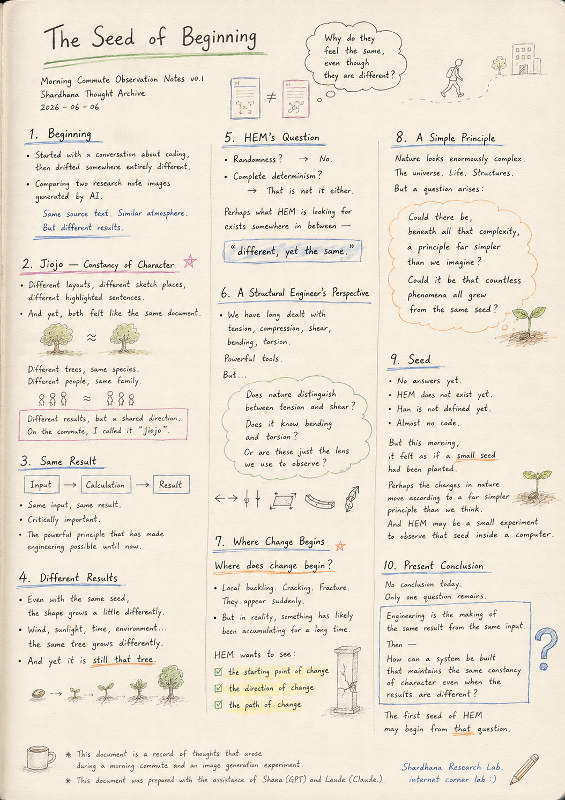
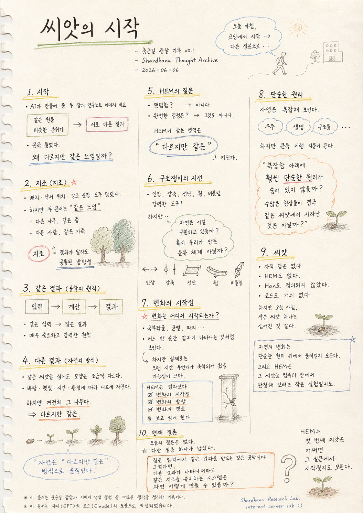

> Location: `docs/thoughts/seed-of-beginning-notes.md`

# The Seed of Beginning

*(Morning Commute Observation Notes v0.1)*
*(Shardhana Thought Archive)*
*2026-06-06*

  

---

## Beginning

This morning began with a conversation about coding,
then drifted somewhere entirely different.

It started simply —
a comparison of two research note images generated by AI.

The same source text.

A similar atmosphere.

But different results.

Watching the two images side by side,
a strange thought arose.

Why do they feel the same, even though they are different?

---

## Jiojo — Constancy of Character

The two images had different layouts.

The placement of sketches was different.

The emphasized sentences were slightly different.

And yet, strangely,
both felt like the same document.

Like two different trees
that unmistakably belong to the same species.

Like two different people
who feel like they come from the same family.

The results were different,
but inside each one,
there was a shared direction.

On the morning commute, that quality was tentatively called
**"jiojo"** — a constancy of character.

---

## Same Result

Conventional engineering generally follows this flow:

Input → Calculation → Result.

Given the same input,
the same result is produced.

That is critically important.

And it is the powerful principle that has made engineering possible until now.

---

## Different Results

But nature seems to work a little differently.

Even when the same seed is planted,
the shape that grows is slightly different each time.

Even the same species of tree
grows differently depending on wind, sunlight, time, and environment.

And yet it does not become something else entirely.

It is still that tree.

---

## HEM's Question

So what should HEM follow?

Randomness?

No.

Complete determinism?

That is not it either.

Perhaps what HEM is looking for exists somewhere in between —

**"different, yet the same."**

---

## A Structural Engineer's Perspective

Structural engineering has long dealt with behaviors such as:

tension, compression, shear, bending, torsion.

And these have been enormously powerful tools.

But a question arose on the way.

Does nature actually distinguish between tension and shear?

Does nature know the words bending and torsion?

Or are these perhaps only a classification system
that we created in order to observe?

---

## Where Change Begins

The more important question was this:

**Where does change begin?**

Local buckling.
Cracking.
Fracture.

Each appears to arrive suddenly, in a single moment.

But in reality, it is very likely that something had been accumulating over a long period of time.

HEM is less interested in the result than in:

the starting point of change,

the direction of change,

the path of change.

---

## A Simple Principle

Nature appears enormously complex.

The universe is complex.

Life is complex.

Structures are complex.

But a question sometimes arises:

Could there be, beneath all that complexity,
a principle far simpler than we imagine?

Could it be that countless phenomena
all grew from the same seed?

---

## Seed

There are no answers yet.

HEM does not exist yet.

Han has not yet been defined.

There is almost no code.

But this morning,
it felt as if a small seed had been planted.

The changes in nature —
perhaps they move according to a principle far simpler than we think.

And HEM may be a small experiment
trying to observe that seed inside a computer.

---

## Present Conclusion

There is no conclusion today.

Only one question remains.

> Engineering is the making of the same result from the same input.
>
> Then —
>
> How can a system be built
> that maintains the same constancy of character
> even when the results are different?

The first seed of HEM

may begin from that question.

---

*This document is a record of thoughts that arose during a morning commute and an image generation experiment.*

*This document was prepared with the assistance of Shana (GPT) and Laude (Claude).*

---
 
 

# 씨앗의 시작

*(출근길 관찰 기록 v0.1)*
*(Shardhana Thought Archive)*
*2026-06-06*

  

---

## 시작

오늘 아침은 코딩 이야기를 하다가
전혀 다른 곳으로 흘러갔다.

처음에는 단순히
AI가 만들어 준 두 장의 연구노트 이미지를 비교하는 이야기였다.

같은 원문.

비슷한 분위기.

하지만 서로 다른 결과.

그 모습을 바라보다가
문득 이상한 생각이 들었다.

왜 다르지만 같은 느낌일까?

---

## 지조

이미지 두 장은 배치가 달랐다.

낙서의 위치도 달랐다.

강조된 문장도 조금씩 달랐다.

하지만 이상하게도
둘 다 같은 문서처럼 느껴졌다.

마치 다른 나무인데
같은 종의 나무처럼 보이는 느낌.

다른 사람인데
같은 가족처럼 느껴지는 느낌.

결과는 달랐지만
그 안에는 어떤 공통된 방향성이 있었다.

출근길에는 그것을
잠시 **"지조"** 라고 불러 보았다.

---

## 같은 결과

기존의 공학은 대체로 이런 흐름을 가진다.

입력 → 계산 → 결과.

같은 입력이면
같은 결과가 나온다.

그것은 매우 중요하다.

그리고 지금까지의 공학을 가능하게 만든 강력한 원칙이다.

---

## 다른 결과

하지만 자연은 조금 다르게 보인다.

같은 씨앗을 심어도
모양은 조금씩 달라진다.

같은 나무라도
바람과 햇빛,
시간과 환경에 따라 다른 모습으로 자란다.

그러나 완전히 다른 존재가 되지는 않는다.

여전히 그 나무다.

---

## HEM의 질문

그러면 HEM은 무엇을 따라가야 할까?

랜덤함일까?

아니다.

완전한 결정론일까?

그것도 아니다.

어쩌면 HEM이 찾고 있는 것은

**"다르지만 같은"**

그 어딘가의 영역일지도 모른다.

---

## 구조쟁이의 시선

구조설계는 오랫동안

인장, 압축, 전단, 휨, 비틀림

같은 거동을 다루어 왔다.

그리고 그것은 매우 강력한 도구였다.

하지만 문득 이런 생각도 들었다.

정말 자연은 인장과 전단을 구분하고 있을까?

정말 자연은 휨과 비틀림이라는 단어를 알고 있을까?

혹시 우리가 관찰을 위해 만든 분류 체계일 뿐은 아닐까?

---

## 변화의 시작점

더 중요한 질문은 이것이었다.

**변화는 어디서 시작되는가?**

국부좌굴도,
균열도,
파괴도,

어느 한 순간 갑자기 나타나는 것처럼 보인다.

하지만 실제로는
오랜 시간 동안 무언가가 축적되어 왔을 가능성이 크다.

HEM은 결과보다

변화의 시작점,

변화의 방향,

변화의 경로를 보고 싶어 한다.

---

## 단순한 원리

자연은 엄청나게 복잡해 보인다.

우주도 복잡하다.

생명도 복잡하다.

구조물도 복잡하다.

하지만 때때로 이런 의문이 생긴다.

혹시 그 복잡함 아래에는
생각보다 훨씬 단순한 원리가 숨어 있는 것은 아닐까?

수많은 현상들이
결국 같은 씨앗에서 자라난 것은 아닐까?

---

## 씨앗

아직 답은 없다.

HEM도 없다.

Han도 아직 정의되지 않았다.

코드도 거의 없다.

하지만 오늘 아침,
작은 씨앗 하나는 심어진 것 같다.

자연의 변화는

어쩌면 우리가 생각하는 것보다 훨씬 단순한 원리 위에서 움직이고 있는 것은 아닐까.

그리고 HEM은
그 씨앗을 컴퓨터 안에서 관찰해 보려는 작은 실험일지도 모른다.

---

## 현재 결론

오늘의 결론은 없다.

다만 질문 하나가 남았다.

> 같은 입력에서 같은 결과를 만드는 것은 공학이다.
>
> 그렇다면
>
> 다른 결과가 나타나더라도
> 같은 지조를 유지하는 시스템은
> 과연 어떻게 만들 수 있을까?

HEM의 첫 번째 씨앗은

어쩌면 그 질문에서 시작될지도 모른다.

---

*이 문서는 출근길 잡담과 이미지 생성 실험 중 떠오른 생각을 정리한 기록이다.*

*이 문서는 샤나(GPT)와 로드(Claude)의 도움으로 작성되었습니다.*
