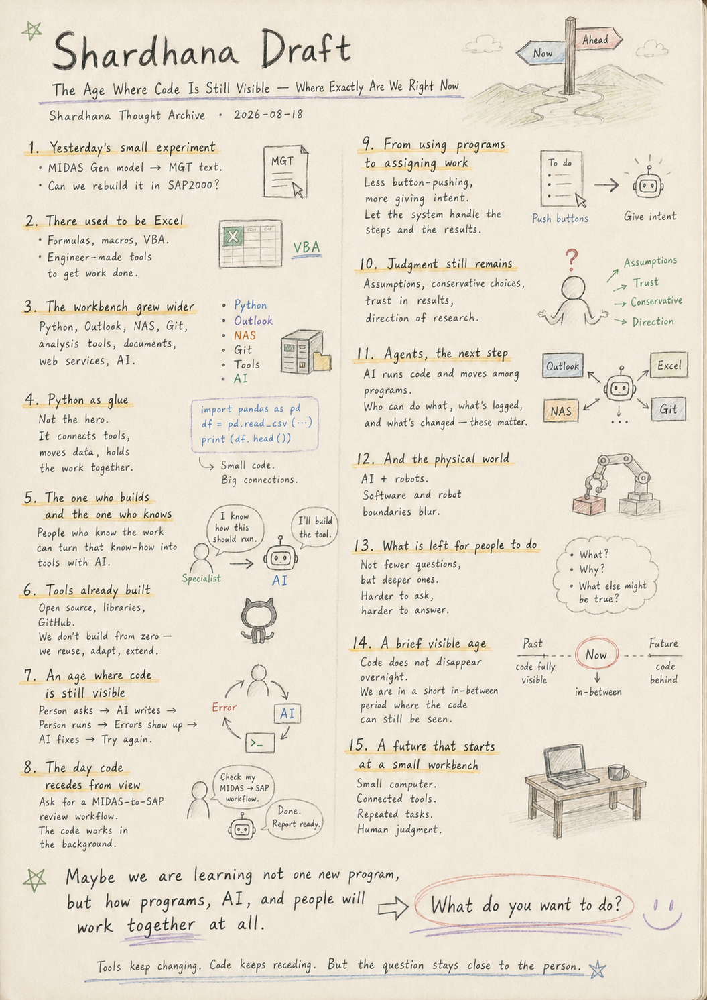
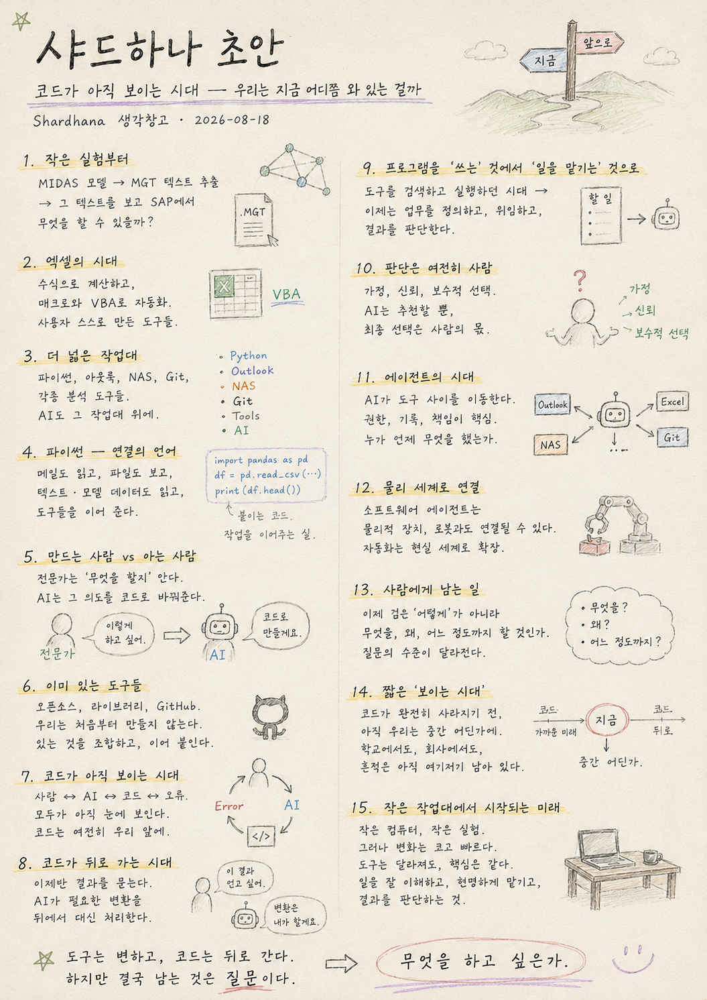

> Location: docs/thoughts/shardhana-draft.md

# Shardhana Draft

## The Age Where Code Is Still Visible — Where Exactly Are We Right Now

*(Shardhana Thought Archive) · Date: 2026-08-18*

  

---

## 1. Yesterday's Small Experiment

Yesterday I was looking at a structural analysis model and, out of nowhere, wanted to move it into a different program. A model built in MIDAS Gen holds nodes, members, materials, sections, loads. Different software, but the information a structure carries doesn't really change.

I opened the MGT text file. At first it looked like a wall of characters. But looking closer, it held everything needed to rebuild the model somewhere else. A small possibility appeared: read the text, pull out what's needed, translate it into a form another program understands — could a MIDAS model be rebuilt in SAP2000? I haven't built anything yet. I only tasted the possibility for a moment. But that small taste kept pulling at something else.

## 2. There Used to Be Excel

Something similar probably happened long ago, back when Excel first spread everywhere. At first it was just a program for tables and calculations. But people didn't stop there — they built formulas, macros, VBA. Someone automated a repetitive office calculation. Someone built their own design tool. Someone built a calculation sheet that got used for decades.

On top of one program called Excel, countless small tools built by engineers piled up. The company that made Excel didn't design all those uses. The users kept inventing new ones, shaped around their own work.

## 3. Now the Workbench Has Gotten Wider

Now you don't need to solve everything inside one program. There's Python, Outlook, a NAS, Git, structural analysis software, document tools, web services, and AI. Each program is good at something different. The real problem has always been connecting them.

Until now, a person had to do that connecting by hand — saving a file, opening another program, converting formats, reading it back in, sometimes writing a small piece of code. Now AI has started stepping into that connective role.

## 4. Python as Glue

Until recently, Python was, to me, a language for writing code. It's started looking different. It reads mail from Outlook, finds and copies files, saves things to a NAS, parses text, reads structural model data. Python doesn't do all of that work itself — it links the programs together.

Today's Python resembles VBA from the Excel era, but it moves through a much wider space. And there's another interesting shift: writing that connective code used to require learning Python directly. Now you can build it in conversation with AI. Even without fully knowing the code, the engineer already knows what they want to happen.

## 5. The One Who Builds and the One Who Knows

This is where the roles start to shift. Building a tool used to require someone who was good at programming. But if a structural engineer understands the structure, understands the workflow, knows exactly where the repetition happens — AI can help turn that understanding into code.

This isn't a story about programmers disappearing. It's a story about the door widening for a specialist to build their own small tools directly. The structural engineer doesn't become a programmer. The structural engineer's thinking becomes something a program can run on.

## 6. Tools Already Built

Another thought followed: a lot of what feels like a new discovery has probably already been built by someone else. GitHub holds an enormous amount of code. Python has an enormous number of libraries. Someone has already written code that talks to Outlook. Someone has already built a tool that reads structural models. Someone has already built a format converter.

So there's no need to always start from zero. Look first. If a tool already exists, use it. If it falls a little short, fix it. Add only the piece your own work actually needs. The way an engineer once inherited a senior colleague's calculation sheet and gradually reshaped it into their own — code and tools may end up passed down the same way.

## 7. An Age Where the Code Is Still Visible to People

Right now is a strange moment. A person talks to AI. AI writes code. The person runs it. Something breaks. The error goes back to the AI. The AI fixes it. It runs again. For now, every step of that is still visible — the Python file, the terminal, the error message, all in plain sight.

This might be a strange era that only lasts a short while. Once AI develops far enough, the need for a person to watch this in-between process directly will likely keep shrinking.

## 8. The Day the Code Disappears From View

A little further out, it might look like this: *"Get this MIDAS model ready for review in SAP."* And the AI reads the MGT file, analyzes what's needed, builds the SAP model, flags anything that didn't convert cleanly, and lists what needs checking.

A person might never look at the Python file. Might not need to know which library was used. The code hasn't disappeared — it's just stepped back. The way a driver doesn't think about ignition timing every time they start the engine, software can quietly recede behind a person's field of view too.

## 9. From Using Programs to Assigning Work

Up to now, we've been learning how to use programs — Excel, AutoCAD, MIDAS, SAP, Outlook. Each one with its own menus, its own commands, its own sequence of steps.

Going forward, the time spent directly operating a program may shrink, while the time spent explaining to AI what needs doing grows. *"Sort these emails by sender." "Compare what changed in this model." "Pick up yesterday's research where I left off."* A person becomes less someone who presses buttons and more someone who states a purpose.

## 10. Judgment Still Remains

Handing something off in words doesn't mean handing everything over to AI. Which model to build. Which assumptions to use. What to treat conservatively. Which result to trust. What needs a second check. These are different from simply knowing how to operate software.

Even when AI offers many possible paths, which one to take is still likely to remain a person's call. The engineer's role may be shifting — from someone who calculates to someone who judges, from someone who operates a program to someone who designs the direction of the research itself.

## 11. Agents, the Next Step

Today's AI writes code through conversation. The next step will likely be AI that runs that code directly — opening files, executing programs, checking results, fixing problems and trying again, moving between programs toward a stated goal without a person issuing instructions one by one.

That's when AI stops being a conversation partner and becomes something closer to a worker. The word "agent" starts to carry real weight. But once there's a worker, another question follows immediately: what should it be allowed to do, and what should it not be allowed to do. As convenience grows, permissions and records may matter even more, not less.

## 12. And the Physical World

After that, it might step off the screen entirely. AI connected not just to programs, but to robots. *"Check that part." "Measure this dimension." "Reshoot this angle." "Set up today's experiment."* AI judges, and a robot moves.

An agent that once operated only in the world of information reaches into the physical world. At that point, the line we currently draw between "software" and "robot" might start to blur too.

## 13. So What Is Left for People to Do

Thinking through this future always circles back to the same question. So what is left for a person to do?

Probably not a shortage of things to do, but a shift in where the question sits. Less *how do I calculate this* and more *what should I be calculating?* Less *which button do I press* and more *what do I actually want to know?* Less *which program should I use* and more *how do I want to look at nature itself?* The easier the tools get, the more the question itself may matter.

## 14. A Brief, Visible Age

Maybe we're standing at an interesting midpoint right now. In the past, people wrote code directly. In the future, code might nearly vanish from view. And right now, we're in between — a person talks to AI, the AI writes Python, and the person can still watch, directly, how it all moves.

If Excel and VBA once showed us one era's way of working, Python and AI, for now, might be showing us a glimpse of another one.

## 15. A Future That Starts at a Small Workbench

I don't know exactly what the future will look like. I don't know how far AI will go, or how soon robots will arrive. But one thing seems to have already begun: turning a person's thinking into small pieces of code, connecting different tools together, handing off repetitive tasks, and letting a person judge the result again.

It doesn't take a massive lab. This kind of experiment can start on a single small computer.

Yesterday, I was only curious whether one structural model could move into another program. Today, that small curiosity carried a little further.

Maybe we're not living through the era of learning one new program. We're living through the era of **learning how programs, AI, and people are going to work together at all.**

And if someday code, and programs, and even the name "AI" itself quietly disappear behind what a person sees, then the one thing likely to remain, in the end, is this:

**What do you want to do?**

---

*Tools keep changing. Code keeps receding. But the question stays close to the person.*

*Maybe right now is a brief and interesting age — one where a person can still watch, directly, the process by which code disappears.*

---

This document was prepared with the assistance of Shana (GPT) and Laude (Claude).

---
 
 

# 샤드하나 초안

## 코드가 아직 보이는 시대 — 우리는 지금 어디쯤 와 있는 걸까

*(Shardhana 생각창고) · Date: 2026-08-18*

  

---

## 1. 어제의 작은 실험

어제 구조해석 모델 하나를 바라보다가 문득 다른 프로그램으로 옮겨 보고 싶어졌다. MIDAS Gen에서 만든 모델 안에는 절점, 부재, 재료, 단면, 하중이 있다. 프로그램은 달라도 구조물이 담고 있는 정보는 크게 다르지 않다.

MGT 텍스트 파일을 열어보니 처음엔 복잡한 문자열처럼 보였지만, 그 안엔 모델을 다시 만들 수 있는 재료들이 들어 있었다. 이 텍스트를 읽고 필요한 정보를 꺼내 다른 프로그램이 이해할 형식으로 바꾼다면, MIDAS 모델을 SAP2000에서도 다시 만들 수 있지 않을까 — 아직 만든 건 없다. 그저 가능성을 잠깐 맛봤을 뿐인데, 그 작은 경험이 다른 생각으로 이어졌다.

## 2. 예전에는 Excel이 있었다

오래전 Excel이 처음 퍼지던 때도 비슷했을 것이다. 처음엔 표를 만들고 계산하는 프로그램이었지만, 사람들은 거기서 멈추지 않고 수식과 매크로, VBA를 붙였다. 누군가는 반복 계산을 자동화했고, 누군가는 자기만의 설계 프로그램을, 누군가는 수십 년 쓰는 계산서를 만들었다.

Excel이라는 하나의 프로그램 위에 수많은 기술자들의 작은 도구가 쌓였다. 그 사용법을 만든 회사가 아니라, 사용자들이 자기 일에 맞춰 계속 새로운 쓰임을 만들어간 것이다.

## 3. 이제는 작업대가 넓어졌다

지금은 Excel 하나 안에서 모든 걸 해결할 필요가 없다. Python, Outlook, NAS, Git, 구조해석 프로그램, 문서 프로그램, 웹 서비스, 그리고 AI. 각 프로그램은 서로 다른 일을 잘하고, 문제는 그 사이를 연결하는 일이었다.

그동안은 사람이 직접 연결했다 — 파일을 저장하고, 다른 프로그램을 열고, 형식을 바꾸고, 필요하면 작은 코드를 짰다. 이제 그 연결 과정에 AI가 들어오기 시작했다.

## 4. Python이라는 접착제

얼마 전까지 Python은 코드를 작성하는 언어였는데, 조금씩 다르게 보이기 시작했다. 메일을 읽고, 파일을 찾아 복사하고, NAS에 저장하고, 텍스트를 분석하고, 구조 모델 데이터를 읽는다 — 모든 일을 직접 하는 게 아니라 프로그램 사이를 이어준다.

지금의 Python은 예전 Excel 시대의 VBA와 닮았지만, 훨씬 넓은 공간에서 움직이는 연결자에 가깝다. 그리고 재미있는 변화가 하나 더 있다. 예전엔 그 코드를 만들려면 Python을 직접 배워야 했지만, 지금은 AI와 대화하며 함께 만들 수 있다. 코드를 완전히 몰라도 무엇을 하고 싶은지는 기술자가 이미 알고 있다.

## 5. 만드는 사람과 아는 사람

예전엔 도구를 만들려면 프로그래밍을 잘하는 사람이 필요했다. 하지만 구조기술자가 구조를 알고, 업무 흐름을 알고, 반복이 어디서 발생하는지 알고 있다면 AI가 그 생각을 코드로 옮기는 걸 도울 수 있다.

프로그래머가 없어진다는 얘기가 아니다. 전문가가 자기 분야의 작은 도구를 직접 만들어볼 수 있는 문이 넓어진다는 얘기다. 구조기술자가 프로그래머가 되는 게 아니라, 구조기술자의 생각이 프로그램으로 움직이게 되는 것.

## 6. 이미 만들어진 공구들

우리가 새롭게 발견했다고 생각하는 것들 중 많은 건 이미 누군가 만들어 놓았을 것이다. GitHub엔 수많은 코드가, Python엔 수많은 라이브러리가 있다. 항상 처음부터 만들 필요는 없다.

먼저 찾아본다. 선배들이 만든 공구가 있으면 써보고, 부족하면 고치고, 필요한 부분만 새로 붙인다. 예전 기술자가 선배의 계산서를 받아 조금씩 자기 방식으로 바꿔갔듯, 앞으로 코드와 도구도 그렇게 이어질지 모른다.

## 7. 사람에게 코드가 보이는 지금

지금은 조금 묘한 시기다. 사람이 AI에게 말하면 AI가 코드를 만들고, 사람이 그걸 실행하다 오류가 나면 다시 AI에게 보여주고, AI가 고친다. 아직은 그 과정이 모두 눈에 보인다 — Python 파일도, 터미널도, 오류 메시지도.

어쩌면 지금은 아주 짧게 존재할 특이한 시대인지도 모른다. AI가 충분히 발전하면 사람이 이 중간 과정을 직접 볼 필요는 점점 줄어들 것이다.

## 8. 코드가 뒤로 사라지는 날

조금 더 지나면 이런 식이 될지도 모른다. *"이 MIDAS 모델을 SAP에서 검토할 수 있게 만들어 줘."* 그러면 AI가 MGT 파일을 읽고, 정보를 분석하고, SAP 모델을 만들고, 변환되지 않은 항목과 검증할 부분을 정리해준다.

사람은 Python 파일을 보지 않을 수도, 어떤 라이브러리를 썼는지 알 필요도 없을지 모른다. 코드는 사라진 게 아니라 뒤로 물러났을 뿐이다. 운전할 때 엔진의 점화 순서를 매번 생각하지 않는 것처럼, 소프트웨어도 조금씩 사람의 시야 뒤로 사라질 수 있다.

## 9. 프로그램을 사용하는 것에서 일을 시키는 것으로

지금까지 우리는 프로그램 사용법을 배웠다 — Excel, AutoCAD, MIDAS, SAP, Outlook. 각자 메뉴가 있고 명령어가 있고 작업 순서가 있었다.

하지만 앞으로는 프로그램을 직접 쓰는 시간보다 AI에게 무엇을 해야 하는지 설명하는 시간이 더 많아질 수도 있다. *"이 메일들을 사람별로 정리해줘." "모델 변경사항을 비교해줘." "어제 하던 연구를 이어서 준비해줘."* 사람은 점점 버튼을 누르는 사람이 아니라 목적을 설명하는 사람이 되어간다.

## 10. 그래도 판단은 남는다

말로 시킨다고 모든 걸 AI에게 넘길 수 있는 건 아니다. 어떤 모델을 만들 것인가, 어떤 가정을 쓸 것인가, 무엇을 보수적으로 볼 것인가, 어떤 결과를 믿을 것인가 — 이런 선택은 단순한 사용법과는 다르다.

AI가 수많은 방법을 제시해도 어떤 길을 선택할지는 여전히 사람의 몫일 가능성이 크다. 기술자의 역할은 계산하는 사람에서 판단하는 사람으로, 프로그램을 조작하는 사람에서 연구 방향을 설계하는 사람으로 조금씩 이동하고 있는지도 모른다.

## 11. Agent라는 다음 단계

지금의 AI는 대화로 코드를 만들어주지만, 다음 단계에선 그 코드를 직접 실행하는 AI가 더 자연스러워질 것이다. 파일을 열고, 프로그램을 실행하고, 결과를 확인하고, 문제가 있으면 다시 고친다 — 사람이 하나하나 명령하지 않아도 목적을 따라 여러 프로그램 사이를 움직인다.

그때부터 AI는 대화 상대가 아니라 작업자가 된다. Agent라는 말이 조금 더 현실적인 의미를 가지기 시작한다. 하지만 작업자가 생기면 또 다른 문제가 따라온다 — 무엇을 할 수 있게 하고, 무엇은 하지 못하게 할 것인가. 편리함이 커질수록 권한과 기록은 오히려 더 중요해질지 모른다.

## 12. 그리고 물리적인 세계

그다음엔 화면 밖으로 나갈 수도 있다. AI가 프로그램만이 아니라 로봇과 연결된다. *"저 부품을 확인해줘." "치수를 측정해줘." "오늘 실험을 준비해줘."* AI가 판단하고 로봇이 움직인다.

정보 세계에서 움직이던 Agent가 물리 세계까지 연결되는 것. 그때는 지금 우리가 말하는 프로그램과 로봇의 경계도 조금씩 흐려질지 모른다.

## 13. 그럼 사람은 무엇을 할까

이런 미래를 생각하면 항상 같은 질문으로 돌아온다. 그럼 사람은 무엇을 할까.

아마 할 일이 없어지는 게 아니라 질문의 위치가 달라질 것이다. *어떻게 계산할까*보다 *무엇을 계산해야 할까?* *어떤 버튼을 누를까*보다 *무엇을 알고 싶은가?* *어떤 프로그램을 쓸까*보다 *어떤 방법으로 자연을 바라볼까?* 도구가 쉬워질수록 질문은 오히려 더 중요해질 수도 있다.

## 14. 잠깐 보이는 시대

어쩌면 우리는 지금 재미있는 중간 지점에 서 있다. 과거엔 사람이 직접 코드를 작성했고, 미래엔 코드가 사람의 눈에서 거의 사라질 수도 있다. 그리고 지금은 그 사이에 있다 — 사람이 AI에게 말하고, AI가 Python을 만들고, 사람이 그 코드를 실행하며 어떻게 움직이는지 아직 바라볼 수 있는 시대.

예전 Excel과 VBA가 한 시대의 작업 방식을 보여주었다면, 지금의 Python과 AI도 잠시 동안 또 다른 시대의 모습을 보여주고 있는 것인지 모른다.

## 15. 작은 작업대에서 시작되는 미래

미래가 정확히 어떻게 될지는 모른다. 하지만 한 가지는 이미 시작된 것 같다 — 사람이 가진 생각을 작은 코드로 만들고, 서로 다른 도구를 연결하고, 반복되는 일을 맡겨보고, 그 결과를 다시 사람이 판단하는 과정. 거대한 연구소가 아니어도 된다. 작은 컴퓨터 한 대에서도 이런 실험은 시작할 수 있다.

어제는 구조 모델 하나를 다른 프로그램으로 옮길 수 있을까 궁금했을 뿐이었다. 오늘은 그 작은 궁금증이 조금 더 먼 곳으로 이어졌다.

우리는 지금 새로운 프로그램 하나를 배우는 시대가 아니라, **프로그램과 AI와 사람이 어떻게 함께 일할 것인지를 배우기 시작한 시대**인지도 모른다.

그리고 언젠가 코드도, 프로그램도, AI라는 이름조차도 사람의 눈 뒤로 자연스럽게 사라진다면, 그때 마지막까지 남는 것은 아마 하나일 것이다.

**무엇을 하고 싶은가.**

---

*도구는 계속 바뀐다. 코드는 조금씩 뒤로 사라진다. 하지만 질문은 사람 곁에 남는다.*

*어쩌면 지금은, 사람이 코드가 사라지는 과정을 직접 바라볼 수 있는 아주 짧고 재미있는 시대인지도 모른다.*

---

이 문서는 샤나(GPT)와 로드(Claude)의 도움으로 작성되었습니다.
