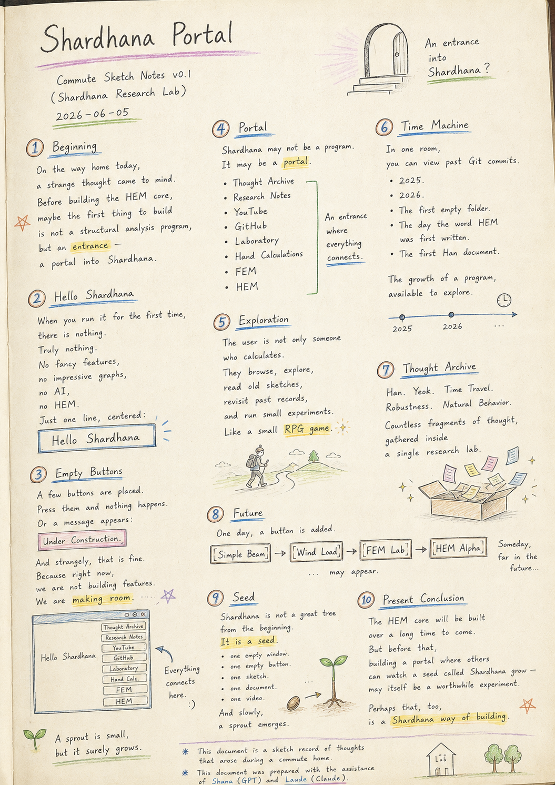
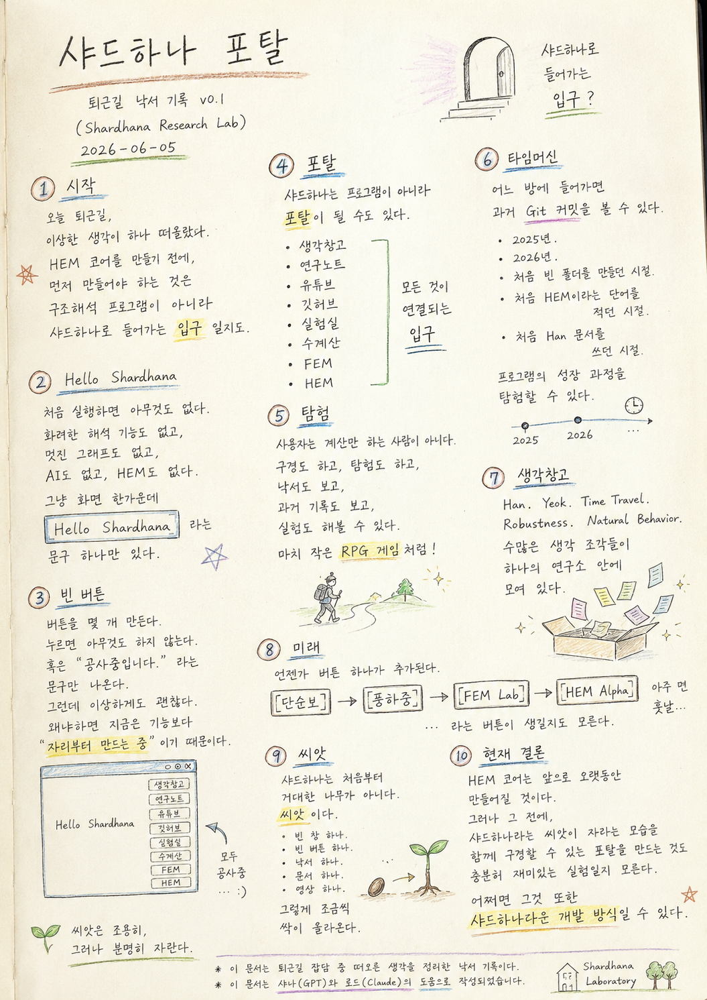

> Location: `docs/thoughts/shardhana-portal-notes.md`

# Shardhana Portal

*(Commute Sketch Notes v0.1)*
*(Shardhana Research Lab)*
*2026-06-05*

<p align="center">
  
</p>

---

## Beginning

On the way home today, a strange thought came to mind.

Before building the HEM core,
perhaps the first thing to build
is not a structural analysis program,
but an **entrance** — a portal into Shardhana.

---

## Hello Shardhana

When you run it for the first time, there is nothing.

Truly nothing.

No elaborate analysis features.
No impressive graphs.
No AI.
No HEM.

Just one line, centered on the screen:

> **Hello Shardhana**

---

## Empty Buttons

A few buttons are placed on screen.

Press them and nothing happens.
Or perhaps a message appears: **Under Construction.**

And strangely, that is fine.

Because right now, we are not building features.
We are **making room**.

---

## Portal

Shardhana may not be a program at all.
It may be a **portal**.

- Thought Archive
- Research Notes
- YouTube
- GitHub
- Laboratory
- Hand Calculations
- FEM
- HEM

An entrance where everything connects.

---

## Exploration

The user is not only someone who calculates.

They browse.
They explore.
They read old sketches.
They revisit past records.
They run small experiments.

Like a small **RPG game**.

---

## Time Machine

In one room, you can view past Git commits.

- 2025.
- 2026.
- The days when the first empty folder was created.
- The days when the word HEM was first written down.
- The days when the first Han document was composed.

The growth of a program, available to explore.

---

## Thought Archive

Han. Yeok. Time Travel. Robustness. Natural Behavior.

Countless fragments of thought,
gathered inside a single research lab.

---

## Future

One day, a button is added.

```
[ Simple Beam ]
```

Then another day,

```
[ Wind Load ]
```

appears. Then another day,

```
[ FEM Lab ]
```

opens. And someday, far in the future,

```
[ HEM Alpha ]
```

may appear.

---

## Seed

Shardhana is not a great tree from the beginning.

**It is a seed.**

One empty window.
One empty button.
One sketch.
One document.
One video.

And slowly, a sprout emerges.

---

## Present Conclusion

The HEM core will be built over a long time to come.

But before that,
building a portal where others can watch
a seed called Shardhana grow —
may itself be a worthwhile experiment.

Perhaps that, too,
is a **Shardhana way of building**.

---

*This document is a sketch record of thoughts that arose during a commute home.*

*This document was prepared with the assistance of Shana (GPT) and Laude (Claude).*

---
<br>
<br>

# 샤드하나 포탈

*(퇴근길 낙서 기록 v0.1)*
*(Shardhana Research Lab)*
*2026-06-05*

<p align="center">
  
</p>

---

## 시작

오늘 퇴근길에 이상한 생각이 하나 떠올랐다.

HEM 코어를 만들기 전에,
어쩌면 먼저 만들어야 하는 것은
구조해석 프로그램이 아니라
샤드하나로 들어가는 **입구**일지도 모른다는 생각이었다.

---

## Hello Shardhana

처음 실행하면 아무것도 없다.

정말 아무것도 없다.

화려한 해석 기능도 없고,
멋진 그래프도 없고,
AI도 없고,
HEM도 없다.

그냥 화면 한가운데

> **Hello Shardhana**

라는 문구 하나만 있다.

---

## 빈 버튼

버튼을 몇 개 만든다.

누르면 아무것도 하지 않는다.
혹은 **공사중입니다.** 라는 문구만 나온다.

그런데 이상하게도 괜찮다.

왜냐하면 지금은 기능보다
**자리부터 만드는 중**이기 때문이다.

---

## 포탈

샤드하나는 프로그램이 아니라 **포탈**이 될 수도 있다.

- 생각창고
- 연구노트
- 유튜브
- 깃허브
- 실험실
- 수계산
- FEM
- HEM

모든 것이 연결되는 입구.

---

## 탐험

사용자는 계산만 하는 사람이 아니다.

구경도 하고,
탐험도 하고,
낙서도 보고,
과거 기록도 보고,
실험도 해볼 수 있다.

마치 작은 **RPG 게임**처럼.

---

## 타임머신

어느 방에 들어가면 과거 Git 커밋을 볼 수 있다.

- 2025년.
- 2026년.
- 처음 빈 폴더를 만들던 시절.
- 처음 HEM이라는 단어를 적던 시절.
- 처음 Han 문서를 쓰던 시절.

프로그램의 성장 과정을 탐험할 수 있다.

---

## 생각창고

Han. Yeok. Time Travel. Robustness. Natural Behavior.

수많은 생각 조각들이
하나의 연구소 안에 모여 있다.

---

## 미래

언젠가 버튼 하나가 추가된다.

```
[ 단순보 ]
```

또 어느 날

```
[ 풍하중 ]
```

이 생긴다. 또 어느 날

```
[ FEM Lab ]
```

이 열린다. 그리고 아주 먼 훗날,

```
[ HEM Alpha ]
```

라는 버튼이 생길지도 모른다.

---

## 씨앗

샤드하나는 처음부터 거대한 나무가 아니다.

**씨앗이다.**

빈 창 하나.
빈 버튼 하나.
낙서 하나.
문서 하나.
영상 하나.

그렇게 조금씩 싹이 올라온다.

---

## 현재 결론

HEM 코어는 앞으로 오랫동안 만들어질 것이다.

그러나 그 전에,
샤드하나라는 씨앗이 자라는 모습을
함께 구경할 수 있는 포탈을 만드는 것도
충분히 재미있는 실험일지 모른다.

어쩌면 그것 또한
**샤드하나다운 개발 방식**일 수 있다.

---

*이 문서는 퇴근길 잡담 중 떠오른 생각을 정리한 낙서 기록이다.*

*이 문서는 샤나(GPT)와 로드(Claude)의 도움으로 작성되었습니다.*
