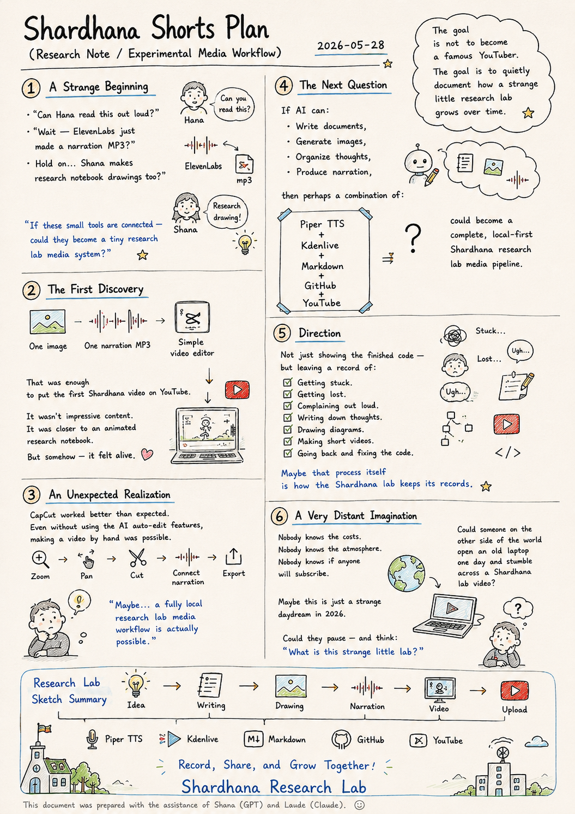
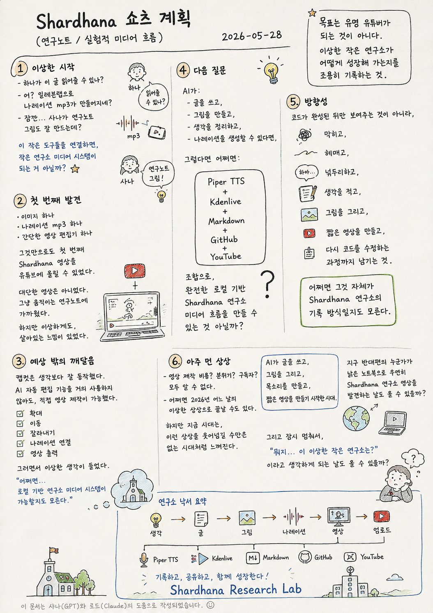

> Location: `docs/thoughts/shardhana-shorts-vision-notes.md`

# Shardhana Shorts Vision

*(Research Note / Experimental Media Vision)*  
*Date: 2026-05-28*

## 🎬 YouTube Video

[Watch on YouTube](https://youtu.be/fSln3HkP0fo)

<p align="center">
  
</p>

---

## 1. A Strange Beginning

There was no plan.

Just curiosity.

*"Can Hana read this out loud?"*

*"Wait — ElevenLabs just made a narration MP3?"*

*"Hold on… Shana makes research notebook drawings too?"*

And then another strange thought arrived:

> *"If these small tools are connected —  
> could they become a tiny research lab media system?"*

---

## 2. The First Discovery

One image.  
One narration MP3.  
One simple video editor.

That was enough  
to put the first Shardhana video on YouTube.

It wasn't impressive content.

It was closer to an animated research notebook.

But somehow —  
it felt alive.

---

## 3. An Unexpected Realization

CapCut worked better than expected.

Even without touching the AI auto-edit features,  
making a video by hand was entirely possible.

Zoom.  
Pan.  
Cut.  
Connect the narration.  
Export.

And somewhere in that process,  
a thought started forming:

> *"Maybe…  
> a fully local research lab media workflow  
> is actually possible."*

---

## 4. The Next Question

If AI can:

- Write documents,
- Generate images,
- Organize thoughts,
- Produce narration,

then perhaps a combination of:

```text
Piper TTS
+ Kdenlive
+ Markdown
+ GitHub
+ YouTube
```

could become a complete,  
local-first Shardhana research lab media pipeline.

---

## 5. Direction

The goal is not  
to become a famous YouTuber.

The goal is:

to quietly document  
how a strange little research lab  
grows over time.

Not just showing the finished code —  
but leaving a record of:

Getting stuck.  
Getting lost.  
Complaining out loud.  
Writing down thoughts.  
Drawing diagrams.  
Making short videos.  
Going back and fixing the code.

Maybe that process itself  
is how the Shardhana lab keeps its records.

---

## 6. A Very Distant Imagination

Nobody knows what video production will cost.  
Nobody knows if the atmosphere we're imagining  
will actually come through.  
Nobody knows if anyone will subscribe.

Maybe this will end up being  
just a strange daydream from somewhere in 2026.

But this era doesn't feel like one  
where ideas like this can simply be laughed off.

AI writes.  
AI draws.  
AI speaks.  
AI makes short videos.

So — could it really happen?

Could someone on the other side of the world  
open an old laptop one day  
and stumble across a Shardhana lab video?

Could they pause —

and think:

*"Wait…  
what is this strange little lab?"*

---

*This document was prepared with the assistance of Shana (GPT) and Laude (Claude).*

---
<br>
<br>

# Shardhana 쇼츠 계획

*(Research Note / Experimental Media Vision)*  
*Date: 2026-05-28*

## 🎬 유튜브 영상

[Watch on YouTube](https://youtu.be/BBQbnCKr_eY)

<p align="center">
  
</p>

---

## 1. 이상한 시작

처음부터 계획이 있었던 것은 아니다.

그냥 호기심이었다.

"하나가 이 글 읽어줄 수 있나?"

"어? 일레븐랩으로 나래이션 mp3가 만들어지네?"

"잠깐... 샤나가 연구노트 그림도 잘 만드는데?"

그리고 또 하나의 이상한 생각이 떠올랐다.

> "이 작은 도구들을 연결하면,  
> 작은 연구소 미디어 시스템이 되는 거 아닐까?"

---

## 2. 첫 번째 발견

이미지 하나.  
나래이션 mp3 하나.  
간단한 영상 편집기 하나.

그것만으로도  
첫 번째 Shardhana 영상을 유튜브에 올릴 수 있었다.

대단한 유튜브 영상은 아니었다.

그냥 움직이는 연구노트에 가까웠다.

하지만 이상하게도,  
살아있는 느낌이 있었다.

---

## 3. 예상 밖의 깨달음

캡컷은 생각보다 잘 동작했다.

심지어 AI 자동 편집 기능을 거의 사용하지 않아도,  
직접 영상 제작이 가능했다.

확대.  
이동.  
잘라내기.  
나래이션 연결.  
영상 출력.

그러면서 이상한 생각이 들기 시작했다.

> "어쩌면…  
> 로컬 기반 연구소 미디어 시스템이 가능할지도 모른다."

---

## 4. 다음 질문

AI가:

- 글을 쓰고,
- 그림을 만들고,
- 생각을 정리하고,
- 나래이션을 생성할 수 있다면,

그렇다면 어쩌면:

```text
Piper TTS
+ Kdenlive
+ Markdown
+ GitHub
+ YouTube
```

조합으로,

완전한 로컬 기반 Shardhana 연구소 미디어 흐름을  
만들 수 있는 것 아닐까?

---

## 5. 방향성

목표는  
유명 유튜버가 되는 것이 아니다.

목표는:

이상한 작은 연구소가  
어떻게 성장해 가는지를  
조용히 기록하는 것이다.

코드가 완성된 뒤만 보여주는 것이 아니라,

막히고,  
헤매고,  
넋두리하고,  
생각을 적고,  
그림을 그리고,  
짧은 영상을 만들고,  
다시 코드를 수정하는 과정까지 남기는 것.

어쩌면 그것 자체가  
Shardhana 연구소의 기록 방식일지도 모른다.

---

## 6. 아주 먼 상상

영상 제작 비용이 얼마나 들지도 모르고,  
정말 원하는 분위기가 만들어질지도 모르고,  
구독자가 생길지도 모른다.

어쩌면 그냥  
2026년 어느 날의 이상한 상상으로 끝날 수도 있다.

하지만 지금 시대는,  
이런 상상을 완전히 웃어넘길 수만은 없는 시대처럼 느껴진다.

AI가 글을 쓰고,  
그림을 그리고,  
목소리를 만들고,  
짧은 영상을 만들기 시작한 시대.

그렇다면 정말,

지구 반대편의 누군가가  
낡은 노트북으로 우연히  
Shardhana 연구소 영상을 발견하게 되는 날도  
올 수 있는 걸까?

그리고 잠시 멈춰서,

"뭐지…  
이 이상한 작은 연구소는?"

이라고 생각하게 되는 날도  
올 수 있을까?

---

*이 문서는 샤나(GPT)와 로드(Claude)의 도움으로 작성되었습니다.*
