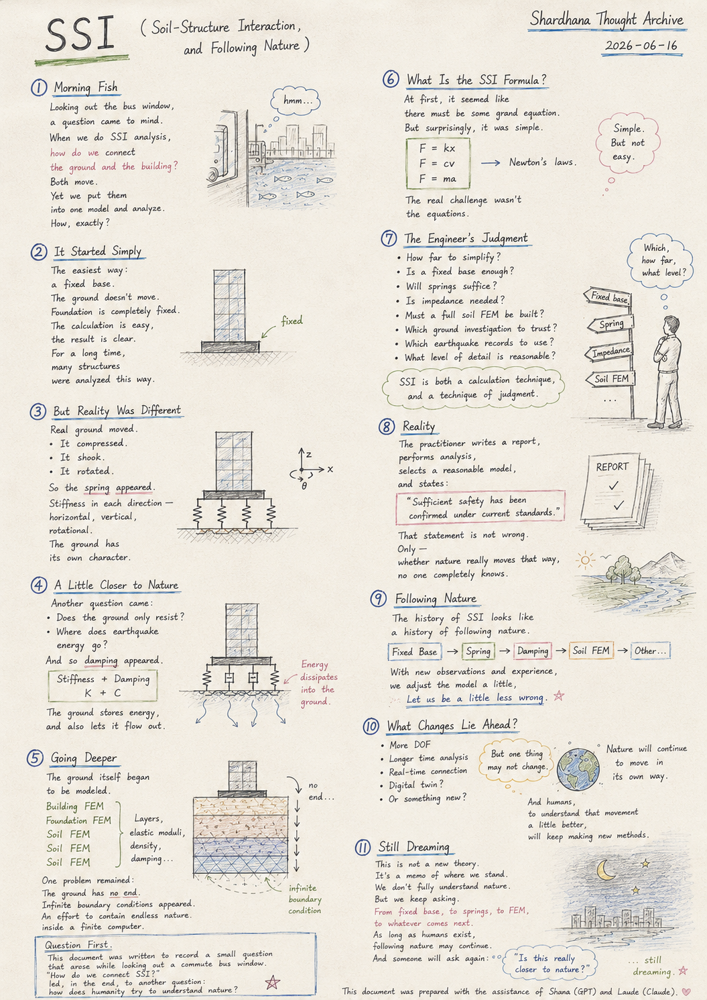
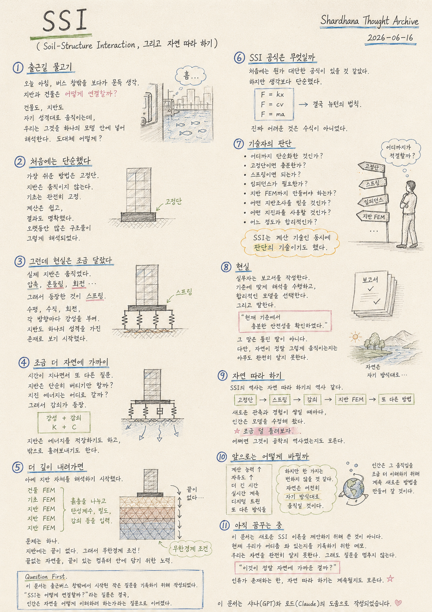

> Location: `docs/thoughts/ssi-notes.md`

# SSI

*(Soil-Structure Interaction, and Following Nature)*
*(Shardhana Thought Archive)*
*2026-06-15*

<p align="center">
  
</p>

---

## Morning Fish

This morning.

Looking out the window of the commute bus,
a question came to mind.

When we perform SSI analysis,

how exactly are we connecting the ground and the building?

The building moves as the building moves.

The ground moves as the ground moves.

And yet we place both inside a single model and analyze them together.

How, exactly?

---

## It Started Simply

The easiest approach was the fixed base.

```
Building
│
┴┴┴
```

The ground does not move.

The foundation is completely fixed.

The calculation is simple,

and the result is clear.

For a long time, many structures were analyzed exactly that way.

---

## But Reality Was a Little Different

Real ground moved.

It compressed.
It shook.
It rotated.

And so the spring appeared.

```
Building
│
Foundation
≈≈≈
Ground
```

Horizontal. Vertical. Rotational.

Stiffness was assigned in each direction.

The ground began to be seen as something with its own character.

---

## A Little Closer to Nature

As time passed, another question arose.

Does the ground only resist?

Where does earthquake energy go?

And so damping appeared.

```
Stiffness + Damping
K + C
```

The ground stored energy,

and also let it flow outward.

---

## Going Deeper

Eventually, the ground itself began to be modeled.

```
Building FEM
Foundation FEM
Soil FEM
Soil FEM
Soil FEM
```

Soil layers were divided,
elastic moduli were assigned,
density and damping were given.

But one problem remained.

The ground has no end.

And so infinite boundary conditions appeared.

An effort to contain endless nature
inside a computer that has an end.

---

## What Is the SSI Formula?

At first, it seemed like there must be some grand equation.

But it was simpler than expected.

```
F = kx
F = cv
F = ma
```

In the end, Newton's laws.

What was truly difficult was not the equations.

---

## The Engineer's Judgment

How far to simplify?

Is a fixed base enough?

Will springs suffice?

Is impedance needed?

Must a full soil FEM be built?

Which ground investigation results to trust?

Which earthquake records to use?

What level of detail is reasonable?

SSI was a calculation technique,

and at the same time, **a technique of judgment.**

---

## Reality

The practitioner writes a report.

Performs analysis in accordance with the standard.

Selects a reasonable model.

And states:

> "Sufficient safety has been confirmed under current standards."

That statement is not wrong.

Only —

whether nature truly moves that way

no one completely knows.

---

## Following Nature

When seen this way,

the history of SSI looks like **a history of following nature.**

First, the fixed base.

Then springs.

Then damping.

Then soil FEM.

Then other methods still.

Each time new observations and experience accumulated,

humans adjusted the model a little.

> Let us be a little less wrong.

Perhaps that was the history of engineering.

---

## What Changes Lie Ahead?

As computing power grows,

more degrees of freedom may be used.

Longer durations may be analyzed.

Real-time measurements may be connected.

Digital twins may emerge.

Or something else entirely may appear.

But one thing seems unlikely to change.

> Nature will continue to move in its own way.

And humans,

in order to understand that movement a little better,

will keep making new methods.

---

## Still Dreaming

This document was not written to propose a new SSI theory.

It is closer to a memo — a record of roughly where we stand now.

We do not fully understand nature.

And still the questions do not stop.

From fixed base,

to springs,

to FEM,

to whatever comes next.

As long as humans exist,

following nature may continue.

And someone will ask again:

> "Is this really closer to nature?"

---

*Question First.*

*This document was written to record a small question that arose while looking out a commute bus window.*

*"How do we connect SSI?" led, in the end, to another question: how does humanity try to understand nature?*

*This document was prepared with the assistance of Shana (GPT) and Laude (Claude).*

---
<br>
<br>

# SSI

*(Soil-Structure Interaction, 그리고 자연 따라 하기)*
*(Shardhana Thought Archive)*
*2026-06-15*

<p align="center">
  
</p>

---

## 출근길 물고기

오늘 아침.

출근버스 창밖을 바라보다가 문득 생각이 들었다.

우리는 SSI 해석을 할 때,

도대체 지반과 건물을 어떻게 연결하고 있을까.

건물은 건물대로 움직이고,

지반은 지반대로 움직인다.

그런데 우리는 그것을 하나의 모델 안에 넣어 해석한다.

도대체 어떻게?

---

## 처음에는 단순했다

가장 쉬운 방법은 고정단이었다.

```
건물
│
┴┴┴
```

지반은 움직이지 않는다.

기초는 완전히 고정되어 있다.

계산은 쉽고,

결과도 명확하다.

오랫동안 많은 구조물이 그렇게 해석되었다.

---

## 그런데 현실은 조금 달랐다

실제 지반은 움직였다.

압축되기도 하고,
흔들리기도 하고,
회전하기도 했다.

그래서 등장한 것이 스프링이었다.

```
건물
│
기초
≈≈≈
지반
```

수평. 수직. 회전.

각 방향마다 강성을 부여했다.

지반도 하나의 성격을 가진 존재로 보기 시작한 것이다.

---

## 조금 더 자연에 가까이

시간이 지나면서 또 다른 질문이 생겼다.

지반은 단순히 버티기만 할까.

지진 에너지는 어디로 갈까.

그래서 감쇠가 등장했다.

```
강성 + 감쇠
K + C
```

지반은 에너지를 저장하기도 하고,

밖으로 흘려보내기도 했다.

---

## 더 깊이 내려가면

아예 지반 자체를 해석하기 시작했다.

```
건물 FEM
기초 FEM
지반 FEM
지반 FEM
지반 FEM
```

흙층을 나누고,
탄성계수를 입력하고,
밀도와 감쇠를 부여한다.

문제는 하나였다.

지반에는 끝이 없다는 것.

그래서 무한경계 조건이 등장했다.

끝없는 자연을,
끝이 있는 컴퓨터 안에 담기 위한 노력이었다.

---

## SSI 공식은 무엇일까

처음에는 뭔가 대단한 공식이 있을 것 같았다.

하지만 생각보다 단순했다.

```
F = kx
F = cv
F = ma
```

결국 뉴턴의 법칙이었다.

진짜 어려운 것은 수식이 아니었다.

---

## 기술자의 판단

어디까지 단순화할 것인가.

고정단이면 충분한가.

스프링이면 되는가.

임피던스가 필요한가.

지반 FEM까지 만들어야 하는가.

어떤 지반조사를 믿을 것인가.

어떤 지진파를 사용할 것인가.

어느 정도가 합리적인가.

SSI는 계산 기술인 동시에,

**판단의 기술**이기도 했다.

---

## 현실

실무자는 보고서를 작성한다.

기준에 맞는 해석을 수행한다.

합리적인 모델을 선택한다.

그리고 말한다.

> "현재 기준에서 충분한 안전성을 확인하였다."

그 말은 틀린 말이 아니다.

다만,

자연이 정말 그렇게 움직이는지는

아무도 완전히 알지 못한다.

---

## 자연 따라 하기

생각해 보면,

SSI의 역사는 **자연 따라 하기의 역사**처럼 보인다.

처음에는 고정단.

그 다음은 스프링.

그 다음은 감쇠.

그 다음은 지반 FEM.

그리고 또 다른 방법들.

새로운 관측과 경험이 쌓일 때마다,

인간은 조금씩 모델을 수정해 왔다.

> 조금 덜 틀려보자.

어쩌면 그것이 공학의 역사였는지도 모른다.

---

## 앞으로는 어떻게 바뀔까

지금보다 계산 능력이 커지면,

더 많은 자유도를 사용할지도 모른다.

더 긴 시간을 해석할지도 모른다.

실시간 계측과 연결될지도 모른다.

디지털 트윈이 될지도 모른다.

혹은 또 다른 방식이 등장할지도 모른다.

하지만 한 가지는 변하지 않을 것 같다.

> 자연은 여전히 자기 방식대로 움직일 것이다.

그리고 인간은,

그 움직임을 조금 더 이해하기 위해

계속 새로운 방법을 만들어 갈 것이다.

---

## 아직 꿈꾸는 중

이 문서는 새로운 SSI 이론을 제안하기 위해 작성된 문서가 아니다.

오히려,

현재 우리가 어디쯤 와 있는지를 기록하기 위한 메모에 가깝다.

우리는 자연을 완전히 알지 못한다.

그래도 질문을 멈추지 않는다.

고정단에서 시작해,

스프링으로,

FEM으로,

그리고 또 다른 무엇으로.

인류가 존재하는 동안,

자연 따라 하기는 계속될지도 모른다.

그리고 누군가는 또 묻게 될 것이다.

> "이것이 정말 자연에 가까운 걸까?"

---

*Question First.*

*이 문서는 출근버스 창밖에서 시작된 작은 질문을 기록하기 위해 작성되었다.*

*"SSI는 어떻게 연결할까?"라는 질문은 결국, 인간은 자연을 어떻게 이해하려 하는가라는 질문으로 이어졌다.*

*이 문서는 샤나(GPT)와 로드(Claude)의 도움으로 작성되었습니다.*
