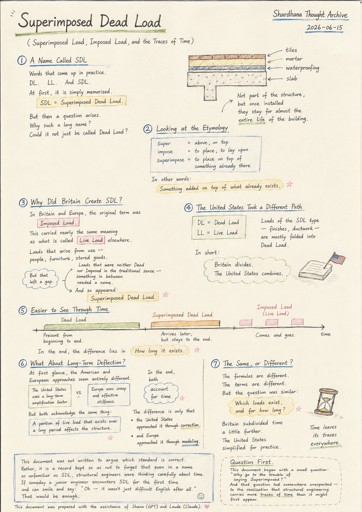
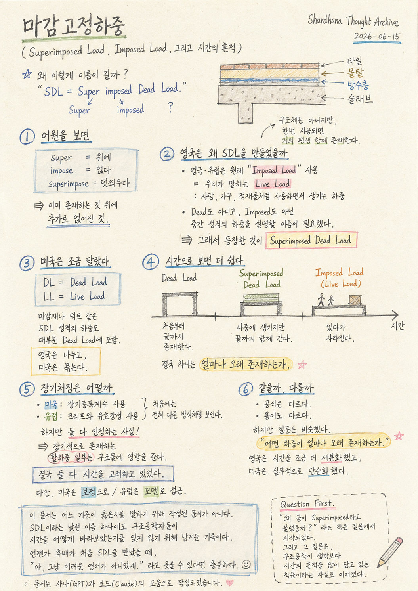

> Location: `docs/thoughts/superimposed-load-notes.md`

# Superimposed Dead Load

*(Superimposed Load, Imposed Load, and the Traces of Time)*
*(Shardhana Thought Archive)*
*2026-06-15*

## 🎬 YouTube Video

[Watch on YouTube](https://youtu.be/YvRg9RhSrco)

<p align="center">
  
</p>

---

## A Name Called SDL

Words that come up in practice.

DL.

LL.

And SDL.

At first, it is simply memorized.

> SDL = Superimposed Dead Load.

But then a question arises.

Why such a long name?

Could it not just be called Dead Load?

---

## Looking at the Etymology

Superimposed is built like this:

```
super       = above, on top
impose      = to place, to lay upon
superimpose = to place on top of something already there
```

In other words:

> Something added on top of what already exists.

Mortar on a slab,
tiles,
ceiling finishes,
ductwork — these belong here.

Not part of the structure itself,
but once installed, they stay for almost the entire life of the building.

---

## Why Did Britain Create SDL?

In Britain and Europe, the original term was

> Imposed Load.

This carried nearly the same meaning as what is called

> Live Load

elsewhere.

Loads that arise from use — people, furniture, stored goods.

But that left a gap.

Loads that were neither Dead
nor Imposed in the traditional sense —
something in between needed a name.

And so appeared:

> Superimposed Dead Load.

---

## The United States Took a Different Path

The American approach is comparatively simple.

```
DL = Dead Load
LL = Live Load
```

Loads of the SDL type — finishes, ductwork — are mostly folded into Dead Load.

In short:

> Britain divides.
>
> The United States combines.

---

## Easier to See Through Time

Dead Load

> Present from beginning to end.

Superimposed Dead Load

> Arrives later, but stays to the end.

Imposed Load (Live Load)

> Comes and goes.

In the end, the difference lies in

> **How long it exists.**

---

## What About Long-Term Deflection?

At first glance, the American and European approaches seem entirely different.

The United States uses a long-term amplification factor.
Europe uses creep and effective stiffness.

But both acknowledge the same thing:

> A portion of live load that exists over a long period affects the structure.

In the end, both

> **account for time.**

The difference is only that

the United States approached it through correction,
and Europe approached it through modeling.

---

## The Same, or Different?

The formulas are different.

The terms are different.

But the question was similar:

> Which loads exist, and for how long?

Britain subdivided time a little further.

The United States simplified for practice.

---

This document was not written to argue which standard is correct.

Rather, it is a record kept so as not to forget
that even in a name as unfamiliar as SDL,
structural engineers were thinking carefully about time.

If someday a junior engineer encounters SDL for the first time
and can smile and say:

> "Oh — it wasn't just difficult English after all."

That would be enough.

---

*Question First.*

*This document began with a small question: "Why go to the trouble of saying Superimposed?"*

*And that question led somewhere unexpected — to the realization that structural engineering carries more traces of time than it might first appear.*

*This document was prepared with the assistance of Shana (GPT) and Laude (Claude).*

---
<br>
<br>

# 마감고정하중

*(Superimposed Load, Imposed Load, 그리고 시간의 흔적)*
*(Shardhana Thought Archive)*
*2026-06-15*

## 🎬 유튜브 영상

[Watch on YouTube](https://youtu.be/2hyv2YGH2mY)

<p align="center">
  
</p>

---

## SDL이라는 이름

실무를 하다 보면 듣게 되는 말.

DL.

LL.

그리고 SDL.

처음에는 그냥 외운다.

> SDL = Superimposed Dead Load.

그런데 문득 궁금해진다.

왜 이렇게 이름이 길까.

그냥 Dead Load라고 하면 안 되는 걸까.

---

## 어원을 보면

Superimposed는 이렇게 만들어졌다.

```
super   = 위에
impose  = 얹다
superimpose = 덧씌우다
```

즉,

> 이미 존재하는 것 위에 추가로 얹어진 것.

슬래브 위의 몰탈,
타일,
천장재,
덕트 등이 여기에 해당한다.

구조체는 아니지만,
한번 시공되면 거의 평생 함께 존재한다.

---

## 영국은 왜 SDL을 만들었을까

영국과 유럽에서는 원래

> Imposed Load

라는 용어를 사용했다.

이것은 우리가 말하는

> Live Load

와 거의 같은 의미였다.

사람, 가구, 적재물처럼 사용하면서 생기는 하중이다.

그러다 보니,

Dead도 아니고,
Imposed도 아닌,

중간 성격의 하중을 설명할 이름이 필요했다.

그래서 등장한 것이

> Superimposed Dead Load

이었다.

---

## 미국은 조금 달랐다

미국은 비교적 단순하다.

```
DL = Dead Load
LL = Live Load
```

마감재나 덕트 같은 SDL 성격의 하중도
대부분 Dead Load에 포함시킨다.

즉,

> 영국은 나누고,
>
> 미국은 묶는다.

---

## 시간으로 보면 더 쉽다

Dead Load

> 처음부터 끝까지 존재한다.

Superimposed Dead Load

> 나중에 생기지만 끝까지 함께 간다.

Imposed Load (Live Load)

> 있다가 사라진다.

결국 차이는

> **얼마나 오래 존재하는가.**

에 있었다.

---

## 장기처짐은 어떨까

처음에는 미국과 유럽이 전혀 다른 방식처럼 보인다.

미국은 장기증폭계수를 사용하고,
유럽은 크리프와 유효강성을 사용한다.

하지만 둘 다 인정하는 사실이 있다.

> 장기적으로 존재하는 활하중 일부는 구조물에 영향을 준다.

결국 둘 다

> **시간을 고려하고 있었다.**

다만,

미국은 보정으로,
유럽은 모델로 접근했을 뿐이다.

---

## 같을까, 다를까

공식은 다르다.

용어도 다르다.

하지만 질문은 비슷했다.

> 어떤 하중이 얼마나 오래 존재하는가.

영국은 시간을 조금 더 세분화했고,

미국은 실무적으로 단순화했다.

---

이 문서는 어느 기준이 옳은지를 말하기 위해 작성된 문서가 아니다.

오히려,

SDL이라는 낯선 이름 하나에도
구조공학자들이 시간을 어떻게 바라보았는지를
잊지 않기 위해 남겨둔 기록이다.

언젠가 후배가 처음 SDL을 만났을 때,

> "아, 그냥 어려운 영어가 아니었네."

라고 웃을 수 있다면 충분하다.

---

*Question First.*

*이 문서는 "왜 굳이 Superimposed라고 불렀을까?"라는 작은 질문에서 시작되었다.*

*그리고 그 질문은, 구조공학이 생각보다 시간의 흔적을 많이 담고 있는 학문이라는 사실로 이어졌다.*

*이 문서는 샤나(GPT)와 로드(Claude)의 도움으로 작성되었습니다.*
