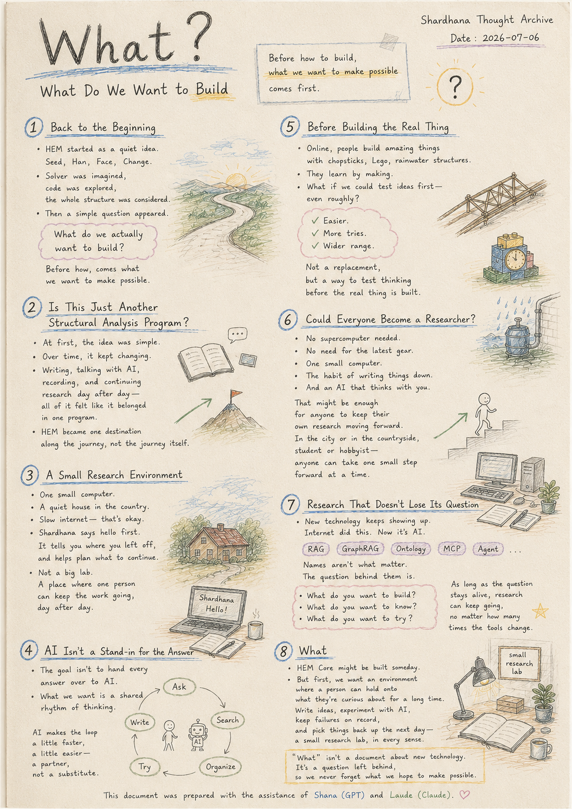
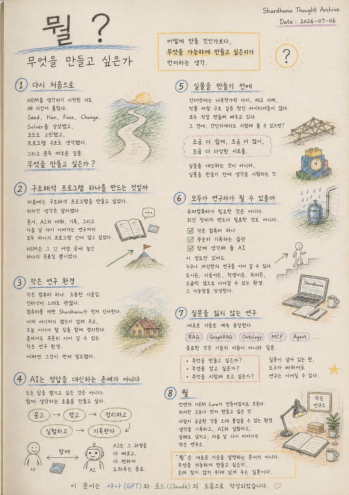

> Location: `docs/thoughts/what.md`

# What?

## What Do We Want to Build

*(Shardhana Thought Archive)*
*Date: 2026-07-06*

  

---

## 1. Back to the Beginning

Some time has passed since HEM first started as an idea.

Seed,
Han,
Face,
Change.

Then came the imagined Solver, the code, the whole program structure.

But one very simple question surfaced, out of nowhere.

**What do we actually want to build?**

Before *how* to build it, comes *what* we want to make possible in the first place.

---

## 2. Is This Just Another Structural Analysis Program?

At first, the idea was simple: build a structural analysis program.

But as time went on, that idea kept shifting.

Writing documents, talking with AI, keeping records, picking research back up the next day — all of it started to feel like it belonged inside one single program.

HEM turned out to be one destination along that journey, not the journey itself.

---

## 3. A Small Research Environment

One small computer.

A quiet house out in the country.

A slow internet connection — that's fine too.

Turn the computer on, and Shardhana says hello first.

It tells you where you left off yesterday, and helps you lay out what's worth continuing today.

Not a massive lab. A small research environment where one person alone can still keep the work going, day after day.

Maybe that's what was needed first, before anything else.

---

## 4. AI Isn't a Stand-in for the Answer

The goal was never to hand every answer over to AI.

What's wanted instead is a shared rhythm of thinking.

Ask what you're curious about. Look things up. Organize them. Try something. Write it down.

AI just makes that whole loop a little faster, a little easier — a partner in the process, not a substitute for it.

---

## 5. Before Building the Real Thing

Online, it's easy to find people building bridges out of chopsticks, clocks out of Lego, structures for catching rainwater.

Every one of them is learning by making something with their own hands.

What if, before any of that, there was a way to test the idea first — even roughly?

A little easier. A few more tries. A wider range of things worth attempting.

Not a replacement for the real thing — a way to test the thinking *before* the real thing gets built.

---

## 6. Could Everyone Become a Researcher?

This doesn't call for a supercomputer.

It doesn't require the latest equipment, either.

One small computer, the habit of writing things down consistently, and an AI willing to think alongside you.

That much might be enough for someone to keep their own research moving forward.

In the city or out in the country, a student or a hobbyist — an environment where anyone can take one small step forward at a time.

That's the kind of possibility this points toward.

---

## 7. Research That Doesn't Lose Its Question

New technology keeps showing up.

The internet did this. AI is doing it now.

RAG,
GraphRAG,
Ontology,
MCP,
Agent.

At first, every one of these names sounds intimidating.

But in the end, what matters isn't the name of the technology — it's the question behind it.

What do you want to build? What do you want to know? What do you want to try?

As long as the question stays alive, the research can keep going, no matter how many times the tools underneath it change.

---

## 8. What

HEM Core might get built, someday.

But there's something that needs to come before that.

An environment where a person can hold onto what they're curious about, for a long time.

A place to write down ideas, experiment alongside AI, let failures stay on record, and pick things back up the next day — a small research lab, in every sense of the word "small."

*"What"* isn't a document explaining some new technology.

It's a question left behind, so we never forget what we hope to make possible.

---
This document was prepared with the assistance of Shana (GPT) and Laude (Claude).

---
 
 

# 뭘?

## 무엇을 만들고 싶은가

*(Shardhana Thought Archive)*
*Date: 2026-07-06*

  

---

## 1. 다시 처음으로

HEM을 생각하기 시작한 지도 꽤 시간이 흘렀다.

Seed,
Han,
Face,
Change.

그리고 Solver를 상상했고,
코드를 고민했고,
프로그램 구조도 생각했다.

하지만 문득 아주 단순한 질문 하나가 떠올랐다.

**무엇을 만들고 싶은가?**

어떻게 만들 것인가보다
무엇을 가능하게 만들고 싶은지가 먼저라는 생각이 들었다.

---

## 2. 구조해석 프로그램 하나를 만드는 것일까

처음에는 구조해석 프로그램을 만들고 싶다고 생각했다.

하지만 시간이 지날수록
생각은 조금씩 달라졌다.

문서를 만들고,
AI와 대화하고,
기록을 남기고,
다시 이어서 연구하는 과정까지도
하나의 프로그램 안에 담고 싶어졌다.

HEM은
그 긴 여정 끝에 놓여 있는 하나의 목표일 뿐이었다.

---

## 3. 작은 연구 환경

작은 컴퓨터 하나.

조용한 시골집.

인터넷이 조금 느려도 괜찮다.

컴퓨터를 켜면
Shardhana가 먼저 인사를 한다.

어제 어디까지 했는지 알려 주고,
오늘 이어서 할 수 있는 일을 함께 정리한다.

거대한 연구실이 아니라,
혼자서도 꾸준히 연구를 이어 갈 수 있는
작은 연구 환경.

어쩌면 그것이 먼저 필요했다.

---

## 4. AI는 정답을 대신하는 존재가 아니다

AI에게 모든 답을 맡기고 싶은 것은 아니다.

오히려 함께 생각하는 흐름을 만들고 싶다.

궁금한 것을 물어보고,
자료를 찾아보고,
정리하고,
실험하고,
기록한다.

AI는 그 과정을 조금 더 빠르고,
조금 더 편하게 만들어 주는 동료가 된다.

---

## 5. 실물을 만들기 전에

인터넷에서는
나무젓가락으로 다리를 만들고,
레고로 시계를 만들고,
빗물을 저장하는 구조를 만드는 사람들을 쉽게 볼 수 있다.

모두 직접 만들며 배우고 있다.

만약 그 전에
간단하게라도 시험해 볼 수 있다면 어떨까.

조금 더 쉽게,
조금 더 많이,
조금 더 다양한 방법을 시도할 수 있지 않을까.

실물을 대신하는 것이 아니라,
실물을 만들기 전에 생각을 시험하는 것이다.

---

## 6. 모두가 연구자가 될 수 있을까

거대한 슈퍼컴퓨터가 필요한 것이 아니다.

최신 장비가 반드시 필요한 것도 아니다.

작은 컴퓨터 하나와
꾸준히 기록하는 습관.

그리고 함께 생각해 줄 AI.

그 정도만 있어도
누군가는 자신만의 연구를 계속 이어 갈 수 있다.

도시에 있든,
시골에 있든,
학생이든,
취미로 만드는 사람이든,
조금씩 앞으로 나아갈 수 있는 환경.

그런 가능성을 상상하게 된다.

---

## 7. 질문을 잃지 않는 연구

새로운 기술은 계속 등장한다.

인터넷이 그랬고,
AI도 그렇다.

RAG,
GraphRAG,
Ontology,
MCP,
Agent.

처음에는 모두 어려운 이름처럼 보인다.

하지만 결국 중요한 것은
기술의 이름이 아니라 질문이다.

무엇을 만들고 싶은가.
무엇을 알고 싶은가.
무엇을 시험해 보고 싶은가.

질문이 살아 있는 한,
도구는 계속 바뀌어도 연구는 이어질 수 있다.

---

## 8. 뭘

언젠가 HEM Core가 만들어질지도 모른다.

하지만 그보다 먼저 만들고 싶은 것이 있다.

사람이 궁금한 것을 오래 붙잡을 수 있는 환경.

생각을 기록하고,
AI와 함께 실험하고,
실패도 남기고,
다음 날 다시 이어 갈 수 있는 작은 연구소.

'What'은 새로운 기술을 설명하는 문서가 아니다.

무엇을 가능하게 만들고 싶은지,
오래 잊지 않기 위해 남겨 두는 질문이다.

---

이 문서는 샤나(GPT)와 로드(Claude)의 도움으로 작성되었습니다.
