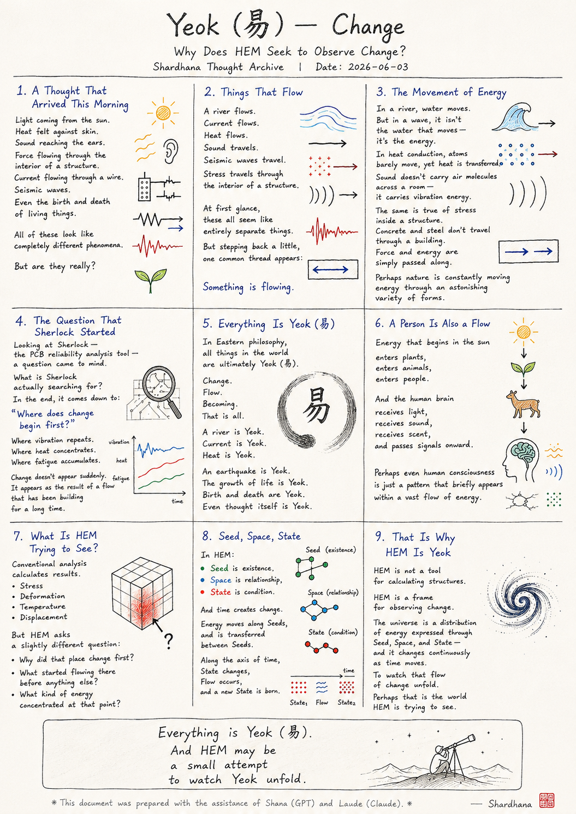
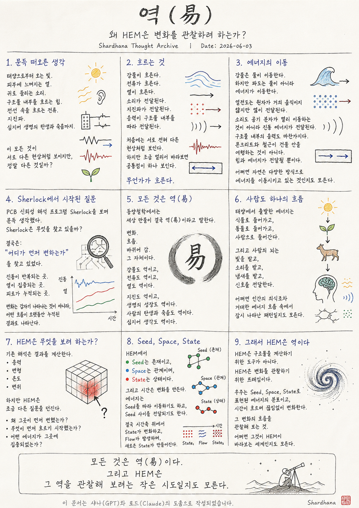

> Location: `docs/yeok.md`

# Yeok (易) — Change

*(Why Does HEM Seek to Observe Change?)*  
*(Shardhana Thought Archive)*  
*Date: 2026-06-03*

  

---

## 1. A Thought That Arrived This Morning

This morning, a thought arrived without warning.

Light coming from the sun.  
Heat felt against skin.  
Sound reaching the ears.  
Force flowing through the interior of a structure.  
Current flowing through a wire.  
Seismic waves.  
Even the birth and death of living things.

All of these look like completely different phenomena.

But are they really?

---

## 2. Things That Flow

A river flows.  
Current flows.  
Heat flows.  
Sound travels.  
Seismic waves travel.  
Stress travels through the interior of a structure.

At first glance, these all seem like entirely separate things.

But stepping back a little,  
one common thread appears:

*Something is flowing.*

---

## 3. The Movement of Energy

In a river, water moves.

But in a wave, it isn't the water that moves —  
it's the energy.

In heat conduction, atoms barely move,  
yet heat is transferred.

Sound doesn't carry air molecules across a room —  
it carries vibration energy.

The same is true of stress inside a structure.

Concrete and steel don't travel through a building.  
Force and energy are simply passed along.

Perhaps nature is constantly moving energy  
through an astonishing variety of forms.

---

## 4. The Question That Sherlock Started

Looking at Sherlock — the PCB reliability analysis tool —  
a question came to mind.

What is Sherlock actually searching for?

In the end, it comes down to:

> *"Where does change begin first?"*

Where vibration repeats.  
Where heat concentrates.  
Where fatigue accumulates.

Change doesn't appear suddenly.  
It appears as the result of a flow  
that has been building for a long time.

---

## 5. Everything Is Yeok (易)

In Eastern philosophy,  
all things in the world are ultimately *Yeok* (易).

Change.  
Flow.  
Becoming.

That is all.

A river is Yeok.  
Current is Yeok.  
Heat is Yeok.

An earthquake is Yeok.  
The growth of life is Yeok.

Birth and death are Yeok.

Even thought itself is Yeok.

---

## 6. A Person Is Also a Flow

Energy that begins in the sun

enters plants,  
enters animals,  
enters people.

And the human brain

receives light,  
receives sound,  
receives scent,  
and passes signals onward.

Perhaps even human consciousness  
is just a pattern that briefly appears  
within a vast flow of energy.

---

## 7. What Is HEM Trying to See?

Conventional analysis calculates results.

Stress.  
Deformation.  
Temperature.  
Displacement.

But HEM asks a slightly different question:

Why did that place change first?  
What started flowing there before anything else?  
What kind of energy concentrated at that point?

---

## 8. Seed, Space, State

In HEM:

Seed is existence.  
Space is relationship.  
State is condition.

And time creates change.

Energy moves along Seeds,  
and is transferred between Seeds.

Along the axis of time,  
State changes,  
Flow occurs,  
and a new State is born.

---

## 9. That Is Why HEM Is Yeok

HEM is not a tool for calculating structures.

HEM is a frame for observing change.

The universe is a distribution of energy  
expressed through Seed, Space, and State —  
and it changes continuously as time moves.

To watch that flow of change unfold.

Perhaps that is the world HEM is trying to see.

---

Everything is Yeok (易).

And HEM may be  
a small attempt  
to watch Yeok unfold.

---

*This document was prepared with the assistance of Shana (GPT) and Laude (Claude).*

---
 
 

# 역(易)

*(왜 HEM은 변화를 관찰하려 하는가?)*  
*(Shardhana Thought Archive)*  
*Date: 2026-06-03*

  

---

## 1. 문득 떠오른 생각

오늘 아침 문득 이런 생각이 들었다.

태양으로부터 오는 빛.  
피부에 느껴지는 열.  
귀로 들리는 소리.  
구조물 내부를 흐르는 힘.  
전선 속을 흐르는 전류.  
지진파.  
심지어 생명의 탄생과 죽음까지.

이 모든 것이 서로 다른 현상처럼 보이지만,

정말 다른 것일까?

---

## 2. 흐르는 것

강물이 흐른다.  
전류가 흐른다.  
열이 흐른다.  
소리가 전달된다.  
지진파가 전달된다.  
응력이 구조물 내부를 따라 전달된다.

처음에는 서로 전혀 다른 현상처럼 보인다.

하지만 조금 멀리서 바라보면  
공통점이 하나 보인다.

무언가가 흐른다.

---

## 3. 에너지의 이동

강물은 물이 이동한다.

하지만 파도는 물이 아니라 에너지가 이동한다.

열전도는 원자가 거의 움직이지 않지만 열이 전달된다.

소리도 공기 분자가 멀리 이동하는 것이 아니라  
진동 에너지가 전달된다.

구조물 내부의 응력도 마찬가지다.

콘크리트와 철근이 건물 안을 여행하는 것이 아니다.  
힘과 에너지가 전달될 뿐이다.

어쩌면 자연은  
다양한 방식으로 에너지를 이동시키고 있는 것인지도 모른다.

---

## 4. Sherlock에서 시작된 질문

PCB 신뢰성 해석 프로그램 Sherlock을 보며  
문득 생각했다.

Sherlock은 무엇을 찾고 있을까?

결국은:

> "어디가 먼저 변하는가"

를 찾고 있었다.

진동이 반복되는 곳.  
열이 집중되는 곳.  
피로가 누적되는 곳.

변화는 갑자기 나타나는 것이 아니라,  
어떤 흐름이 오랫동안 누적된 결과로 나타난다.

---

## 5. 모든 것은 역(易)

동양철학에서는  
세상 만물이 결국 역(易)이라고 말한다.

변화.  
흐름.  
바뀌어 감.

그 자체이다.

강물도 역이고,  
전류도 역이고,  
열도 역이다.

지진도 역이고,  
생명의 성장도 역이다.

사람의 탄생과 죽음도 역이다.

심지어 생각도 역이다.

---

## 6. 사람도 하나의 흐름

태양에서 출발한 에너지는

식물로 들어가고,  
동물로 들어가고,  
사람으로 들어간다.

그리고 사람의 뇌는

빛을 받고,  
소리를 받고,  
냄새를 받고,  
신호를 전달한다.

어쩌면 인간의 의식조차  
거대한 에너지 흐름 속에서  
잠시 나타난 패턴일지도 모른다.

---

## 7. HEM은 무엇을 보려 하는가?

기존 해석은 결과를 계산한다.

응력.  
변형.  
온도.  
변위.

하지만 HEM은 조금 다른 질문을 던진다.

왜 그곳이 먼저 변했는가?  
무엇이 먼저 흐르기 시작했는가?  
어떤 에너지가 그곳에 집중되었는가?

---

## 8. Seed, Space, State

HEM에서

Seed는 존재이고,  
Space는 관계이며,  
State는 상태이다.

그리고 시간은 변화를 만든다.

에너지는  
Seed를 따라 이동하기도 하고,  
Seed 사이를 전달되기도 한다.

결국 시간축 위에서  
State가 변화하고,  
Flow가 발생하며,  
새로운 State가 만들어진다.

---

## 9. 그래서 HEM은 역이다

HEM은 구조물을 계산하기 위한 도구가 아니다.

HEM은 변화를 관찰하기 위한 프레임이다.

우주는 Seed, Space, State로 표현된 에너지의 분포이고,  
시간이 흐르며 끊임없이 변화한다.

그 변화의 흐름을 관찰해 보는 것.

어쩌면 그것이 HEM이 바라보는 세계인지도 모른다.

---

모든 것은 역(易)이다.

그리고 HEM은  
그 역을 관찰해 보려는 작은 시도일지도 모른다.

---

*이 문서는 샤나(GPT)와 로드(Claude)의 도움으로 작성되었습니다.*
